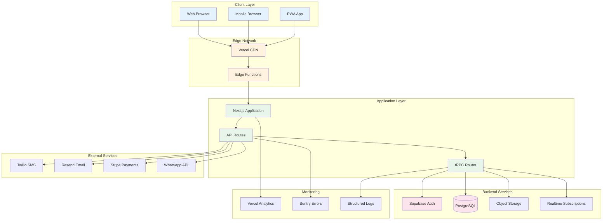
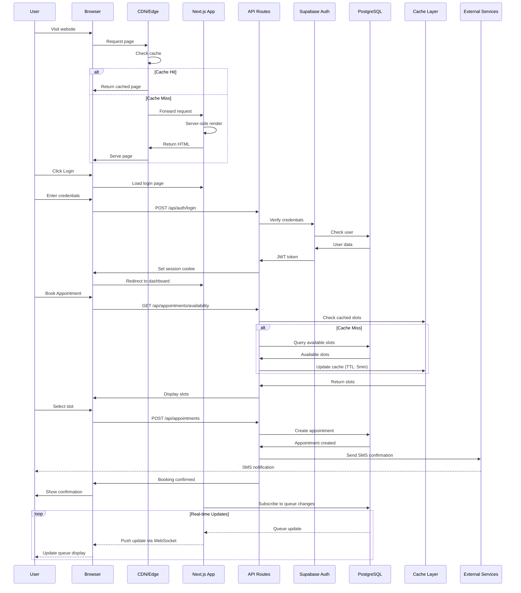
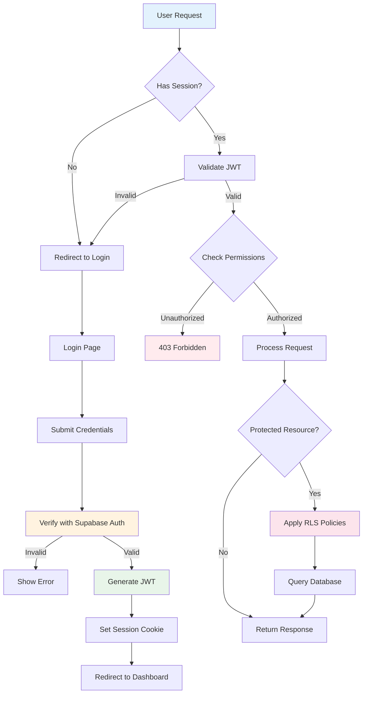
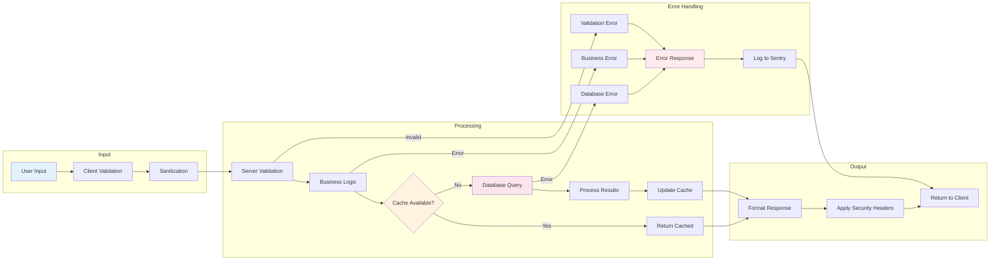
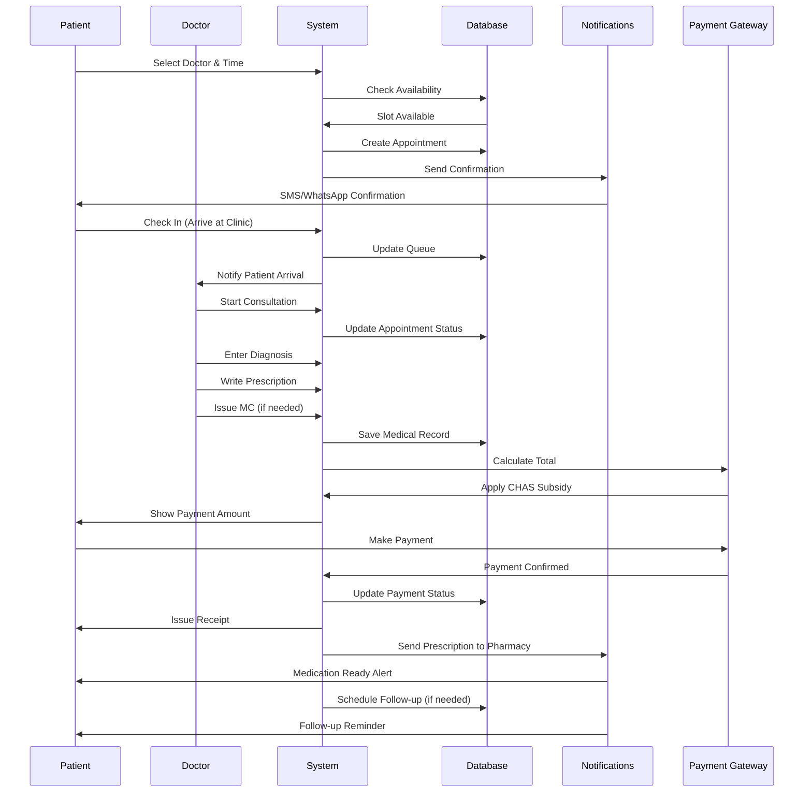
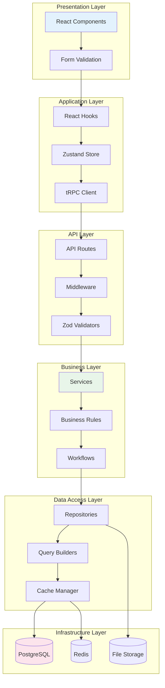
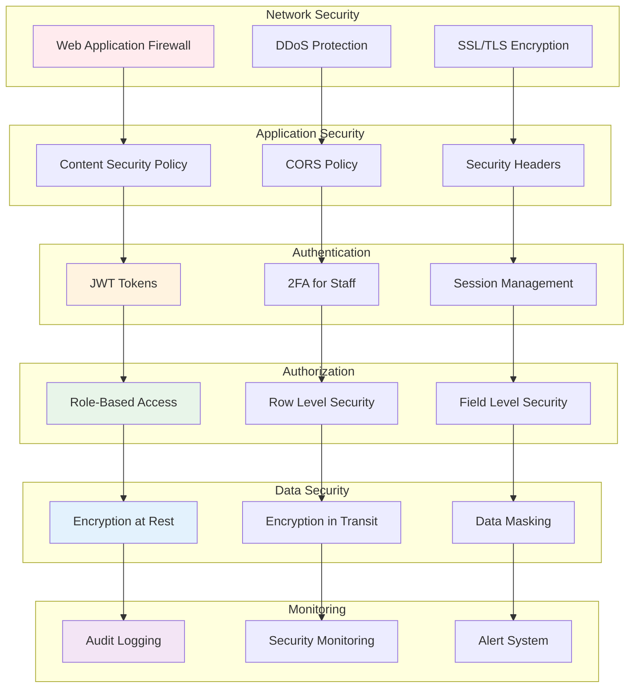
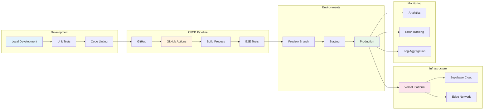

# Project Architecture Document v2.0
## Gabriel Family Clinic Healthcare Platform - Practical Implementation Architecture

**Version**: 2.0.0  
**Date**: November 2024  
**Status**: Production-Ready Architecture  
**Approach**: Incremental, Pragmatic, Achievable  

---

## Table of Contents
1. [Executive Overview](#1-executive-overview)
2. [System Architecture](#2-system-architecture)
3. [Complete File Hierarchy](#3-complete-file-hierarchy)
4. [Application Logic Flow](#4-application-logic-flow)
5. [User-Module Interactions](#5-user-module-interactions)
6. [Key Architectural Patterns](#6-key-architectural-patterns)
7. [Data Flow Architecture](#7-data-flow-architecture)
8. [Security Architecture](#8-security-architecture)
9. [Deployment Architecture](#9-deployment-architecture)
10. [Development Guidelines](#10-development-guidelines)

---

## 1. Executive Overview

### 1.1 Architecture Philosophy
The Gabriel Family Clinic v2.0 architecture follows a **"Progressive Enhancement"** approach - starting with a solid, simple foundation and adding complexity only when validated by real usage. Every architectural decision prioritizes **maintainability, security, and user experience** over technical sophistication.

### 1.2 Core Principles
```typescript
const ARCHITECTURE_PRINCIPLES = {
  simplicity: "Choose boring technology that works",
  security: "Security by default, not by addition",
  performance: "Fast enough is better than perfect",
  maintainability: "Code for the next developer (it might be you)",
  scalability: "Scale when needed, not when imagined",
  accessibility: "Usable by everyone, especially seniors"
};
```

### 1.3 Technology Decisions
```typescript
const TECH_STACK = {
  frontend: {
    framework: "Next.js 13.5 (Pages Router)", // Stable, well-documented
    ui_components: "Mantine 7.0",            // Complete component library
    styling: "CSS Modules + Tailwind",       // Scoped + utilities
    state: "Zustand 4.4",                   // Simple state management
    forms: "React Hook Form 7.47",          // Performant forms
    validation: "Zod 3.22"                  // Runtime + TypeScript validation
  },
  backend: {
    database: "PostgreSQL 15 (Supabase)",   // Managed, scalable
    auth: "Supabase Auth",                  // Built-in, secure
    api: "Next.js API Routes + tRPC",       // Type-safe API
    realtime: "Supabase Realtime",          // WebSocket subscriptions
    storage: "Supabase Storage",            // S3-compatible
    edge_functions: "Vercel Edge Functions" // Fast, serverless
  },
  infrastructure: {
    hosting: "Vercel Pro",                  // Optimized for Next.js
    cdn: "Vercel Edge Network",             // Global distribution
    monitoring: "Vercel Analytics + Sentry", // Performance + errors
    emails: "Resend",                       // Reliable email delivery
    sms: "Twilio",                         // SMS notifications
    ci_cd: "GitHub Actions"                // Automated deployments
  }
};
```

---

## 2. System Architecture

### 2.1 High-Level Architecture



### 2.2 Component Architecture

```typescript
// Core architectural components
const ARCHITECTURE_COMPONENTS = {
  presentation: {
    pages: "Server-side rendered pages",
    components: "Reusable UI components", 
    layouts: "Shared page layouts",
    styles: "Modular CSS + utility classes"
  },
  
  business_logic: {
    services: "Business logic encapsulation",
    hooks: "Shared React hooks",
    utils: "Helper functions",
    validators: "Data validation schemas"
  },
  
  data_access: {
    api: "REST + tRPC endpoints",
    database: "PostgreSQL with RLS",
    cache: "In-memory + Redis",
    storage: "File uploads to S3"
  },
  
  cross_cutting: {
    auth: "Authentication & authorization",
    logging: "Structured logging",
    monitoring: "Performance tracking",
    security: "XSS, CSRF protection"
  }
};
```

---

## 3. Complete File Hierarchy

### 3.1 Project Root Structure

```
gabriel-family-clinic-v2/
├── 📁 src/                                    # Source code
├── 📁 public/                                 # Static assets
├── 📁 database/                               # Database migrations & seeds
├── 📁 docs/                                   # Documentation
├── 📁 tests/                                  # Test files
├── 📁 scripts/                                # Build & deployment scripts
├── 📁 .github/                                # GitHub Actions workflows
├── 📁 .vscode/                                # VS Code settings
├── 📄 .env.example                            # Environment variables template
├── 📄 .env.local                              # Local environment (gitignored)
├── 📄 .gitignore                              # Git ignore rules
├── 📄 next.config.js                          # Next.js configuration
├── 📄 tailwind.config.js                      # Tailwind CSS configuration
├── 📄 tsconfig.json                           # TypeScript configuration
├── 📄 package.json                            # Dependencies & scripts
├── 📄 README.md                               # Project documentation
└── 📄 vercel.json                             # Vercel deployment config
```

### 3.2 Detailed Source Code Structure

```
src/
├── 📁 pages/                                  # Next.js Pages (Routes)
│   ├── 📁 api/                               # API Routes
│   │   ├── 📁 auth/
│   │   │   ├── login.ts                     # POST /api/auth/login
│   │   │   ├── logout.ts                    # POST /api/auth/logout
│   │   │   ├── register.ts                  # POST /api/auth/register
│   │   │   └── verify-otp.ts                # POST /api/auth/verify-otp
│   │   ├── 📁 appointments/
│   │   │   ├── index.ts                     # GET/POST appointments
│   │   │   ├── [id].ts                      # GET/PUT/DELETE appointment
│   │   │   ├── availability.ts              # GET available slots
│   │   │   └── queue-status.ts              # GET real-time queue
│   │   ├── 📁 patients/
│   │   │   ├── index.ts                     # Patient CRUD
│   │   │   ├── [id]/
│   │   │   │   ├── index.ts                # Patient details
│   │   │   │   ├── medical-records.ts      # Medical history
│   │   │   │   └── prescriptions.ts        # Prescriptions
│   │   ├── 📁 doctors/
│   │   │   ├── index.ts                     # Doctor listing
│   │   │   └── [id]/
│   │   │       ├── schedule.ts              # Doctor schedule
│   │   │       └── consultations.ts         # Consultation history
│   │   ├── 📁 payments/
│   │   │   ├── create-intent.ts             # Stripe payment intent
│   │   │   ├── confirm.ts                   # Payment confirmation
│   │   │   └── webhook.ts                   # Stripe webhook
│   │   ├── 📁 trpc/
│   │   │   └── [...trpc].ts                 # tRPC handler
│   │   ├── 📁 webhooks/
│   │   │   ├── twilio.ts                    # SMS status updates
│   │   │   └── whatsapp.ts                  # WhatsApp callbacks
│   │   └── health.ts                        # Health check endpoint
│   │
│   ├── 📁 portal/                            # Patient Portal Pages
│   │   ├── index.tsx                        # Portal dashboard
│   │   ├── register.tsx                     # Patient registration
│   │   ├── login.tsx                        # Patient login
│   │   ├── 📁 appointments/
│   │   │   ├── index.tsx                    # Appointments list
│   │   │   ├── book.tsx                     # Book appointment
│   │   │   ├── [id].tsx                     # Appointment details
│   │   │   └── reschedule.tsx               # Reschedule appointment
│   │   ├── 📁 medical-records/
│   │   │   ├── index.tsx                    # Medical records list
│   │   │   └── [id].tsx                     # Record details
│   │   ├── 📁 prescriptions/
│   │   │   ├── index.tsx                    # Prescriptions list
│   │   │   └── [id].tsx                     # Prescription details
│   │   ├── 📁 payments/
│   │   │   ├── index.tsx                    # Payment history
│   │   │   ├── pay.tsx                      # Make payment
│   │   │   └── receipt/[id].tsx             # Payment receipt
│   │   └── 📁 profile/
│   │       ├── index.tsx                    # Profile view
│   │       ├── edit.tsx                     # Edit profile
│   │       └── settings.tsx                 # Account settings
│   │
│   ├── 📁 doctor/                            # Doctor Portal Pages
│   │   ├── index.tsx                        # Doctor dashboard
│   │   ├── login.tsx                        # Doctor login
│   │   ├── 📁 schedule/
│   │   │   ├── index.tsx                    # Daily schedule
│   │   │   └── manage.tsx                   # Manage availability
│   │   ├── 📁 patients/
│   │   │   ├── index.tsx                    # Patient list
│   │   │   └── [id]/
│   │   │       ├── index.tsx                # Patient details
│   │   │       ├── consultation.tsx         # New consultation
│   │   │       └── history.tsx              # Patient history
│   │   ├── 📁 consultations/
│   │   │   ├── index.tsx                    # Consultations list
│   │   │   ├── new.tsx                      # New consultation
│   │   │   └── [id].tsx                     # Consultation details
│   │   └── 📁 prescriptions/
│   │       ├── index.tsx                    # Prescriptions issued
│   │       └── new.tsx                      # Write prescription
│   │
│   ├── 📁 admin/                             # Admin Portal Pages  
│   │   ├── index.tsx                        # Admin dashboard
│   │   ├── login.tsx                        # Admin login
│   │   ├── 📁 clinics/
│   │   │   ├── index.tsx                    # Clinics list
│   │   │   ├── [id]/
│   │   │   │   ├── index.tsx               # Clinic details
│   │   │   │   ├── settings.tsx            # Clinic settings
│   │   │   │   └── staff.tsx               # Staff management
│   │   ├── 📁 users/
│   │   │   ├── index.tsx                    # Users list
│   │   │   ├── patients.tsx                 # Patient management
│   │   │   ├── doctors.tsx                  # Doctor management
│   │   │   └── staff.tsx                    # Staff management
│   │   ├── 📁 reports/
│   │   │   ├── index.tsx                    # Reports dashboard
│   │   │   ├── appointments.tsx             # Appointment analytics
│   │   │   ├── revenue.tsx                  # Revenue reports
│   │   │   └── operational.tsx              # Operational metrics
│   │   └── 📁 settings/
│   │       ├── index.tsx                    # System settings
│   │       ├── services.tsx                 # Services & pricing
│   │       └── integrations.tsx             # Third-party integrations
│   │
│   ├── index.tsx                             # Homepage
│   ├── about.tsx                             # About us
│   ├── services.tsx                          # Services listing
│   ├── clinics.tsx                           # Clinic locations
│   ├── doctors.tsx                           # Doctor profiles
│   ├── book-appointment.tsx                  # Public booking page
│   ├── contact.tsx                           # Contact page
│   ├── _app.tsx                              # Next.js App wrapper
│   ├── _document.tsx                         # HTML document structure
│   └── 404.tsx                               # 404 error page
│
├── 📁 components/                             # Reusable React Components
│   ├── 📁 layout/
│   │   ├── Layout.tsx                       # Main layout wrapper
│   │   ├── Header.tsx                       # Site header
│   │   ├── Navigation.tsx                   # Navigation menu
│   │   ├── Footer.tsx                       # Site footer
│   │   ├── Sidebar.tsx                      # Dashboard sidebar
│   │   └── MobileMenu.tsx                   # Mobile navigation
│   │
│   ├── 📁 common/
│   │   ├── Logo.tsx                         # Clinic logo
│   │   ├── LoadingSpinner.tsx              # Loading indicator
│   │   ├── ErrorBoundary.tsx               # Error handling wrapper
│   │   ├── SEO.tsx                         # SEO meta tags
│   │   ├── Toast.tsx                       # Toast notifications
│   │   └── Modal.tsx                       # Modal dialog
│   │
│   ├── 📁 forms/
│   │   ├── FormField.tsx                   # Generic form field
│   │   ├── InputText.tsx                   # Text input
│   │   ├── InputPhone.tsx                  # Phone number input
│   │   ├── InputNRIC.tsx                   # NRIC input with validation
│   │   ├── DatePicker.tsx                  # Date selection
│   │   ├── TimePicker.tsx                  # Time selection
│   │   ├── Select.tsx                      # Dropdown select
│   │   ├── Checkbox.tsx                    # Checkbox input
│   │   ├── RadioGroup.tsx                  # Radio button group
│   │   └── FileUpload.tsx                  # File upload component
│   │
│   ├── 📁 appointment/
│   │   ├── AppointmentCard.tsx             # Appointment display card
│   │   ├── AppointmentForm.tsx             # Booking form
│   │   ├── DoctorSelection.tsx             # Doctor picker
│   │   ├── TimeSlotPicker.tsx              # Time slot selection
│   │   ├── QueueDisplay.tsx                # Queue number display
│   │   └── AppointmentStatus.tsx           # Status indicator
│   │
│   ├── 📁 patient/
│   │   ├── PatientCard.tsx                 # Patient info card
│   │   ├── PatientSearch.tsx               # Patient search
│   │   ├── MedicalHistory.tsx              # Medical history view
│   │   ├── VitalSigns.tsx                  # Vitals display
│   │   └── AllergyList.tsx                 # Allergy information
│   │
│   ├── 📁 doctor/
│   │   ├── DoctorCard.tsx                  # Doctor profile card
│   │   ├── DoctorSchedule.tsx              # Schedule calendar
│   │   ├── ConsultationForm.tsx            # Consultation notes
│   │   ├── PrescriptionForm.tsx            # Prescription writer
│   │   └── MCForm.tsx                      # Medical certificate
│   │
│   ├── 📁 payment/
│   │   ├── PaymentForm.tsx                 # Payment collection
│   │   ├── PaymentMethod.tsx               # Payment method selector
│   │   ├── PriceBreakdown.tsx              # Price details
│   │   ├── CHASCalculator.tsx              # CHAS subsidy calculator
│   │   └── Receipt.tsx                     # Payment receipt
│   │
│   └── 📁 ui/                               # Base UI Components
│       ├── Button.tsx                       # Button component
│       ├── Card.tsx                         # Card container
│       ├── Badge.tsx                        # Status badge
│       ├── Alert.tsx                        # Alert message
│       ├── Table.tsx                        # Data table
│       ├── Tabs.tsx                         # Tab navigation
│       ├── Accordion.tsx                    # Collapsible sections
│       ├── Avatar.tsx                       # User avatar
│       ├── Breadcrumb.tsx                   # Breadcrumb navigation
│       └── Pagination.tsx                   # Page navigation
│
├── 📁 lib/                                   # Library/Utility Code
│   ├── 📁 api/
│   │   ├── client.ts                       # API client setup
│   │   ├── endpoints.ts                    # API endpoint definitions
│   │   ├── fetcher.ts                      # Data fetching utilities
│   │   └── error-handler.ts                # API error handling
│   │
│   ├── 📁 auth/
│   │   ├── auth-context.tsx                # Auth context provider
│   │   ├── use-auth.ts                     # Auth hook
│   │   ├── session.ts                      # Session management
│   │   ├── permissions.ts                  # Role permissions
│   │   └── protected-route.tsx             # Route protection
│   │
│   ├── 📁 database/
│   │   ├── supabase-client.ts              # Supabase client
│   │   ├── queries/
│   │   │   ├── appointments.ts             # Appointment queries
│   │   │   ├── patients.ts                 # Patient queries
│   │   │   ├── doctors.ts                  # Doctor queries
│   │   │   └── payments.ts                 # Payment queries
│   │   └── migrations/                     # Database migrations
│   │
│   ├── 📁 hooks/
│   │   ├── use-appointments.ts             # Appointments hook
│   │   ├── use-patient.ts                  # Patient data hook
│   │   ├── use-doctor.ts                   # Doctor data hook
│   │   ├── use-realtime.ts                 # Realtime updates hook
│   │   ├── use-toast.ts                    # Toast notifications
│   │   └── use-media-query.ts              # Responsive design
│   │
│   ├── 📁 services/
│   │   ├── appointment-service.ts          # Appointment logic
│   │   ├── patient-service.ts              # Patient logic
│   │   ├── doctor-service.ts               # Doctor logic
│   │   ├── payment-service.ts              # Payment processing
│   │   ├── notification-service.ts         # Notifications
│   │   └── queue-service.ts                # Queue management
│   │
│   ├── 📁 utils/
│   │   ├── constants.ts                    # App constants
│   │   ├── formatters.ts                   # Data formatters
│   │   ├── validators.ts                   # Input validators
│   │   ├── nric-utils.ts                   # NRIC utilities
│   │   ├── date-utils.ts                   # Date/time utilities
│   │   ├── phone-utils.ts                  # Phone formatting
│   │   └── encryption.ts                   # Encryption utilities
│   │
│   ├── 📁 integrations/
│   │   ├── stripe.ts                       # Stripe integration
│   │   ├── twilio.ts                       # Twilio SMS
│   │   ├── resend.ts                       # Email service
│   │   └── whatsapp.ts                     # WhatsApp API
│   │
│   └── 📁 trpc/
│       ├── client.ts                       # tRPC client
│       ├── server.ts                       # tRPC server
│       ├── context.ts                      # Request context
│       └── routers/
│           ├── appointment.router.ts       # Appointment endpoints
│           ├── patient.router.ts           # Patient endpoints
│           ├── doctor.router.ts            # Doctor endpoints
│           └── index.ts                    # Root router
│
├── 📁 styles/                               # Global Styles
│   ├── globals.css                         # Global CSS
│   ├── variables.css                       # CSS variables
│   ├── 📁 themes/
│   │   ├── default.css                     # Default theme
│   │   ├── dark.css                        # Dark mode
│   │   └── high-contrast.css               # Accessibility
│   └── 📁 components/                      # Component styles
│       ├── button.module.css               # Button styles
│       ├── card.module.css                 # Card styles
│       └── form.module.css                 # Form styles
│
├── 📁 types/                                # TypeScript Types
│   ├── api.types.ts                        # API types
│   ├── database.types.ts                   # Database schema types
│   ├── appointment.types.ts                # Appointment types
│   ├── patient.types.ts                    # Patient types
│   ├── doctor.types.ts                     # Doctor types
│   ├── payment.types.ts                    # Payment types
│   └── index.ts                            # Type exports
│
├── 📁 config/                               # Configuration
│   ├── app.config.ts                       # App configuration
│   ├── database.config.ts                  # Database config
│   ├── seo.config.ts                       # SEO settings
│   └── features.config.ts                  # Feature flags
│
└── 📁 data/                                 # Static Data
    ├── clinics.json                        # Clinic information
    ├── services.json                       # Service catalog
    ├── timeslots.json                      # Available time slots
    └── languages.json                      # Supported languages
```

### 3.3 Key File Descriptions

#### Core Application Files

1. **`src/pages/_app.tsx`**
   ```typescript
   // Main application wrapper with providers
   export default function App({ Component, pageProps }) {
     return (
       <AuthProvider>
         <ThemeProvider>
           <NotificationProvider>
             <Layout>
               <Component {...pageProps} />
             </Layout>
           </NotificationProvider>
         </ThemeProvider>
       </AuthProvider>
     );
   }
   ```

2. **`src/pages/api/trpc/[...trpc].ts`**
   ```typescript
   // tRPC API handler for type-safe API calls
   export default createNextApiHandler({
     router: appRouter,
     createContext,
     onError: ({ error }) => {
       console.error('tRPC error:', error);
       Sentry.captureException(error);
     },
   });
   ```

3. **`src/lib/database/supabase-client.ts`**
   ```typescript
   // Supabase client with RLS
   export const supabase = createClient(
     process.env.NEXT_PUBLIC_SUPABASE_URL!,
     process.env.NEXT_PUBLIC_SUPABASE_ANON_KEY!,
     {
       auth: {
         persistSession: true,
         autoRefreshToken: true,
       },
     }
   );
   ```

---

## 4. Application Logic Flow

### 4.1 Main Application Flow



### 4.2 Authentication & Authorization Flow



### 4.3 Data Processing Flow



---

## 5. User-Module Interactions

### 5.1 Complete User-Module Interaction Map

```mermaid
graph TB
    subgraph "User Roles"
        PATIENT[👤 Patient]
        DOCTOR[👨‍⚕️ Doctor]
        STAFF[👥 Staff]
        ADMIN[👨‍💼 Admin]
    end
    
    subgraph "Core Modules"
        AUTH[🔐 Authentication]
        PROFILE[📋 Profile Management]
        APPT[📅 Appointments]
        RECORDS[📄 Medical Records]
        PRESC[💊 Prescriptions]
        PAYMENT[💳 Payments]
        QUEUE[📊 Queue Management]
    end
    
    subgraph "Communication"
        NOTIFY[🔔 Notifications]
        SMS[📱 SMS Service]
        EMAIL[✉️ Email Service]
        WHATSAPP[💬 WhatsApp]
    end
    
    subgraph "Clinical"
        CONSULT[🩺 Consultation]
        DIAG[📋 Diagnosis]
        MC[📝 Medical Certificate]
        LAB[🧪 Lab Orders]
    end
    
    subgraph "Admin Functions"
        USERS[👥 User Management]
        CLINIC[🏥 Clinic Settings]
        REPORTS[📊 Reports]
        BILLING[💰 Billing]
    end
    
    subgraph "Data Layer"
        DB[(PostgreSQL)]
        CACHE[(Redis Cache)]
        FILES[(File Storage)]
        AUDIT[(Audit Logs)]
    end
    
    %% Patient Interactions
    PATIENT -->|Register/Login| AUTH
    PATIENT -->|View/Edit| PROFILE
    PATIENT -->|Book/Cancel| APPT
    PATIENT -->|View| RECORDS
    PATIENT -->|View/Request| PRESC
    PATIENT -->|Make| PAYMENT
    PATIENT -->|Check| QUEUE
    PATIENT -->|Receive| NOTIFY
    
    %% Doctor Interactions
    DOCTOR -->|Login| AUTH
    DOCTOR -->|Manage| PROFILE
    DOCTOR -->|View/Manage| APPT
    DOCTOR -->|Create/Edit| RECORDS
    DOCTOR -->|Write| PRESC
    DOCTOR -->|Conduct| CONSULT
    DOCTOR -->|Enter| DIAG
    DOCTOR -->|Issue| MC
    DOCTOR -->|Order| LAB
    
    %% Staff Interactions
    STAFF -->|Login| AUTH
    STAFF -->|Manage| APPT
    STAFF -->|Update| QUEUE
    STAFF -->|Process| PAYMENT
    STAFF -->|Send| NOTIFY
    
    %% Admin Interactions
    ADMIN -->|Login| AUTH
    ADMIN -->|Manage| USERS
    ADMIN -->|Configure| CLINIC
    ADMIN -->|Generate| REPORTS
    ADMIN -->|Manage| BILLING
    
    %% Module to Service Connections
    AUTH --> DB
    PROFILE --> DB
    APPT --> DB
    APPT --> CACHE
    APPT --> SMS
    RECORDS --> DB
    RECORDS --> FILES
    PRESC --> DB
    PAYMENT --> DB
    PAYMENT --> BILLING
    QUEUE --> CACHE
    QUEUE --> NOTIFY
    
    NOTIFY --> SMS
    NOTIFY --> EMAIL
    NOTIFY --> WHATSAPP
    
    CONSULT --> RECORDS
    DIAG --> RECORDS
    MC --> FILES
    LAB --> RECORDS
    
    %% Admin to Data
    USERS --> DB
    CLINIC --> DB
    REPORTS --> DB
    BILLING --> DB
    
    %% Audit Trail
    AUTH --> AUDIT
    RECORDS --> AUDIT
    PAYMENT --> AUDIT
    PRESC --> AUDIT
    
    style PATIENT fill:#e3f2fd
    style DOCTOR fill:#fff3e0
    style STAFF fill:#e8f5e9
    style ADMIN fill:#fce4ec
    style DB fill:#f3e5f5
    style CACHE fill:#fff9c4
    style AUDIT fill:#ffebee
```



### 5.2 Detailed Module Interactions



---

## 6. Key Architectural Patterns

### 6.1 Design Patterns Implementation

```typescript
// Repository Pattern for Data Access
export class AppointmentRepository {
  async findById(id: string): Promise<Appointment> {
    const { data, error } = await supabase
      .from('appointments')
      .select('*')
      .eq('id', id)
      .single();
    
    if (error) throw new RepositoryError(error.message);
    return data;
  }

  async create(appointment: CreateAppointmentDto): Promise<Appointment> {
    const { data, error } = await supabase
      .from('appointments')
      .insert(appointment)
      .single();
    
    if (error) throw new RepositoryError(error.message);
    return data;
  }
}

// Service Layer Pattern
export class AppointmentService {
  constructor(
    private repo: AppointmentRepository,
    private notificationService: NotificationService,
    private cacheService: CacheService
  ) {}

  async bookAppointment(dto: BookAppointmentDto): Promise<Appointment> {
    // Check availability
    const isAvailable = await this.checkAvailability(dto);
    if (!isAvailable) {
      throw new BusinessError('Slot no longer available');
    }

    // Create appointment
    const appointment = await this.repo.create(dto);

    // Clear cache
    await this.cacheService.invalidate(`slots:${dto.doctorId}:${dto.date}`);

    // Send notifications
    await this.notificationService.sendAppointmentConfirmation(appointment);

    return appointment;
  }
}

// Factory Pattern for Notifications
export class NotificationFactory {
  static create(type: NotificationType): NotificationService {
    switch (type) {
      case 'sms':
        return new SMSNotificationService();
      case 'email':
        return new EmailNotificationService();
      case 'whatsapp':
        return new WhatsAppNotificationService();
      default:
        throw new Error(`Unknown notification type: ${type}`);
    }
  }
}

// Observer Pattern for Real-time Updates
export class QueueManager {
  private observers: QueueObserver[] = [];

  subscribe(observer: QueueObserver) {
    this.observers.push(observer);
  }

  notify(update: QueueUpdate) {
    this.observers.forEach(observer => observer.update(update));
  }

  async updateQueue(clinicId: string, queueNumber: number) {
    // Update database
    await this.updateDatabase(clinicId, queueNumber);
    
    // Notify all observers
    this.notify({ clinicId, currentNumber: queueNumber });
  }
}

// Strategy Pattern for Payment Processing
export interface PaymentStrategy {
  processPayment(amount: number): Promise<PaymentResult>;
}

export class StripePaymentStrategy implements PaymentStrategy {
  async processPayment(amount: number): Promise<PaymentResult> {
    // Stripe payment logic
    const intent = await stripe.paymentIntents.create({ amount });
    return { success: true, transactionId: intent.id };
  }
}

export class PayNowStrategy implements PaymentStrategy {
  async processPayment(amount: number): Promise<PaymentResult> {
    // PayNow QR code generation
    const qrCode = await generatePayNowQR(amount);
    return { success: true, qrCode };
  }
}
```

### 6.2 Error Handling Architecture

```typescript
// Centralized Error Handling
export class AppError extends Error {
  constructor(
    public message: string,
    public statusCode: number,
    public isOperational = true
  ) {
    super(message);
    Error.captureStackTrace(this, this.constructor);
  }
}

export class ValidationError extends AppError {
  constructor(message: string) {
    super(message, 400);
  }
}

export class AuthenticationError extends AppError {
  constructor(message = 'Authentication failed') {
    super(message, 401);
  }
}

export class AuthorizationError extends AppError {
  constructor(message = 'Access denied') {
    super(message, 403);
  }
}

// Global Error Handler Middleware
export const errorHandler = (
  err: Error,
  req: NextApiRequest,
  res: NextApiResponse
) => {
  if (err instanceof AppError && err.isOperational) {
    return res.status(err.statusCode).json({
      error: err.message,
      status: err.statusCode,
    });
  }

  // Log unexpected errors
  console.error('Unexpected error:', err);
  Sentry.captureException(err);

  // Generic error response
  return res.status(500).json({
    error: 'Something went wrong',
    status: 500,
  });
};
```

---

## 7. Data Flow Architecture

### 7.1 Data Flow Layers



### 7.2 Data Validation Pipeline

```typescript
// Multi-layer validation approach
// 1. Client-side validation
export const appointmentSchema = z.object({
  patientId: z.string().uuid(),
  doctorId: z.string().uuid(),
  date: z.string().regex(/^\d{4}-\d{2}-\d{2}$/),
  time: z.string().regex(/^\d{2}:\d{2}$/),
  type: z.enum(['consultation', 'followup', 'vaccination']),
  notes: z.string().max(500).optional(),
});

// 2. API route validation
export default async function handler(req: NextApiRequest, res: NextApiResponse) {
  // Validate request body
  const validation = appointmentSchema.safeParse(req.body);
  if (!validation.success) {
    return res.status(400).json({ errors: validation.error.errors });
  }

  // 3. Business rule validation
  const isValid = await validateBusinessRules(validation.data);
  if (!isValid) {
    return res.status(422).json({ error: 'Business rule violation' });
  }

  // 4. Database constraints
  try {
    const result = await createAppointment(validation.data);
    return res.status(201).json(result);
  } catch (error) {
    if (error.code === '23505') { // Unique violation
      return res.status(409).json({ error: 'Appointment slot already taken' });
    }
    throw error;
  }
}
```

---

## 8. Security Architecture

### 8.1 Security Layers



### 8.2 Security Implementation

```typescript
// Security middleware stack
export const securityMiddleware = [
  // Rate limiting
  rateLimit({
    windowMs: 15 * 60 * 1000, // 15 minutes
    max: 100, // limit each IP to 100 requests per windowMs
    message: 'Too many requests from this IP',
  }),

  // Security headers
  helmet({
    contentSecurityPolicy: {
      directives: {
        defaultSrc: ["'self'"],
        styleSrc: ["'self'", "'unsafe-inline'"],
        scriptSrc: ["'self'", "'unsafe-inline'", 'https://cdn.vercel-insights.com'],
        imgSrc: ["'self'", 'data:', 'https:'],
      },
    },
  }),

  // CORS configuration
  cors({
    origin: process.env.ALLOWED_ORIGINS?.split(',') || ['http://localhost:3000'],
    credentials: true,
    methods: ['GET', 'POST', 'PUT', 'DELETE'],
  }),

  // Input sanitization
  expressSanitizer(),

  // Session validation
  async (req: NextApiRequest, res: NextApiResponse, next: NextFunction) => {
    const token = req.headers.authorization?.replace('Bearer ', '');
    if (!token) return next();

    try {
      const user = await verifyToken(token);
      req.user = user;
    } catch (error) {
      // Invalid token, continue as anonymous
    }
    next();
  },
];

// Data encryption utilities
export class EncryptionService {
  private algorithm = 'aes-256-gcm';
  private key = Buffer.from(process.env.ENCRYPTION_KEY!, 'base64');

  encrypt(text: string): EncryptedData {
    const iv = crypto.randomBytes(16);
    const cipher = crypto.createCipheriv(this.algorithm, this.key, iv);
    
    let encrypted = cipher.update(text, 'utf8', 'hex');
    encrypted += cipher.final('hex');
    
    const authTag = cipher.getAuthTag();
    
    return {
      encrypted,
      iv: iv.toString('hex'),
      authTag: authTag.toString('hex'),
    };
  }

  decrypt(data: EncryptedData): string {
    const decipher = crypto.createDecipheriv(
      this.algorithm,
      this.key,
      Buffer.from(data.iv, 'hex')
    );
    
    decipher.setAuthTag(Buffer.from(data.authTag, 'hex'));
    
    let decrypted = decipher.update(data.encrypted, 'hex', 'utf8');
    decrypted += decipher.final('utf8');
    
    return decrypted;
  }
}
```

---

## 9. Deployment Architecture

### 9.1 Deployment Pipeline



### 9.2 Environment Configuration

```typescript
// Environment-specific configuration
export const config = {
  development: {
    apiUrl: 'http://localhost:3000/api',
    supabaseUrl: process.env.NEXT_PUBLIC_SUPABASE_URL,
    enableDebug: true,
    mockPayments: true,
    rateLimiting: false,
  },
  staging: {
    apiUrl: 'https://staging.gabrielclinic.sg/api',
    supabaseUrl: process.env.NEXT_PUBLIC_SUPABASE_URL,
    enableDebug: true,
    mockPayments: false,
    rateLimiting: true,
  },
  production: {
    apiUrl: 'https://gabrielclinic.sg/api',
    supabaseUrl: process.env.NEXT_PUBLIC_SUPABASE_URL,
    enableDebug: false,
    mockPayments: false,
    rateLimiting: true,
  },
};

// Deployment scripts
{
  "scripts": {
    "dev": "next dev",
    "build": "next build",
    "start": "next start",
    "test": "jest",
    "test:e2e": "playwright test",
    "lint": "eslint . --ext .ts,.tsx",
    "type-check": "tsc --noEmit",
    "db:migrate": "supabase migration up",
    "db:seed": "tsx scripts/seed.ts",
    "deploy:preview": "vercel --env preview",
    "deploy:staging": "vercel --env staging --prod",
    "deploy:production": "vercel --prod"
  }
}
```

---

## 10. Development Guidelines

### 10.1 Code Organization Principles

```typescript
// Feature-based organization
src/
  features/
    appointment/
      components/     // UI components
      hooks/         // Custom hooks
      services/      // Business logic
      types/         // TypeScript types
      utils/         // Helper functions
      index.ts       // Public exports

// Naming conventions
- Components: PascalCase (AppointmentCard.tsx)
- Hooks: camelCase with 'use' prefix (useAppointments.ts)
- Services: PascalCase with 'Service' suffix (AppointmentService.ts)
- Utils: camelCase (formatDate.ts)
- Types: PascalCase with 'Type' or 'Interface' suffix
- Constants: UPPER_SNAKE_CASE

// File structure template
/**
 * @module AppointmentService
 * @description Handles appointment-related business logic
 */

import { z } from 'zod';
import { supabase } from '@/lib/supabase';
import type { Appointment } from '@/types';

// Validation schemas
const appointmentSchema = z.object({...});

// Service class
export class AppointmentService {
  // Public methods
  async create(data: CreateAppointmentDto): Promise<Appointment> {
    // Implementation
  }
  
  // Private methods
  private async checkAvailability(slot: TimeSlot): Promise<boolean> {
    // Implementation
  }
}

// Export singleton instance
export const appointmentService = new AppointmentService();
```

### 10.2 Testing Strategy

```typescript
// Unit test example
describe('AppointmentService', () => {
  beforeEach(() => {
    // Setup
  });

  describe('create', () => {
    it('should create appointment successfully', async () => {
      const appointment = await appointmentService.create(mockData);
      expect(appointment).toHaveProperty('id');
    });

    it('should throw error for invalid slot', async () => {
      await expect(appointmentService.create(invalidData))
        .rejects
        .toThrow('Slot not available');
    });
  });
});

// E2E test example
test('Patient books appointment', async ({ page }) => {
  // Navigate to booking page
  await page.goto('/book-appointment');
  
  // Select doctor
  await page.click('[data-testid="doctor-card-1"]');
  
  // Select date and time
  await page.click('[data-testid="date-picker"]');
  await page.click('[data-testid="date-2024-01-15"]');
  await page.click('[data-testid="time-slot-10:00"]');
  
  // Confirm booking
  await page.click('[data-testid="confirm-booking"]');
  
  // Verify success
  await expect(page.locator('[data-testid="success-message"]'))
    .toContainText('Appointment confirmed');
});
```

### 10.3 Performance Optimization Guidelines

```typescript
// 1. Code splitting
const DoctorPortal = dynamic(() => import('@/features/doctor'), {
  loading: () => <LoadingSpinner />,
  ssr: false,
});

// 2. Image optimization
<Image
  src="/doctor.jpg"
  alt="Doctor"
  width={300}
  height={400}
  loading="lazy"
  placeholder="blur"
/>

// 3. Data fetching optimization
export const getServerSideProps: GetServerSideProps = async (context) => {
  // Parallel data fetching
  const [appointments, doctors] = await Promise.all([
    fetchAppointments(),
    fetchDoctors(),
  ]);

  return {
    props: {
      appointments,
      doctors,
    },
    // Cache for 5 minutes
    revalidate: 300,
  };
};

// 4. Memoization
const ExpensiveComponent = memo(({ data }) => {
  const processedData = useMemo(() => 
    heavyProcessing(data), [data]
  );
  
  return <div>{processedData}</div>;
});

// 5. Database query optimization
const optimizedQuery = `
  SELECT 
    a.id,
    a.date,
    a.time,
    json_build_object(
      'id', p.id,
      'name', p.name
    ) as patient,
    json_build_object(
      'id', d.id,
      'name', d.name
    ) as doctor
  FROM appointments a
  JOIN patients p ON a.patient_id = p.id
  JOIN doctors d ON a.doctor_id = d.id
  WHERE a.clinic_id = $1
    AND a.date = $2
  ORDER BY a.time
  LIMIT 50
`;
```

---

## Conclusion

This comprehensive Project Architecture Document provides a **practical, achievable blueprint** for building the Gabriel Family Clinic v2.0 platform. The architecture prioritizes:

1. **Simplicity**: Using proven technologies and patterns
2. **Security**: Multiple layers of protection for sensitive health data
3. **Performance**: Optimized for Singapore's network conditions
4. **Maintainability**: Clear structure and comprehensive documentation
5. **Scalability**: Can grow from 1 to 10+ clinics without major refactoring

The modular approach allows for **incremental development and deployment**, reducing risk and enabling early user feedback. Each component is designed to be testable, maintainable, and replaceable as the system evolves.

**Success Factors:**
- Start with MVP features and iterate based on real usage
- Maintain clear separation of concerns
- Prioritize user experience, especially for elderly patients
- Keep security and compliance as first-class considerations
- Document decisions and maintain clean code

This architecture provides a solid foundation for building a modern, competitive healthcare platform that serves Singapore's family clinic needs while remaining achievable with a small development team.
