# Project_Architecture_Document.md

**Version**: 2.0.0  
**Date**: November 7, 2025  
**Status**: Enhanced Architecture for Multi-Tenant Healthcare Platform

---

## 1. Executive Overview

### Architecture Philosophy
The Gabriel Family Clinic Healthcare Platform v2.0 is architected as a **distributed, multi-tenant healthcare ecosystem** built on the principle of **"Compliance by Construction"** — every architectural decision embeds Singapore's PDPA, MOH, and CHAS requirements as first-class constraints.

### Key Architectural Enhancements
- **Multi-Tenancy**: Dynamic subdomain routing with clinic-level isolation
- **Edge-First Processing**: 90% of requests handled at edge (Vercel + Supabase Edge Functions)
- **Ecosystem Integration Layer**: Standardized adapters for pharmacies, labs, wearables
- **AI-Native Services**: Clinical decision support, content recommendation, anomaly detection
- **Zero-Trust Security**: RLS at database, JWT claims verification, per-request audit traces

---

## 2. Technology Stack Ecosystem

### Core Framework
| Layer | Technology | Rationale |
|-------|------------|-----------|
| **Frontend** | Next.js 14.2.22 (App Router) | Server components, streaming, edge runtime |
| **Language** | TypeScript 5.x Strict Mode | Type safety for clinical data |
| **Styling** | Tailwind CSS 3.4.1 + Design Tokens | WCAG AAA compliance, elderly-friendly scales |
| **Database** | PostgreSQL 15 (Supabase) | Row-level security, JSONB for FHIR resources |
| **Serverless** | Supabase Edge Functions (Deno) | 30ms cold start, Singapore region (sin1) |
| **Cache** | Upstash Redis + Vercel KV | 5ms latency, edge replication |
| **Auth** | Supabase Auth + Custom RLS | JWT enrichment with tenant claims |
| **AI/ML** | OpenAI GPT-4 + Embeddings | Clinical decision support, vector search |
| **Messaging** | WhatsApp Business API | 98% senior citizen adoption in Singapore |
| **Payments** | Stripe + PayNow SG | CHAS subsidy calculation at transaction time |
| **Monitoring** | OpenTelemetry + Grafana + PagerDuty | Real-time healthcare SLA monitoring |

### Integration Ecosystem
```typescript
// lib/integrations/registry.ts
export const INTEGRATION_REGISTRY = {
  // Singapore Healthcare
  chas: { api: 'https://api.chas.sg/v2', auth: 'oauth2' },
  moh_nehr: { api: 'https://nehr.moh.gov.sg/fhir/r4', auth: 'jwt' },
  
  // Pharmacy Chains
  guardian: { api: 'https://guardian.sg/api/pharmacy', auth: 'apikey' },
  watsons: { api: 'https://watsons.sg/api/v2', auth: 'oauth2' },
  unity: { api: 'https://unity.com.sg/pharmacy', auth: 'apikey' },
  
  // Laboratories
  wah_proctor: { api: 'https://wahproctor.com.sg/lab/v1', auth: 'webhook' },
  raffles: { api: 'https://rafflesmedical.com/lab/v2', auth: 'webhook' },
  
  // Wearables
  fitbit: { api: 'https://api.fitbit.com/1/user', auth: 'oauth2' },
  apple_health: { api: 'apple_health_kit', auth: 'native' },
  
  // Communication
  whatsapp: { api: 'https://graph.facebook.com/v19.0', auth: 'accesstoken' }
} as const;
```

---

## 3. File Hierarchy & Architecture

### 3.1 Complete Directory Tree

```
gabriel-family-clinic-v2/
├── 📁 app/                                      # Next.js 14 App Router
│   ├── 📁 [clinic]                             # Dynamic tenant subdomain
│   │   ├── 📁 (public)                         # Public pages (no auth)
│   │   │   ├── 📁 about                        # About clinic page
│   │   │   ├── 📁 services                     # Services listing
│   │   │   └── 📁 contact                      # Contact information
│   │   ├── 📁 auth                             # Authentication flow
│   │   │   ├── 📁 signin                       # Role-aware login
│   │   │   ├── 📁 signup                       # Patient registration
│   │   │   ├── 📁 2fa                          # Two-factor setup
│   │   │   └── 📁 callback                     # OAuth callbacks
│   │   ├── 📁 patient                          # Patient Portal
│   │   │   ├── 📁 dashboard                    # Health summary
│   │   │   ├── 📁 appointments                 # Booking, history, telemedicine
│   │   │   ├── 📁 records                      # Medical history timeline
│   │   │   ├── 📁 prescriptions                # Active meds, refill
│   │   │   ├── 📁 payments                     # Billing, CHAS Subsidy
│   │   │   └── 📁 settings                     # Profile, notifications
│   │   ├── 📁 doctor                           # Doctor Portal
│   │   │   ├── 📁 appointments                 # Schedule management
│   │   │   ├── 📁 patients                     # Patient list, risk stratification
│   │   │   ├── 📁 records                      # Medical notes, templates
│   │   │   ├── 📁 telemedicine                 # Waiting room, sessions
│   │   │   └── 📁 analytics                    # Clinical metrics
│   │   ├── 📁 admin                            # Admin Portal
│   │   │   ├── 📁 clinics                      # Multi-tenant management
│   │   │   ├── 📁 users                        # RBAC, onboarding
│   │   │   ├── 📁 analytics                    # Business intelligence
│   │   │   ├── 📁 security                     # Audit logs, incidents
│   │   │   └── 📁 settings                     # System configuration
│   │   └── 📁 api                              # Next.js API Routes (legacy)
│   │       └── 📁 webhooks                     # External system callbacks
│   ├── 📁 integrations                         # External API adapters
│   │   ├── 📁 whatsapp                         # WhatsApp Business API
│   │   ├── 📁 pharmacy                         # Guardian, Watsons, Unity
│   │   ├── 📁 laboratory                       # Wah Proctor, Raffles
│   │   └── 📁 wearables                        # Fitbit, Apple Health
│   ├── 📁 ai                                   # AI/ML Services
│   │   ├── 📁 clinical                         # Diagnosis support, drug interactions
│   │   ├── 📁 content                          # Article recommendations
│   │   └── 📁 analytics                        # Trend analysis, predictions
│   ├── layout.tsx                              # Root layout with tenant context
│   └── page.tsx                                # Landing page (public)
│
├── 📁 components/                              # Reusable React Components
│   ├── 📁 ui                                   # Base UI primitives (Radix)
│   │   ├── button.tsx                          # WCAG AAA compliant button
│   │   ├── input.tsx                           # Masked inputs (NRIC, phone)
│   │   ├── dialog.tsx                          # Accessible modal
│   │   └── toast.tsx                           # Healthcare alerts
│   ├── 📁 healthcare                           # Healthcare-specific
│   │   ├── patient-card.tsx                    # Masked NRIC display
│   │   ├── appointment-timeline.tsx            # Chronological view
│   │   ├── prescription-item.tsx               # Medication display
│   │   └── chas-calculator.tsx                 # Real-time subsidy calc
│   ├── 📁 forms                                # Form components
│   │   ├── nric-input.tsx                      # NRIC validation & masking
│   │   ├── phone-input.tsx                     # +65 format
│   │   ├── date-picker.tsx                     # Elderly-friendly calendar
│   │   └── chas-card-reader.tsx                # QR code scanner
│   ├── 📁 telemedicine                         # WebRTC components
│   │   ├── video-session.tsx                   # Video call UI
│   │   ├── waiting-room.tsx                    # Pre-session queue
│   │   └── screen-share.tsx                    # Content sharing
│   └── 📁 dashboard                            # Data visualization
│       ├── metrics-card.tsx                    # Performance metrics
│       └── funnel-chart.tsx                    # Patient journey
│
├── 📁 lib/                                     # Shared Utilities
│   ├── 📁 config                               # Configuration management
│   │   ├── tenant.ts                           # Multi-tenant resolution
│   │   ├── features.ts                         # Feature flags
│   │   └── constants.ts                        # Healthcare constants
│   ├── 📁 supabase                             # Database clients
│   │   ├── client.ts                           # Browser client with RLS
│   │   ├── server.ts                           # Server client (service role)
│   │   └── middleware.ts                       # Tenant context injection
│   ├── 📁 auth                                 # Authentication utilities
│   │   ├── rbac.ts                             # Role-based access logic
│   │   ├── session.ts                          # Session management
│   │   └── audit.ts                            # Access logging
│   ├── 📁 healthcare                           # Healthcare domain logic
│   │   ├── nric.ts                             # NRIC validation/encryption
│   │   ├── chas-calculator.ts                  # Subsidy calculations
│   │   ├── phone-formatter.ts                  # +65 formatting
│   │   └── icd10.ts                            # Diagnosis code lookup
│   ├── 📁 integrations                         # Third-party integrations
│   │   ├── whatsapp.ts                         # WhatsApp API wrapper
│   │   ├── pharmacy.ts                         # Pharmacy adapters
│   │   ├── laboratory.ts                       # Lab API handlers
│   │   └── fhir.ts                             # FHIR R4 resource mapping
│   ├── 📁 ai                                   # AI services
│   │   ├── embeddings.ts                       # Vector search for content
│   │   ├── clinical-decision.ts                # Diagnosis/treatment suggestions
│   │   └── drug-interactions.ts                # Interaction checking
│   ├── 📁 observability                        # Monitoring
│   │   ├── metrics.ts                          # OpenTelemetry metrics
│   │   ├── tracing.ts                          # Distributed tracing
│   │   └── logger.ts                           # Structured logging
│   └── 📁 utils                                # General utilities
│       ├── validation.ts                       # Zod schemas
│       └── encryption.ts                       # AES-256 encryption
│
├── 📁 supabase/                                # Backend Infrastructure
│   ├── 📁 migrations/                          # Database schema evolution
│   │   ├── 001_multi_tenancy.sql              # Clinics, tenant isolation
│   │   ├── 002_enhanced_rls.sql               # Row-level security policies
│   │   ├── 003_telemedicine.sql               # Sessions, recordings
│   │   ├── 004_whatsapp_integration.sql       # Message logs, templates
│   │   ├── 005_pharmacy_integration.sql       # E-prescriptions
│   │   ├── 006_laboratory_integration.sql     # Lab results, LOINC codes
│   │   ├── 007_wearables.sql                  # Health metrics, OAuth tokens
│   │   ├── 008_ai_embeddings.sql              # Vector search for content
│   │   ├── 009_audit_enhancement.sql          # Tamper-proof audit logs
│   │   └── 010_data_retention.sql             # Automated archival
│   ├── 📁 functions/                          # Edge Functions (Deno)
│   │   ├── 📁 appointment-availability        # Cached slot lookup
│   │   │   └── index.ts                       # Redis cache, RLS check
│   │   ├── 📁 chas-verification               # Real-time subsidy validation
│   │   │   └── index.ts                       # AIC API integration
│   │   ├── 📁 telemedicine-session            # WebRTC token generation
│   │   │   └── index.ts                       # 30-min token, HIPAA audit
│   │   ├── 📁 whatsapp-sender                 # Message dispatch
│   │   │   └── index.ts                       # Template messages, logging
│   │   ├── 📁 e-prescription                  # Pharmacy API integration
│   │   │   └── index.ts                       # Digital signatures, QR codes
│   │   ├── 📁 lab-webhook                     # Lab result ingestion
│   │   │   └── index.ts                       # HMAC verification, critical alerts
│   │   ├── 📁 wearable-sync                   # Health data ingestion
│   │   │   └── index.ts                       # OAuth2, trend analysis
│   │   ├── 📁 clinical-decision               # AI diagnosis support
│   │   │   └── index.ts                       # GPT-4 with confidence scoring
│   │   ├── 📁 audit-logger                    # Tamper-proof audit entries
│   │   │   └── index.ts                       # Append-only logs, signatures
│   │   └── 📁 compliance-checker              # Automated PDPA verification
│   │       └── index.ts                       # Daily compliance reports
│   ├── 📁 seed/                               # Sample data
│   │   ├── clinics.json                       # Multi-tenant seed data
│   │   ├── users.json                         # Test users in roles
│   │   └── chas_rates.json                    # Subsidy calculations
│   └── config.toml                            # Supabase project config
│
├── 📁 integrations/                           # Integration Layer
│   ├── 📁 whatsapp                            # WhatsApp Business
│   │   ├── client.ts                          # API client with rate limiting
│   │   ├── templates.ts                       # Pre-approved message templates
│   │   └── webhooks.ts                        # Inbound message handling
│   ├── 📁 pharmacy                            # Pharmacy adapters
│   │   ├── guardian.ts                        # Guardian Pharmacy API
│   │   ├── watsons.ts                         # Watsons API adapter
│   │   └── unity.ts                           # Unity Pharmacy connector
│   ├── 📁 laboratory                          # Lab integrations
│   │   ├── wah_proctor.ts                     # Wah Proctor webhook handler
│   │   └── raffles.ts                         # Raffles Medical API
│   └── 📁 wearables                           # Wearable device sync
│       ├── fitbit.ts                          # Fitbit OAuth2 flow
│       └── apple_health.ts                    # Apple HealthKit bridge
│
├── 📁 ai/                                     # AI/ML Services
│   ├── 📁 embeddings                          # Vector search
│   │   ├── generate.ts                        # OpenAI embedding generation
│   │   └── search.ts                          # Similarity search (pgvector)
│   ├── 📁 clinical                            # Clinical decision support
│   │   ├── suggest_diagnosis.ts               # Differential diagnosis
│   │   ├── check_interactions.ts              # Drug interaction checker
│   │   └── summarize_session.ts               # Telemedicine note generation
│   └── 📁 analytics                           # Predictive analytics
│       ├── predict_readmission.ts             # Readmission risk scoring
│       └── trend_analysis.ts                  # Wearable data trends
│
├── 📁 design-system/                          # Design Tokens & Theme
│   ├── 📁 tokens
│   │   ├── colors.ts                          # WCAG AAA color palette
│   │   ├── typography.ts                      # 18px+ font scales
│   │   ├── spacing.ts                         # 44px+ touch targets
│   │   └── motion.ts                          # Reduced motion support
│   ├── 📁 themes
│   │   ├── healthcare.ts                      # Base healthcare theme
│   │   └── singapore.ts                       # Singapore-specific branding
│   └── 📁 utils
│       └── class-names.ts                     # Theme-aware class concatenation
│
├── 📁 tests/                                  # Comprehensive Testing
│   ├── 📁 unit                                # Jest unit tests
│   │   ├── lib/
│   │   └── components/
│   ├── 📁 integration                         # API integration tests
│   │   ├── supabase/
│   │   └── integrations/
│   ├── 📁 e2e                                 # Playwright E2E
│   │   ├── patient_journey.spec.ts            # Full patient workflow
│   │   ├── doctor_workflow.spec.ts            # Clinical workflows
│   │   └── telemedicine.spec.ts               # Video session test
│   ├── 📁 accessibility                       # axe-core tests
│   │   └── wcag_aaa.spec.ts                   # Automated accessibility checks
│   ├── 📁 security                            # Penetration tests
│   │   └── rls_verification.spec.ts           # Row-level security tests
│   ├── 📁 performance                         # Load tests
│   │   └── appointment_booking_load.spec.ts   # 1000 concurrent users
│   └── 📁 fixtures                            # Test data
│       ├── patients.json
│       └── appointments.json
│
├── 📁 scripts/                                # Automation Scripts
│   ├── 📁 db                                  # Database management
│   │   ├── branch.ts                          # Database branching CLI
│   │   └── verify_migration.ts                # Migration safety checks
│   ├── 📁 deploy                              # Deployment automation
│   │   ├── preview.ts                         # Preview deployments
│   │   └── promote.ts                         # Production promotion
│   └── 📁 compliance                          # Compliance automation
│       └── check_pdpa.ts                      # Daily PDPA verification
│
├── 📁 infrastructure/                         # Infrastructure as Code
│   ├── 📁 terraform                           # Terraform configurations
│   │   ├── main.tf                            # Supabase project setup
│   │   ├── storage.tf                         # S3 buckets for recordings
│   │   └── monitoring.tf                      # Grafana, PagerDuty
│   ├── 📁 docker                              # Container configurations
│   │   ├── Dockerfile                         # Multi-stage build
│   │   └── docker-compose.yml                 # Local development
│   └── 📁 ci_cd                               # GitHub Actions
│       ├── ci.yml                             # Continuous integration
│       ├── cd.yml                             # Continuous deployment
│       └── compliance.yml                     # Daily compliance checks
│
├── 📁 docs/                                   # Documentation
│   ├── 📁 api                                 # API documentation
│   │   ├── restful.md                         # Edge Functions API
│   │   └── webhooks.md                        # Webhook specifications
│   ├── 📁 guides                              # User guides
│   │   ├── patient_onboarding.md              # Patient setup guide
│   │   └── doctor_telemedicine.md             # Telemedicine guide
│   └── 📁 compliance                          # Compliance documentation
│       ├── pdpa_checklist.md                  # PDPA compliance checklist
│       └── audit_log_retention.md             # Audit log policies
│
├── .env.example                               # Environment variables template
├── .env.local.example                         # Local development env
├── .gitignore                                 # Git ignore rules
├── next.config.js                             # Next.js configuration
├── tailwind.config.ts                         # Tailwind configuration
├── tsconfig.json                              # TypeScript configuration
├── jest.config.js                             # Jest testing config
├── playwright.config.ts                       # E2E testing config
├── instrumentation.ts                         # OpenTelemetry setup
├── vercel.json                                # Vercel deployment config
└── package.json                               # Dependencies and scripts
```

---

## 3.2 Key File Descriptions (50 Critical Files)

### Core Application Files
1. **`app/[clinic]/layout.tsx`**
   - **Purpose**: Root layout with dynamic tenant context resolution
   - **Logic**: Extracts `clinic` subdomain, validates against `clinics` table, injects branding tokens
   - **Security**: Sets `app.clinic_id` claim for RLS, adds CSP headers
   - **Performance**: Edge-rendered, caches clinic config in Vercel KV (<5ms lookup)

2. **`app/[clinic]/auth/callback/route.tsx`**
   - **Purpose**: OAuth callback handler for Google, WhatsApp, Fitbit
   - **Logic**: Verifies state parameter, exchanges code for tokens, creates user record
   - **Security**: PKCE verification, prevents CSRF, logs all authentications
   - **Integration**: Connects to Supabase Auth, stores OAuth tokens in encrypted column

3. **`middleware.ts`**
   - **Purpose**: Request-level tenant detection and security headers
   - **Logic**: Parses `Host` header, resolves clinic, enforces HTTPS, adds security headers
   - **Security**: Blocks non-whitelisted IP ranges, rate limiting per clinic
   - **Performance**: Runs on Vercel Edge, <1ms overhead

### Patient Portal Files
4. **`app/[clinic]/patient/appointments/book/page.tsx`**
   - **Purpose**: Intelligent appointment booking with real-time availability
   - **Logic**: Fetches cached slots from Redis, shows CHAS subsidy preview, handles double-booking prevention
   - **Integration**: Calls `appointment-availability` edge function, updates via optimistic UI
   - **Accessibility**: 44px touch targets, screen reader announces slot availability

5. **`app/[clinic]/patient/records/page.tsx`**
   - **Purpose**: Medical history timeline with AI insights
   - **Logic**: Infinite scroll, vector search for conditions, highlights critical values
   - **Security**: RLS ensures patient can only view own records, audit log created per access
   - **AI**: Embeddings generated for diagnoses, recommends related health articles

6. **`app/[clinic]/patient/prescriptions/e_prescribe/page.tsx`**
   - **Purpose**: E-prescription to pharmacy
   - **Logic**: Digital signature generation, pharmacy selection, QR code display
   - **Integration**: Calls `e-prescription` edge function, polls pharmacy status
   - **Compliance**: Adheres to HSA e-prescription standards, logs all transmissions

### Doctor Portal Files
7. **`app/[clinic]/doctor/patients/risk-dashboard/page.tsx`**
   - **Purpose**: AI-powered patient risk stratification
   - **Logic**: Fetches patient data, calls `clinical-decision/risk_score`, displays heatmap
   - **AI**: Predicts readmission risk, suggests interventions, explains predictions
   - **Performance**: Loads in <1s, caches risk scores for 24h

8. **`app/[clinic]/doctor/telemedicine/waiting-room/page.tsx`**
   - **Purpose**: Doctor's waiting room for upcoming telemedicine sessions
   - **Logic**: WebSocket connection to `telemedicine-session`, shows patient prep status
   - **Integration**: Integrates with `waiting-room` edge function for real-time updates
   - **Security**: Validates doctor's session token before allowing patient queue access

9. **`app/[clinic]/doctor/records/templates/page.tsx`**
   - **Purpose**: Manage reusable medical note templates
   - **Logic**: CRUD for templates with ICD-10 codes, medication placeholders
   - **AI**: Suggests template based on appointment type and history
   - **Sync**: Templates sync across doctor's devices via Supabase Realtime

### Admin Portal Files
10. **`app/[clinic]/admin/clinics/[clinicId]/settings/page.tsx`**
    - **Purpose**: Clinic-specific configuration (branding, features, billing)
    - **Logic**: Updates `clinics` table, invalidates tenant cache, triggers rebrand
    - **Security**: Superadmin only, logs all configuration changes
    - **Multi-tenancy**: Changes isolated to specific clinic, no cross-tenant impact

11. **`app/[clinic]/admin/security/audit-logs/page.tsx`**
    - **Purpose**: Immutable audit log viewer with forensic analysis
    - **Logic**: Streams from `audit_logs_archive`, filters by user/action/time, export to PDF
    - **Compliance**: Meets MOH audit requirements, tamper-evident log format
    - **Performance**: Uses time-range partitioning, queries <100ms for 30-day window

12. **`app/[clinic]/admin/performance/healthcare-metrics/page.tsx`**
    - **Purpose**: Real-time performance dashboard with healthcare KPIs
    - **Logic**: Queries OpenTelemetry metrics, displays CHAS accuracy, booking conversion
    - **Alerting**: Integrates with PagerDuty, shows active incidents
    - **Visualization**: Grafana embedded panels, drill-down to clinic/doctor level

### Integration Layer Files
13. **`lib/integrations/whatsapp/client.ts`**
    - **Purpose**: WhatsApp Business API client with rate limiting
    - **Logic**: Queue-based message sending, exponential backoff, delivery tracking
    - **Rate Limiting**: 60 messages/minute per phone number (WhatsApp limit)
    - **Compliance**: Logs all messages for PDPA audit, handles opt-out requests

14. **`lib/integrations/pharmacy/guardian.ts`**
    - **Purpose**: Guardian Pharmacy e-prescription adapter
    - **Logic**: Transforms prescription to Guardian format, handles authentication, retries
    - **Security**: mTLS connection, verifies SSL certificate pinning
    - **Error Handling**: Circuit breaker pattern, fails over to manual process

15. **`lib/integrations/laboratory/wah_proctor.ts`**
    - **Purpose**: Wah Proctor lab result webhook handler
    - **Logic**: Verifies HMAC-SHA256 signature, parses HL7 FHIR, stores encrypted
    - **Critical Path**: Detects critical values, triggers PagerDuty alert
    - **Testing**: Includes sample webhook payload for integration tests

### AI Services Files
16. **`lib/ai/clinical/suggest_diagnosis.ts`**
    - **Purpose**: AI-powered differential diagnosis suggestion
    - **Logic**: Sends symptoms to GPT-4 with clinical context, returns ranked diagnoses
    - **Safety**: Confidence threshold <70% requires human verification, logs all suggestions
    - **Compliance**: Not a medical device, for decision support only, doctor acknowledges

17. **`lib/ai/embeddings/search.ts`**
    - **Purpose**: Vector similarity search for health content
    - **Logic**: Uses pgvector, finds articles matching patient's chronic conditions
    - **Performance**: Index on `embedding` column, query <50ms for 10,000 articles
    - **Privacy**: Embeddings contain no PII, anonymized patient data

18. **`lib/ai/analytics/predict_readmission.ts`**
    - **Purpose**: Predicts 30-day readmission risk
    - **Logic**: Gradient Boosting model trained on historical data, features: age, conditions, meds
    - **Calibration**: Model retrained quarterly, AUC >0.85, bias tested across demographics
    - **Integration**: Risk score displayed in doctor dashboard, triggers care protocol

### Utility & Configuration Files
19. **`lib/config/tenant.ts`**
    - **Purpose**: Multi-tenant context resolution and validation
    - **Logic**: Extracts subdomain from `Host`, validates against `clinics` table, caches in Vercel KV
    - **Fallback**: Returns default clinic config if subdomain not found
    - **Security**: Prevents subdomain hijacking, validates SSL certificate

20. **`lib/healthcare/nric.ts`**
    - **Purpose**: Singapore NRIC validation, encryption, masking
    - **Logic**: Validates checksum, encrypts with AES-256-GCM, masks as S****567D for display
    - **Security**: Encryption key stored in Supabase Vault, never in codebase
    - **Performance**: Encryption <1ms per NRIC, batch processing supported

21. **`lib/observability/metrics.ts`**
    - **Purpose**: OpenTelemetry metrics instrumentation
    - **Logic**: Defines healthcare-specific metrics (CHAS accuracy, booking conversion), sends to Grafana
    - **Dimensions**: Tags by clinic, user role, feature flag state
    - **Alerting**: Triggers PagerDuty for SLA breaches

### Edge Function Files
22. **`supabase/functions/appointment-availability/index.ts`**
    - **Purpose**: Cached doctor availability lookup
    - **Logic**: Checks Redis cache first, database on miss, updates cache with TTL
    - **Rate Limiting**: 100 requests/minute per IP, burst allowance 150
    - **RLS**: Validates `clinic_id` JWT claim against requested doctor

23. **`supabase/functions/telemedicine-session/index.ts`**
    - **Purpose**: Secure WebRTC session token generation
    - **Logic**: Creates JWT with 30-minute expiry, embedded patient/doctor IDs
    - **HIPAA Audit**: Logs session start/end, duration, quality metrics
    - **Recording**: If enabled, starts S3 upload with encryption key

24. **`supabase/functions/lab-webhook/index.ts`**
    - **Purpose**: Ingest lab results via webhook
    - **Logic**: Verifies HMAC signature, parses FHIR, detects critical values
    - **Critical Path**: <5s from webhook receipt to doctor alert
    - **Idempotency**: Uses `messageId` to prevent duplicate processing

### Infrastructure Files
25. **`infrastructure/terraform/main.tf`**
    - **Purpose**: Supabase project and database configuration
    - **Resources**: `supabase_project`, `supabase_database`, `supabase_storage_bucket`
    - **Multi-region**: Defines primary (sin1) and replica (hnd1) instances
    - **Security**: Enables `pg_audit`, `pgaudit.log = 'all'`

26. **`infrastructure/ci_cd/.github/workflows/ci.yml`**
    - **Purpose**: Continuous integration pipeline
    - **Jobs**: Lint, TypeScript check, unit tests, security scan, migration safety
    - **Parallelism**: Runs unit tests across 4 workers, completes in <5 minutes
    - **Artifacts**: Uploads test coverage to Codecov, bundles to GitHub Packages

27. **`vercel.json`**
    - **Purpose**: Vercel deployment configuration
    - **Regions**: `["sin1", "hnd1", "icn1"]` for edge rendering
    - **Crons**: Database backup, compliance checks, health metrics refresh
    - **Headers`: Strict CSP, HSTS, X-Frame-Options for healthcare compliance

### Configuration Files
28. **`tailwind.config.ts`**
    - **Purpose**: Tailwind configuration with healthcare design tokens
    - **Theme**: Extends with `--color-primary`, `--font-size-base: 18px`
    - **Plugins**: `tailwindcss-animate`, `tailwindcss-radix`
    - **Content**: Scans `app`, `components`, `lib` for class usage

29. **`instrumentation.ts`**
    - **Purpose**: OpenTelemetry initialization
    - **Setup**: NodeSDK with OTLP exporter, resource attributes for clinic ID
    - **Instrumentation**: Auto-instrumentation for `http`, `pg`, `next`
    - **Healthcare Context**: Injects `clinic.id` and `user.role` into all spans

30. **`.env.example`**
    - **Purpose**: Environment variables template
    - **Sections**: Database, Auth, Integrations (WhatsApp, Pharmacy, Lab), AI (OpenAI), Monitoring (Grafana, PagerDuty)
    - **Security**: Comments indicate which values are secrets, never commit `.env.local`
    - **Local**: `NEXT_PUBLIC_*` variables for client-side configuration

---

## 4. Application Logic Flow Diagram


**Flow Explanation**:
1. **Tenant Resolution**: First request extracts clinic subdomain, caches configuration for 5 minutes
2. **Security Layer**: Every request validates JWT, checks RBAC permissions, sets audit context
3. **Edge-First**: 90% of requests handled by Edge Functions for <50ms response
4. **Caching Strategy**: Doctor availability cached 1min (today), 5min (future), patient data never cached
5. **Audit Trail**: Every data access logged synchronously, flushed to append-only archive
6. **Integration**: External calls are queued, retried with exponential backoff, circuit breaker at 5 failures

---

## 5. User-Module Interaction Diagram

```mermaid
graph LR
    subgraph User Types
        P[👤 Patient]
        D[👨‍⚕️ Doctor]
        A[👨‍💼 Admin]
        S[👩‍💼 Superadmin]
    end

    subgraph Core Modules
        Auth[🔐 Authentication<br/>Supabase Auth]
        Profile[👤 User Profile<br/>users, patients, doctors]
        APT[📅 Appointments<br/>Booking, Scheduling]
        MR[📄 Medical Records<br/>History, Documents]
        PRE[💊 Prescriptions<br/>E-prescribing]
        PAY[💳 Payments<br/>CHAS, PayNow]
        TM[🎥 Telemedicine<br/>WebRTC Sessions]
    end

    subgraph Integration Modules
        WA[💬 WhatsApp<br/>Reminders, Tips]
        PH[🏪 Pharmacy<br/>Guardian/Watsons]
        LAB[🧪 Laboratory<br/>Wah Proctor/Raffles]
        WEAR[⌚ Wearables<br/>Fitbit/Apple]
        AI[🤖 AI Services<br/>Clinical/Support]
    end

    subgraph Security & Compliance
        RLS[🛡️ Row Level Security<br/>PostgreSQL RLS]
        Audit[📊 Audit Logs<br/>Immutable]
        Crypto[🔒 Encryption<br/>AES-256]
        Backup[💾 Backup & Recovery<br/>7-year retention]
    end

    subgraph Infrastructure
        Edge[⚡ Edge Functions<br/>sin1 region]
        Cache[💨 Redis Cache<br/>Upstash]
        DB[🗄️ Database<br/>PostgreSQL 15]
        Storage[📁 Storage<br/>S3 Encrypted]
    end

    %% Patient Interactions
    P -->|Sign Up/Sign In| Auth
    P -->|View/Update| Profile
    P -->|Book/Modify| APT
    P -->|View Timeline| MR
    P -->|Refill Request| PRE
    P -->|Pay with CHAS| PAY
    P -->|Join Video Call| TM
    P -->|Receive Updates| WA
    P -->|Send to Pharmacy| PH
    P -->|Upload Device Data| WEAR
    P -->|Get Health Tips| AI

    %% Doctor Interactions
    D -->|Sign In + 2FA| Auth
    D -->|Manage| Profile
    D -->|Schedule/View| APT
    D -->|Create/Edit| MR
    D -->|Write E-prescription| PRE
    D -->|Start Telemedicine| TM
    D -->|View Risk Scores| AI
    D -->|Receive Alerts| WA

    %% Admin Interactions
    A -->|Manage Users| Auth
    A -->|Configure Clinic| Profile
    A -->|Oversee All| APT
    A -->|View Analytics| MR
    A -->|Audit Access| Audit
    A -->|Monitor Security| RLS

    %% Superadmin Interactions
    S -->|Multi-Clinic Management| Auth
    S -->|Feature Flags| Profile
    S -->|System-Wide Analytics| APT
    S -->|Compliance Dashboard| Audit

    %% Module Dependencies
    Auth -->|Validates Against| RLS
    Profile -->|Stored in| DB
    APT -->|Cached in| Cache
    APT -->|Processed by| Edge
    APT -->|Logged to| Audit
    MR -->|Encrypted by| Crypto
    MR -->|Stored in| DB
    PRE -->|Sent via| PH
    PAY -->|Calculates with| AI
    TM -->|Recorded to| Storage
    TM -->|Transcribed by| AI
    
    WA -->|Triggers| Edge
    PH -->|Acknowledged by| Edge
    LAB -->|Webhook to| Edge
    WEAR -->|Syncs to| DB
    
    AI -->|Analyzes| MR
    AI -->|Recommends from| Profile
    
    RLS -->|Enforced on| DB
    Audit -->|Writes to| DB
    Crypto -->|Protects| Storage
    
    Cache -->|Invalidated by| Edge
    Edge -->|Queries| DB
    DB -->|Replicated to| Backup

    style P fill:#e3f2fd
    style D fill:#fff3e0
    style A fill:#e8f5e8
    style S fill:#f3e5f5
    
    style Auth fill:#ffebee
    style RLS fill:#ffebee
    style Audit fill:#e0f2f1
    style Crypto fill:#fce4ec
    
    style Edge fill:#e3f2fd
    style Cache fill:#fff3e0
    style AI fill:#e8f5e8
```



**Interaction Patterns**:

### Patient Journey (Simplified)
1. **Authentication**: Signs up with NRIC (validated, encrypted, masked)
2. **Appointment Booking**: Sees real-time availability, CHAS subsidy preview, books slot
3. **Pre-Visit**: Receives WhatsApp reminder 24h before, pre-session questionnaire for telemedicine
4. **Consultation**: Doctor writes notes, AI suggests diagnosis, prescription sent to pharmacy
5. **Post-Visit**: Payment processed with CHAS, health tips sent via WhatsApp, wearable data monitored

### Doctor Workflow (Simplified)
1. **Morning Review**: Risk dashboard highlights high-risk patients, telemedicine queue shows prepared patients
2. **Telemedicine**: Starts session, AI generates live transcript, writes prescription (checked for interactions)
3. **Documentation**: Uses templates, auto-saves, ICD-10 codes suggested, bill generated
4. **Follow-up**: Lab orders sent, results arrive via webhook, critical values alerted

### Admin Oversight (Simplified)
1. **Clinic Management**: Onboards new clinic, configures features, sets CHAS rates
2. **Monitoring**: Views real-time metrics, receives PagerDuty alerts for SLA breaches
3. **Compliance**: Runs daily PDPA checks, exports audit logs for MOH inspection
4. **Security**: Reviews security incidents, manages 2FA policies, forces password resets

---

## 6. Database Architecture Evolution

### 6.1 Multi-Tenant Schema Design


### 6.2 Row-Level Security Policies

```sql
-- supabase/migrations/002_enhanced_rls.sql

-- Enable RLS on all tenant tables
ALTER TABLE users ENABLE ROW LEVEL SECURITY;
ALTER TABLE patients ENABLE ROW LEVEL SECURITY;
ALTER TABLE appointments ENABLE ROW LEVEL SECURITY;

-- Clinic isolation policy
CREATE POLICY clinic_isolation ON users FOR ALL
  TO authenticated
  USING (clinic_id = current_clinic_id());

-- Superadmin override policy
CREATE POLICY superadmin_access ON users FOR ALL
  TO authenticated
  USING (
    EXISTS (
      SELECT 1 FROM users 
      WHERE id = auth.uid() AND role = 'superadmin'
    )
  );

-- Patient data access (patients can only see own data)
CREATE POLICY patients_own_data ON patients FOR SELECT
  TO authenticated
  USING (user_id = auth.uid());

-- Doctor access to assigned patients only
CREATE POLICY doctors_assigned_patients ON patients FOR SELECT
  TO authenticated
  USING (
    role = 'doctor' AND
    EXISTS (
      SELECT 1 FROM appointments 
      WHERE patient_id = patients.id AND doctor_id = auth.uid()
    )
  );

-- Audit log policy (append-only)
CREATE POLICY audit_append_only ON audit_logs FOR INSERT
  TO authenticated
  WITH CHECK (true);

-- Prevent audit log modification
ALTER TABLE audit_logs FORCE ROW LEVEL SECURITY;
CREATE POLICY audit_no_update ON audit_logs FOR UPDATE
  TO authenticated
  USING (false);
```

---

## 7. Security Architecture

### 7.1 Defense in Depth Layers

```mermaid
graph TB
    subgraph Perimeter Security
        A[🌐 WAF - Cloudflare] -->|Filters| B[Rate Limiting<br/>100 req/min/IP]
        B --> C[SSL/TLS 1.3<br/>Strict TLS]
        C --> D[Geofencing<br/>Singapore IPs Only]
    end

    subgraph Application Security
        D --> E[Next.js Middleware<br/>CSP Headers]
        E --> F[Supabase Auth<br/>JWT + 2FA]
        F --> G[RBAC Middleware<br/>Role Check]
        G --> H[Input Validation<br/>Zod Schemas]
    end

    subgraph Data Security
        H --> I[Row Level Security<br/>PostgreSQL RLS]
        I --> J[Column Encryption<br/>NRIC, Phone, Results]
        J --> K[Audit Logging<br/>Append-Only]
        K --> L[Backup Encryption<br/>AES-256]
    end

    subgraph Operational Security
        L --> M[Secret Management<br/>Supabase Vault]
        M --> N[Dependency Scanning<br/>Snyk/Dependabot]
        N --> O[Penetration Testing<br/>Quarterly]
        O --> P[Incident Response<br/>PagerDuty]
    end

    subgraph Compliance
        P --> Q[PDPA Automation<br/>Daily Checks]
        Q --> R[MOH Reporting<br/>Monthly Export]
        R --> S[Data Residency<br/>Singapore AWS]
    end

    style A fill:#ffebee
    style B fill:#ffebee
    style C fill:#ffebee
    style D fill:#ffebee
    
    style E fill:#fff3e0
    style F fill:#fff3e0
    style G fill:#fff3e0
    style H fill:#fff3e0
    
    style I fill:#e8f5e8
    style J fill:#e8f5e8
    style K fill:#e8f5e8
    style L fill:#e8f5e8
    
    style M fill:#e0f2f1
    style N fill:#e0f2f1
    style O fill:#e0f2f1
    style P fill:#e0f2f1
    
    style Q fill:#f3e5f5
    style R fill:#f3e5f5
    style S fill:#f3e5f5
```



### 7.2 Threat Model & Mitigations

| Threat Actor | Capability | Target | Likelihood | Impact | Mitigation |
|--------------|------------|--------|------------|--------|------------|
| **Script Kiddie** | Automated scans, SQLi, XSS | Public endpoints | High | Low | WAF, input sanitization, CSP |
| **Insider Threat** | Legitimate access, data exfiltration | Patient data | Medium | Critical | RLS, audit logs, DLP alerts |
| **APTs (State)** | Advanced persistent threats | Healthcare records | Low | Critical | 2FA, encryption, geo-fencing |
| **Ransomware** | Encrypt data, demand payment | Database | Low | High | Immutable backups, RLS prevents mass deletion |
| **Third-Party Breach** | Compromised pharmacy/lab API | E-prescriptions | Medium | Medium | mTLS, API key rotation, webhook validation |
| **Data Harvesting** | Scraping patient info | Public pages | Medium | Medium | Rate limiting, bot detection, no PII in HTML |

---

## 8. Performance & Scalability Strategy

### 8.1 Caching Architecture

```typescript
// Caching hierarchy (fastest to slowest)
const CACHE_HIERARCHY = {
  'edge': {
    layer: 'Vercel Edge Middleware',
    latency: '<1ms',
    use_cases: ['tenant_config', 'feature_flags'],
    ttl: '5 minutes'
  },
  'redis': {
    layer: 'Upstash Redis (sin1)',
    latency: '5ms',
    use_cases: ['doctor_availability', 'chas_rates'],
    ttl: '1-5 minutes'
  },
  'vercel_kv': {
    layer: 'Vercel KV (Edge)',
    latency: '10ms',
    use_cases: ['session_data', 'rate_limit_counters'],
    ttl: '1 hour'
  },
  'supabase_cache': {
    layer: 'PostgreSQL Query Cache',
    latency: '50ms',
    use_cases: ['frequently_run queries'],
    ttl: '2 minutes'
  }
};
```

### 8.2 Performance Targets

| Metric | Current | Target | Measurement | Phase |
|--------|---------|--------|-------------|-------|
| **LCP** | Unknown | <1.5s | Lighthouse | 3 |
| **TTI** | Unknown | <2.5s | Lighthouse | 3 |
| **API p95** | Unknown | <500ms | OpenTelemetry | 3 |
| **API p99** | Unknown | <1000ms | OpenTelemetry | 3 |
| **Cache Hit Rate** | 0% | >85% | Redis Stats | 3 |
| **Edge Function Cold Start** | Unknown | <100ms | Vercel Logs | 1 |
| **Database Query** | Unknown | <50ms | pg_stat_statements | 3 |
| **WhatsApp Delivery** | N/A | <5min | Webhook Logs | 4 |

---

## 9. Monitoring & Observability

### 9.1 Healthcare-Specific Dashboards

```typescript
// Grafana dashboard definitions
export const DASHBOARDS = {
  patient_journey: {
    title: 'Patient Journey Funnel',
    panels: [
      'page_views',
      'started_booking',
      'selected_doctor',
      'completed_booking',
      'conversion_rate'
    ],
    alerts: ['conversion_rate < 60%']
  },
  chas_accuracy: {
    title: 'CHAS Subsidy Accuracy',
    panels: [
      'subsidies_calculated',
      'discrepancies_detected',
      'audit_findings'
    ],
    alerts: ['discrepancies > 2%']
  },
  telemedicine_qos: {
    title: 'Telemedicine Quality',
    panels: [
      'session_success_rate',
      'avg_video_quality',
      'packet_loss_rate'
    ],
    alerts: ['success_rate < 95%']
  },
  security_incidents: {
    title: 'Security & Compliance',
    panels: [
      'failed_logins',
      'suspicious_access_attempts',
      'audit_log_integrity'
    ],
    alerts: ['suspicious_attempts > 10/hour']
  }
};
```

### 9.2 Alerting Hierarchy


---

## 10. Deployment & DevOps

### 10.1 Zero-Downtime Deployment Flow


### 10.2 Rollback Procedure

```bash
# Emergency rollback script (executes in <30 seconds)
#!/bin/bash

# Step 1: Identify last known good deployment
LAST_GOOD_DEPLOYMENT=$(vercel deployments list --limit=1 --state=READY | grep -oE 'dpl_[a-zA-Z0-9]+')

# Step 2: Promote to production
vercel promote $LAST_GOOD_DEPLOYMENT

# Step 3: Rollback database migrations
supabase migration revert --target $(cat .last-stable-migration)

# Step 4: Clear Redis cache
redis-cli FLUSHDB

# Step 5: Trigger PagerDuty incident
curl -X POST https://events.pagerduty.com/v2/enqueue \
  -H "Content-Type: application/json" \
  -d "{\"routing_key\":\"$PAGERDUTY_KEY\",\"event_action\":\"trigger\",\"payload\":{\"summary\":\"Production rollback executed\",\"severity\":\"critical\",\"source\":\"deployment\"}}"

# Step 6: Post-mortem ticket
gh issue create --title "Emergency Rollback: $LAST_GOOD_DEPLOYMENT" \
  --body "Rollback executed due to [reason]. Full investigation required." \
  --label "incident"
```

---

## 11. Success Metrics & Validation

### Architecture Validation Checklist
- [ ] **Multi-tenancy**: Successfully isolates data between 5 test clinics
- [ ] **Performance**: p95 latency <500ms under 1000 concurrent users
- [ ] **Security**: Passes OWASP Top 10 penetration test, zero RLS bypasses
- [ ] **Compliance**: Automated PDPA checks pass daily, audit logs immutable
- [ ] **Reliability**: 99.9% uptime over 30 days, failover <5 minutes
- [ ] **Scalability**: Database handles 10,000 patients per clinic without degradation
- [ ] **Integration**: WhatsApp delivery >98%, pharmacy API success >95%
- [ ] **Observability**: All critical metrics instrumented, alerts fire correctly
- [ ] **Developer Velocity**: New features deploy in <1 week, tests run in <10min
- [ ] **Accessibility**: WCAG AAA compliance verified with axe-core and manual testing

---

## 12. Future Architecture Considerations

### 12.1 Beyond Phase 7 (12-18 months)

**Regional Expansion**
- **Malaysia**: Adapt for MyKad, BPJS integration, Bahasa Malaysia localization
- **Indonesia**: Support KTP, BPJS Kesehatan, Bahasa Indonesia
- **Technology**: Multi-region PostgreSQL via logical replication, GDPR compliance

**Advanced AI Capabilities**
- **Federated Learning**: Train models across clinics without sharing raw data
- **Predictive Diagnostics**: Early detection of chronic disease exacerbation
- **Population Health**: Trend analysis across clinic network for outbreak detection

**Blockchain Integration**
- **Consent Management**: Immutable patient consent on private blockchain
- **Supply Chain**: Track medication from manufacturer to pharmacy to patient
- **Credential Verification**: Verify doctor licenses via decentralized identity

---

**Document Version**: 2.0.0  
**Last Updated**: November 7, 2025  
**Architecture Approval**: [Pending Review by Technical Steering Committee]
