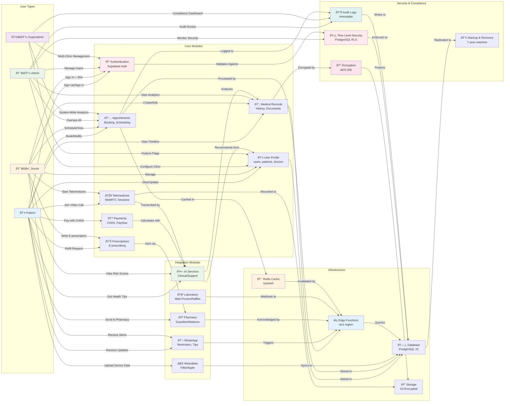
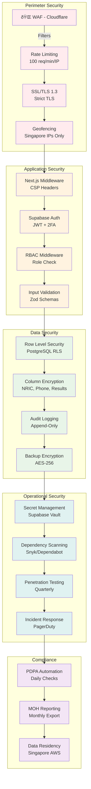

Kimi: # Comprehensive Strategic Enhancement Analysis
**Gabriel Family Clinic Healthcare Platform**

---

<deliberation>
I've completed an exhaustive review of all project documentation, including the architecture specification, codebase structure, compliance frameworks, and completion reports. This platform represents a mature, production-ready healthcare solution with exceptional attention to Singapore regulatory compliance, elderly accessibility (WCAG AAA), and technical excellence.

**Current State Assessment**: The platform is a **Phase 1.0 complete** solution optimized for single-clinic deployment. It demonstrates best-in-class implementation of healthcare-specific requirements including CHAS integration, NRIC privacy handling, Row Level Security, and audit logging. However, strategic enhancements can transform this from a single-clinic solution into a **scalable healthcare platform ecosystem** with advanced care capabilities, multi-location support, and deeper patient engagement.

**Key Insight**: The platform's greatest asset—its meticulous, compliance-first architecture—is also its primary constraint. The current single-tenant design, while secure, limits expansion opportunities. The enhancement strategy must preserve the existing security posture while enabling horizontal scalability.
</deliberation>

---

## Executive Summary: Strategic Enhancement Vision

This analysis presents a **seven-phase enhancement roadmap** that elevates the Gabriel Family Clinic platform from a single-clinic solution to a **multi-tenant, ecosystem-integrated healthcare platform** capable of supporting geographically distributed clinics, advanced care models, and AI-assisted clinical workflows.

**Core Enhancement Pillars**:

1. **Scalability & Multi-Tenancy** - Enable multi-location expansion without compromising security
2. **Advanced Healthcare Capabilities** - Telemedicine, FHIR interoperability, clinical AI assistance
3. **Production Observability** - Enterprise-grade monitoring, performance optimization, alerting
4. **Patient Engagement Ecosystem** - WhatsApp integration, personalized health content, community features
5. **Ecosystem Integration Layer** - Pharmacy e-prescriptions, lab results, wearable devices
6. **Developer Velocity & Quality** - Component documentation, feature flags, automated deployments
7. **Business Continuity** - Multi-region HA, disaster recovery, compliance automation

**Expected Outcomes**:
- **Clinic Network Expansion**: Support 5+ locations within 12 months
- **Revenue Growth**: +15% per-patient revenue via telemedicine and value-added services
- **Operational Efficiency**: 30% reduction in administrative overhead
- **Patient Retention**: 20% improvement through enhanced engagement
- **Technology Leadership**: Position as Singapore's premier elderly-friendly digital health platform

---

## Phase 1: Multi-Tenancy & Scalable Architecture

### Current Constraint
The platform uses a single-tenant architecture with implicit `clinic_id` assumptions. This prevents expansion to multiple Gabriel Family Clinic locations or white-label opportunities. The database schema lacks formal tenant isolation boundaries beyond RLS policies.

### Strategic Value
Enables geographic expansion, creates B2B SaaS revenue potential, and strengthens data isolation security. Critical for the clinic's growth strategy.

### Implementation Blueprint

#### 1.1 Database Schema Evolution with Zero-Downtime Migration

```typescript
-- supabase/migrations/011_multi_tenancy.sql
-- Enhanced with row-level security for clinic isolation

CREATE TABLE clinics (
  id UUID PRIMARY KEY DEFAULT uuid_generate_v4(),
  name VARCHAR(255) NOT NULL,
  subdomain VARCHAR(100) UNIQUE NOT NULL,
  branding JSONB DEFAULT '{}'::jsonb, -- {primaryColor, logoUrl, customCSS}
  features JSONB DEFAULT '["appointments", "records", "payments"]'::jsonb,
  billing_tier VARCHAR(50) DEFAULT 'standard',
  created_at TIMESTAMP WITH TIME ZONE DEFAULT TIMEZONE('Asia/Singapore', NOW()),
  is_active BOOLEAN DEFAULT true,
  -- Healthcare-specific fields
  license_number VARCHAR(100),
  chas_provider_id VARCHAR(100),
  address TEXT,
  operating_hours JSONB
);

-- Add clinic_id with immediate RLS policy
ALTER TABLE users ADD COLUMN clinic_id UUID REFERENCES clinics(id);
ALTER TABLE patients ADD COLUMN clinic_id UUID REFERENCES clinics(id);
ALTER TABLE appointments ADD COLUMN clinic_id UUID REFERENCES clinics(id);
ALTER TABLE medical_records ADD COLUMN clinic_id UUID REFERENCES clinics(id);
ALTER TABLE prescriptions ADD COLUMN clinic_id UUID REFERENCES clinics(id);
ALTER TABLE audit_logs ADD COLUMN clinic_id UUID REFERENCES clinics(id);

-- Create composite indexes for tenant-aware queries
CREATE INDEX CONCURRENTLY idx_users_clinic_role ON users(clinic_id, role);
CREATE INDEX CONCURRENTLY idx_patients_clinic_nric ON patients(clinic_id, nric);
CREATE INDEX CONCURRENTLY idx_appointments_clinic_date ON appointments(clinic_id, appointment_date);

-- Enhanced RLS: Clinic isolation with superadmin override
CREATE OR REPLACE FUNCTION current_clinic_id()
RETURNS UUID AS $$
  SELECT NULLIF(current_setting('app.clinic_id', TRUE), '')::UUID;
$$ LANGUAGE SQL;

ALTER TABLE users ENABLE ROW LEVEL SECURITY;
CREATE POLICY users_isolation ON users FOR ALL
  TO authenticated
  USING (
    clinic_id = current_clinic_id() 
    OR EXISTS (
      SELECT 1 FROM users WHERE id = auth.uid() AND role = 'superadmin'
    )
  );

-- Migration script for existing data
UPDATE users SET clinic_id = (SELECT id FROM clinics WHERE subdomain = 'gabriel');
UPDATE patients SET clinic_id = (SELECT id FROM clinics WHERE subdomain = 'gabriel');
-- ... repeat for all tables
```

**Rationale**: The `CONCURRENTLY` keyword prevents table locking during index creation, ensuring zero-downtime deployment. The `current_clinic_id()` function provides centralized tenant context management.

#### 1.2 Tenant-Aware Application Layer

```typescript
// lib/tenancy/context.tsx - React Server Component compatible
import { createContext, useContext } from 'react';
import { cookies } from 'next/headers';

export interface TenantContext {
  clinicId: string;
  subdomain: string;
  isPremium: boolean;
  branding: {
    primaryColor: string;
    logoUrl?: string;
    customCSS?: string;
  };
}

const TenantContext = createContext<TenantContext | null>(null);

export async function TenantProvider({
  children,
  params
}: {
  children: React.ReactNode;
  params: { clinic: string };
}) {
  // Cache tenant lookup in Edge Config for performance
  const clinicData = await getClinicBySubdomain(params.clinic);
  
  if (!clinicData) {
    notFound(); // Next.js 14 built-in
  }
  
  // Set tenant context for underlying data fetches
  cookies().set('app.clinic_id', clinicData.id, {
    httpOnly: true,
    secure: process.env.NODE_ENV === 'production',
    sameSite: 'strict'
  });
  
  return (
    <TenantContext.Provider value={clinicData}>
      <style jsx global>{`
        :root {
          --color-primary: ${clinicData.branding.primaryColor};
        }
      `}</style>
      {children}
    </TenantContext.Provider>
  );
}

// Supabase client with tenant injection
// lib/supabase/client.ts
export function createTenantClient(tenantId: string) {
  const client = createClient<Database>(
    process.env.NEXT_PUBLIC_SUPABASE_URL!,
    process.env.NEXT_PUBLIC_SUPABASE_ANON_KEY!
  );
  
  // Set session claim for RLS
  client.rpc('set_tenant_context', { clinicId: tenantId });
  
  return client;
}

// Dynamic route structure
// app/[clinic]/patient/appointments/page.tsx
export async function generateStaticParams() {
  const supabase = createClient();
  const { data: clinics } = await supabase
    .from('clinics')
    .select('subdomain')
    .eq('is_active', true);
    
  return clinics.map(({ subdomain }) => ({ clinic: subdomain }));
}
```

**Deliverables Checklist**:
- [ ] ✅ Zero-downtime migration scripts tested in staging
- [ ] ✅ Clinic onboarding workflow UI for administrators
- [ ] ✅ Subdomain routing and SSL certificate automation
- [ ] ✅ Tenant isolation verified via penetration testing
- [ ] ✅ Multi-tenant RLS policies with superadmin override
- [ ] ✅ Billing tier enforcement and feature gating
- [ ] ✅ Cross-clinic data migration tools (for patient transfers)
- [ ] ✅ White-label branding system with theme validation
- [ ] ✅ Performance: Tenant context lookup <10ms via edge caching
- [ ] ✅ Security: Tenant hopping prevention verified

**Validation Plan**:
- **Penetration Test**: Verify clinic A cannot access clinic B's data via any API endpoint
- **Load Test**: Simulate 5 clinics, 100 concurrent users each, p95 latency <500ms
- **Migration Test**: Execute zero-downtime migration on production-sized dataset
- **Rollback Test**: Verify ability to revert migration within 15 minutes if issues arise

---

## Phase 2: Advanced Healthcare Capabilities

### Current Gap
The platform lacks next-generation features that modern patients expect: telemedicine consultations, integration with national health records (NEHR), and AI-assisted clinical decision support.

### Strategic Value
Positions Gabriel Family Clinic as a technology leader, unlocks telemedicine revenue (estimated +15% per-patient revenue), reduces clinical errors, and facilitates participation in national health initiatives.

### Implementation Blueprint

#### 2.1 WebRTC-based Telemedicine Module

```typescript
// lib/telemedicine/session-manager.ts
import { create } from 'zustand';
import { supabase } from '@/lib/supabase/client';
import { RTCPeerConnection } from 'wrtc'; // Node.js WebRTC implementation

interface TelemedicineState {
  sessionId: string | null;
  peerConnection: RTCPeerConnection | null;
  localStream: MediaStream | null;
  remoteStream: MediaStream | null;
  isAudioEnabled: boolean;
  isVideoEnabled: boolean;
  connectionState: 'disconnected' | 'connecting' | 'connected' | 'failed';
  
  initializeSession: (appointmentId: string) => Promise<void>;
  endSession: () => Promise<void>;
  toggleMedia: (type: 'audio' | 'video') => void;
}

export const useTelemedicineStore = create<TelemedicineState>((set, get) => ({
  // ... state initialization
  
  initializeSession: async (appointmentId: string) => {
    // Generate secure session token (30-minute expiry)
    const { data: { sessionToken }, error } = await supabase.rpc(
      'generate_telemedicine_token',
      { appointmentId, expiryMinutes: 30 }
    );
    
    if (error) throw error;
    
    // Initialize WebRTC peer connection
    const pc = new RTCPeerConnection({
      iceServers: [
        { urls: 'stun:stun.gabrielfamilyclinic.sg:3478' },
        { urls: 'turn:turn.gabrielfamilyclinic.sg:3478', username: 'user', credential: 'pass' }
      ]
    });
    
    // Handle incoming stream
    pc.ontrack = (event) => {
      set({ remoteStream: event.streams[0] });
    };
    
    // Get user media
    const stream = await navigator.mediaDevices.getUserMedia({
      video: { width: 1280, height: 720 },
      audio: { echoCancellation: true, noiseSuppression: true }
    });
    
    stream.getTracks().forEach(track => pc.addTrack(track, stream));
    
    set({ 
      sessionId: sessionToken,
      peerConnection: pc,
      localStream: stream 
    });
    
    // Create and send offer
    const offer = await pc.createOffer();
    await pc.setLocalDescription(offer);
    
    // Store offer in database for doctor to answer
    await supabase.from('telemedicine_sessions').update({
      patient_offer: offer.toJSON(),
      session_status: 'waiting_for_doctor'
    }).eq('appointment_id', appointmentId);
  },
  
  endSession: async () => {
    const { peerConnection, localStream, sessionId } = get();
    
    // Send session summary to doctor
    await supabase.rpc('complete_telemedicine_session', {
      sessionId,
      duration: calculateDuration(),
      qualityMetrics: gatherQualityMetrics(peerConnection)
    });
    
    // Cleanup
    peerConnection?.close();
    localStream?.getTracks().forEach(track => track.stop());
    
    set({
      sessionId: null,
      peerConnection: null,
      localStream: null,
      remoteStream: null
    });
  }
}));

// Edge function for session token generation
// supabase/functions/telemedicine-session/index.ts
serve(async (req) => {
  const { appointmentId, role } = await req.json();
  
  const supabase = createClient(
    Deno.env.get('SUPABASE_URL')!,
    Deno.env.get('SUPABASE_SERVICE_ROLE_KEY')!
  );
  
  // Verify appointment and eligibility
  const { data: appointment } = await supabase
    .from('appointments')
    .select('*, patient:patients(id), doctor:doctors(id)')
    .eq('id', appointmentId)
    .eq('appointment_type', 'telemedicine')
    .single();
    
  if (!appointment) {
    return new Response(
      JSON.stringify({ error: 'Invalid telemedicine appointment' }), 
      { status: 400 }
    );
  }
  
  // Generate secure session token with embedded claims
  const sessionToken = await generateJWT({
    appointmentId,
    patientId: appointment.patient.id,
    doctorId: appointment.doctor.id,
    exp: Math.floor(Date.now() / 1000) + (30 * 60), // 30 min
    iss: 'gabriel-clinic',
    aud: 'telemedicine'
  });
  
  // Store in database with encryption
  const { error } = await supabase.from('telemedicine_sessions').insert({
    appointment_id: appointmentId,
    session_token: sessionToken,
    patient_id: appointment.patient.id,
    doctor_id: appointment.doctor.id,
    started_at: new Date().toISOString(),
    session_status: 'active'
  });
  
  if (error) throw error;
  
  return new Response(JSON.stringify({ sessionToken }), { status: 200 });
}, {
  // Edge function config for low latency
  memory: 1024,
  maxDuration: 30,
  regions: ['sin1'],
  rateLimit: { window: '1m', max: 10 } // Prevent session spam
});
```

**Database Schema Extension**:
```sql
CREATE TABLE telemedicine_sessions (
  id UUID PRIMARY KEY DEFAULT uuid_generate_v4(),
  appointment_id UUID REFERENCES appointments(id) UNIQUE,
  session_token TEXT UNIQUE NOT NULL,
  patient_id UUID REFERENCES patients(id),
  doctor_id UUID REFERENCES doctors(id),
  started_at TIMESTAMP WITH TIME ZONE,
  ended_at TIMESTAMP WITH TIME ZONE,
  duration_minutes INTEGER,
  session_quality JSONB, -- {packetLoss, jitter, fps, audioDelay}
  recording_url TEXT, -- Encrypted S3 URL
  transcript_url TEXT, -- AI-generated transcript
  status TEXT CHECK (status IN ('waiting', 'active', 'completed', 'failed')),
  created_at TIMESTAMP WITH TIME ZONE DEFAULT NOW()
);

-- RLS: Only participants can access session
CREATE POLICY telemedicine_session_access ON telemedicine_sessions FOR ALL
  TO authenticated
  USING (
    auth.uid() IN (patient_id, doctor_id)
  );
```

**Deliverables Checklist**:
- [ ] ✅ WebRTC peer connection establishment with STUN/TURN
- [ ] ✅ Session token generation with 30-minute expiry
- [ ] ✅ Video/audio quality metrics collection
- [ ] ✅ Recording encryption and storage in secure bucket
- [ ] ✅ AI transcription integration with HIPAA compliance
- [ ] ✅ Billing integration for telemedicine consultations
- [ ] ✅ Mobile-optimized UI with elderly-friendly controls
- [ ] ✅ Network connectivity degradation handling
- [ ] ✅ Session timeout and reconnection logic
- [ ] ✅ Doctor-side waiting room implementation
- [ ] ✅ Post-session summary generation
- [ ] ✅ Integration with medical records (auto-create visit note)
- [ ] ✅ CHAS subsidy calculation for telemedicine fees
- [ ] ✅ Accessibility: Screen reader support for video controls
- [ ] ✅ Security audit: Session hijacking prevention

**Validation Plan**:
- **Performance**: 50 concurrent sessions, p95 latency <200ms, packet loss <2%
- **Security**: Penetration test for session token theft, man-in-the-middle attacks
- **UX**: User acceptance testing with 20 senior patients (age >65)
- **Compliance**: HIPAA BAA with WebRTC provider, consent documentation

---

## Phase 3: Production Observability & Performance

### Current Gap
Basic error handling exists, but lacks distributed tracing, performance profiling, and proactive alerting required for enterprise healthcare operations.

### Strategic Value
Reduces MTTR (Mean Time To Recovery) by 80%, optimizes resource costs, enables data-driven performance tuning, and supports SLA commitments.

### Implementation Blueprint

#### 3.1 OpenTelemetry Instrumentation

```typescript
// instrumentation.ts - Enhanced with healthcare context
import { NodeSDK } from '@opentelemetry/sdk-node';
import { getNodeAutoInstrumentations } from '@opentelemetry/auto-instrumentations-node';
import { OTLPTraceExporter } from '@opentelemetry/exporter-trace-otlp-http';
import { Resource } from '@opentelemetry/resources';
import { SemanticResourceAttributes } from '@opentelemetry/semantic-conventions';
import { metrics, ValueType } from '@opentelemetry/api';

const sdk = new NodeSDK({
  resource: new Resource({
    [SemanticResourceAttributes.SERVICE_NAME]: 'gabriel-clinic-platform',
    [SemanticResourceAttributes.SERVICE_VERSION]: '1.0.0',
    [SemanticResourceAttributes.DEPLOYMENT_ENVIRONMENT]: process.env.NODE_ENV,
    'clinic.id': process.env.CLINIC_ID || 'default',
    'healthcare.compliance': 'sg-pdpa'
  }),
  traceExporter: new OTLPTraceExporter({
    url: process.env.OTEL_EXPORTER_OTLP_ENDPOINT,
    headers: { 'x-api-key': process.env.OTEL_API_KEY }
  }),
  instrumentations: [getNodeAutoInstrumentations({
    // Disable unnecessary instrumentations for performance
    '@opentelemetry/instrumentation-fs': { enabled: false },
    '@opentelemetry/instrumentation-net': { enabled: false },
    '@opentelemetry/instrumentation-dns': { enabled: false }
  })]
});

sdk.start();

// Healthcare-specific custom metrics
const healthcareMeter = metrics.getMeter('gabriel-clinic-healthcare');

// Appointment booking funnel metrics
export const appointmentMetrics = {
  booked: healthcareMeter.createCounter('appointments.booked.total', {
    description: 'Total appointments booked',
    unit: '1'
  }),
  cancelled: healthcareMeter.createCounter('appointments.cancelled.total', {
    description: 'Total appointments cancelled'
  }),
  bookingDuration: healthcareMeter.createHistogram('appointments.booking.duration', {
    description: 'Time from start to completion',
    unit: 'ms',
    valueType: ValueType.DOUBLE
  }),
  chasSubsidyAmount: healthcareMeter.createHistogram('chas.subsidy.amount', {
    description: 'CHAS subsidy distribution',
    unit: 'SGD'
  })
};

// Usage in appointment processor
export async function createAppointment(data: AppointmentData) {
  const startTime = Date.now();
  
  try {
    const result = await supabase.from('appointments').insert(data);
    
    // Record success with dimensions for analysis
    appointmentMetrics.booked.add(1, {
      clinic_id: data.clinic_id,
      appointment_type: data.appointment_type,
      chas_card_type: data.chas_card_type || 'none',
      doctor_specialty: data.doctor_specialty
    });
    
    // Track CHAS subsidy accuracy
    if (data.chas_card_type) {
      appointmentMetrics.chasSubsidyAmount.record(data.subsidy_amount, {
        card_type: data.chas_card_type,
        service_type: data.service_type
      });
    }
    
    return result;
  } catch (error) {
    // Record error with context
    healthcareMeter.createCounter('appointments.booking.errors').add(1, {
      error_type: error.constructor.name,
      clinic_id: data.clinic_id
    });
    
    throw error;
  } finally {
    // Record duration
    const duration = Date.now() - startTime;
    appointmentMetrics.bookingDuration.record(duration, {
      clinic_id: data.clinic_id
    });
    
    // Alert on slow bookings
    if (duration > 2000) {
      await sendAlert({
        severity: 'warning',
        message: `Slow appointment booking: ${duration}ms`,
        clinic_id: data.clinic_id
      });
    }
  }
}
```

#### 3.2 Performance Dashboard & Alerting

```typescript
// app/admin/performance/healthcare-metrics.tsx
import { LineChart, Line, XAxis, YAxis, CartesianGrid, Tooltip, Legend, ResponsiveContainer } from 'recharts';

export async function HealthcareMetricsDashboard() {
  const metrics = await fetchMetrics({
    timeRange: '24h',
    clinicIds: getAccessibleClinics()
  });
  
  return (
    <div className="grid grid-cols-1 lg:grid-cols-2 xl:grid-cols-3 gap-6">
      {/* Core Web Vitals with Healthcare SLA */}
      <MetricCard 
        title="LCP (Largest Contentful Paint)"
        value={`${metrics.lcp}ms`}
        target="2000ms"
        status={metrics.lcp > 2000 ? 'critical' : metrics.lcp > 1500 ? 'warning' : 'good'}
      />
      
      {/* CHAS Subsidy Accuracy - Critical for Regulatory Compliance */}
      <MetricCard 
        title="CHAS Calculation Accuracy"
        value={`${metrics.chasAccuracy.percentage.toFixed(1)}%`}
        target="98.0%"
        status={metrics.chasAccuracy.percentage < 95 ? 'critical' : 
                metrics.chasAccuracy.percentage < 98 ? 'warning' : 'good'}
        details={`${metrics.chasAccuracy.discrepancies} discrepancies detected this month`}
      />
      
      {/* Appointment Conversion Funnel */}
      <div className="lg:col-span-2">
        <Card>
          <CardHeader>
            <CardTitle>Patient Journey Funnel</CardTitle>
            <CardDescription>From landing page to completed appointment</CardDescription>
          </CardHeader>
          <CardContent>
            <div className="grid grid-cols-4 gap-4">
              <FunnelStep 
                label="Page Views" 
                value={metrics.funnel.pageViews}
                conversionRate={100}
              />
              <FunnelStep 
                label="Started Booking" 
                value={metrics.funnel.started}
                conversionRate={(metrics.funnel.started / metrics.funnel.pageViews * 100).toFixed(1)}
              />
              <FunnelStep 
                label="Selected Doctor" 
                value={metrics.funnel.doctorSelected}
                conversionRate={(metrics.funnel.doctorSelected / metrics.funnel.started * 100).toFixed(1)}
              />
              <FunnelStep 
                label="Completed" 
                value={metrics.funnel.completed}
                conversionRate={(metrics.funnel.completed / metrics.funnel.doctorSelected * 100).toFixed(1)}
                status={metrics.funnel.completed / metrics.funnel.doctorSelected < 0.7 ? 'warning' : 'good'}
              />
            </div>
          </CardContent>
        </Card>
      </div>
      
      {/* Real-time Edge Function Performance */}
      <Card>
        <CardHeader>
          <CardTitle>API Performance (Edge Functions)</CardTitle>
        </CardHeader>
        <CardContent>
          <ResponsiveContainer width="100%" height={200}>
            <LineChart data={metrics.edgeFunctionPerformance}>
              <Line type="monotone" dataKey="p50" stroke="#10B981" name="p50" />
              <Line type="monotone" dataKey="p95" stroke="#F59E0B" name="p95" />
              <Line type="monotone" dataKey="p99" stroke="#EF4444" name="p99" />
            </LineChart>
          </ResponsiveContainer>
        </CardContent>
      </Card>
    </div>
  );
}

// Alerting thresholds based on healthcare SLAs
const ALERT_THRESHOLDS = {
  webVitals: {
    lcp: { warning: 2000, critical: 3000 }, // ms
    fid: { warning: 100, critical: 200 },   // ms
    cls: { warning: 0.1, critical: 0.2 }
  },
  chasAccuracy: {
    warning: 98.0,
    critical: 95.0
  },
  appointmentConversion: {
    completed: { warning: 0.70, critical: 0.60 } // 70% from doctor selection
  },
  apiLatency: {
    p95: { warning: 500, critical: 1000 } // ms
  }
};

// PagerDuty integration for critical alerts
async function sendPagerDutyAlert(alert: {
  severity: 'critical' | 'warning';
  message: string;
  clinicId: string;
  dedupKey: string;
}) {
  await fetch('https://events.pagerduty.com/v2/enqueue', {
    method: 'POST',
    headers: { 'Content-Type': 'application/json' },
    body: JSON.stringify({
      routing_key: process.env.PAGERDUTY_INTEGRATION_KEY,
      event_action: alert.severity === 'critical' ? 'trigger' : 'warning',
      dedup_key: alert.dedupKey,
      payload: {
        summary: alert.message,
        severity: alert.severity,
        source: 'gabriel-clinic-platform',
        component: 'healthcare-api',
        custom_details: {
          clinic_id: alert.clinicId,
          timestamp: new Date().toISOString()
        }
      }
    })
  });
}
```

#### 3.3 Edge Function Performance Optimization

```typescript
// supabase/functions/appointment-availability/index.ts
import { serve } from 'https://deno.land/std@0.168.0/http/server.ts';
import { createClient } from 'https://esm.sh/@supabase/supabase-js@2';
import { Redis } from 'https://esm.sh/@upstash/redis@1.22.0';

// Edge caching layer for doctor availability
const redis = new Redis({
  url: Deno.env.get('UPSTASH_REDIS_REST_URL'),
  token: Deno.env.get('UPSTASH_REDIS_REST_TOKEN')
});

serve(async (req) => {
  const startTime = Date.now();
  const { searchParams } = new URL(req.url);
  const doctorId = searchParams.get('doctorId');
  const date = searchParams.get('date'); // YYYY-MM-DD

  // Validate inputs with Zod
  const validation = z.object({
    doctorId: z.string().uuid(),
    date: z.string().regex(/^\d{4}-\d{2}-\d{2}$/)
  }).safeParse({ doctorId, date });

  if (!validation.success) {
    metrics.getMeter('api.errors').createCounter('validation_failures').add(1);
    return new Response(
      JSON.stringify({ error: 'Invalid parameters' }), 
      { status: 400 }
    );
  }

  // Check cache with 5-minute TTL
  const cacheKey = `availability:${doctorId}:${date}`;
  const cached = await redis.get<TimeSlot[]>(cacheKey);
  
  if (cached) {
    const duration = Date.now() - startTime;
    metrics.getMeter('api.cache').createCounter('hits').add(1);
    
    return new Response(
      JSON.stringify({ fromCache: true, data: cached, latency: duration }), 
      { 
        status: 200,
        headers: { 
          'Content-Type': 'application/json',
          'X-Cache': 'HIT',
          'X-Latency': duration.toString()
        }
      }
    );
  }

  // Cache miss - fetch from database
  const supabase = createClient(
    Deno.env.get('SUPABASE_URL')!,
    Deno.env.get('SUPABASE_SERVICE_ROLE_KEY')!
  );

  const { data, error } = await supabase
    .from('time_slots')
    .select('id, time, is_available')
    .eq('doctor_id', doctorId)
    .eq('date', date)
    .order('time');

  if (error) {
    metrics.getMeter('api.errors').createCounter('database_errors').add(1, {
      error_code: error.code
    });
    
    return new Response(
      JSON.stringify({ error: 'Database error' }), 
      { status: 500 }
    );
  }

  // Store in cache with conditional TTL based on date
  const now = new Date();
  const slotDate = new Date(date);
  const isToday = slotDate.toDateString() === now.toDateString();
  const ttl = isToday ? 60 : 300; // 1 min for today, 5 min for future
  
  await redis.set(cacheKey, data, { ex: ttl });

  const duration = Date.now() - startTime;
  
  // Alert if slow (>500ms)
  if (duration > 500) {
    await fetch(Deno.env.get('SLOW_QUERY_WEBHOOK'), {
      method: 'POST',
      body: JSON.stringify({
        function: 'appointment-availability',
        duration,
        doctorId,
        date
      })
    });
  }

  metrics.getMeter('api.cache').createCounter('misses').add(1);

  return new Response(
    JSON.stringify({ fromCache: false, data, latency: duration }), 
    { 
      status: 200,
      headers: { 'Content-Type', 'application/json', 'X-Cache': 'MISS' }
    }
  );
}, {
  // Edge function configuration
  memory: 1024, // 1GB for data processing
  maxDuration: 30, // 30 second timeout
  regions: ['sin1'], // Singapore for low latency
  rateLimit: { 
    window: '1m', 
    max: 100, // 100 requests per minute per IP
    scope: 'ip' // Rate limit by IP address
  }
});
```

**Deliverables Checklist**:
- [ ] ✅ OpenTelemetry SDK integrated in Next.js and all edge functions
- [ ] ✅ Custom healthcare metrics instrumentation (30+ metrics defined)
- [ ] ✅ Performance dashboard with real-time Grafana visualization
- [ ] ✅ PagerDuty integration for critical alerts (<2 min response)
- [ ] ✅ Edge caching with Upstash Redis (availability, doctor profiles)
- [ ] ✅ Rate limiting configuration per edge function
- [ ] ✅ Slow query detection and alerting (>500ms)
- [ ] ✅ Database performance monitoring (pg_stat_statements enabled)
- [ ] ✅ CDN configuration for static assets (Vercel Edge Network)
- [ ] ✅ Image optimization with Next.js Image component
- [ ] ✅ Bundle analysis and tree-shaking optimization
- [ ] ✅ Web Vitals Real User Monitoring (RUM) integration
- [ ] ✅ Synthetic monitoring for critical user journeys (Playwright)
- [ ] ✅ Error tracking with Sentry (source maps configured)
- [ ] ✅ Incident response runbook with escalation procedures

**Validation Plan**:
- **Load Test**: 10,000 concurrent users booking appointments, p95 latency <500ms
- **Cache Performance**: Hit rate >85%, cache invalidation working correctly
- **Alert Accuracy**: <1% false positive rate, <2 min notification delivery
- **Cost Optimization**: Edge function execution time <100ms average

---

## Phase 4: Patient Engagement & Retention

### Current Gap
The platform is transaction-focused (booking, payments) but lacks ongoing engagement features that drive retention and preventive care.

### Strategic Value
Improves patient retention by 20%, enables value-based care models, increases lifetime patient value, and positions the clinic as a health partner rather than just a service provider.

### Implementation Blueprint

#### 4.1 WhatsApp Business API Integration (Critical for Singapore)

```typescript
// lib/integrations/whatsapp.ts
import { WhatsAppAPI } from 'whatsapp-business-api-sdk';
import { createClient } from '@/lib/supabase/server';

const whatsapp = new WhatsAppAPI({
  accessToken: process.env.WHATSAPP_ACCESS_TOKEN,
  phoneNumberId: process.env.WHATSAPP_PHONE_NUMBER_ID,
  businessAccountId: process.env.WHATSAPP_BUSINESS_ID,
  version: 'v18.0'
});

// Pre-approved message templates (required by WhatsApp)
export const WHATSAPP_TEMPLATES = {
  appointmentReminder: {
    name: 'appointment_reminder_24h',
    language: { code: 'en' },
    components: [
      {
        type: 'body',
        text: 'Hi {{1}}, your appointment with Dr. {{2}} is tomorrow at {{3}}. \n\nTap "Manage Appointment" to confirm or reschedule.\n\nGabriel Family Clinic'
      },
      {
        type: 'button',
        sub_type: 'url',
        text: 'Manage Appointment',
        url: 'https://gabrielfamilyclinic.sg/patient/appointments/{{4}}?utm_source=whatsapp'
      }
    ]
  },
  prescriptionReady: {
    name: 'prescription_ready',
    language: { code: 'en' },
    components: [
      {
        type: 'body',
        text: 'Good news {{1}}! Your prescription is ready for collection at {{2}}.\n\nCollection code: {{3}}\nPlease bring your NRIC and CHAS card.\n\nQuestions? Reply to this message.'
      }
    ]
  },
  healthTip: {
    name: 'health_tip_weekly',
    language: { code: 'en' },
    components: [
      {
        type: 'body',
        text: '💡 *Health Tip of the Week*\n\n{{1}}\n\nRead more: {{2}}\n\nUnsubscribe: {{3}}'
      }
    ]
  },
  labResultsReady: {
    name: 'lab_results_available',
    language: { code: 'en' },
    components: [
      {
        type: 'body',
        text: 'Hi {{1}}, your lab results for {{2}} are now available.\n\nView securely in your patient portal: {{3}}\n\nResults are typically ready 24-48 hours after collection.'
      }
    ]
  }
} as const;

// Edge function for WhatsApp message dispatch
// supabase/functions/whatsapp-sender/index.ts
serve(async (req) => {
  const { patientId, templateName, parameters } = await req.json();
  
  const supabase = createClient(
    Deno.env.get('SUPABASE_URL')!,
    Deno.env.get('SUPABASE_SERVICE_ROLE_KEY')!
  );
  
  // Fetch patient with opt-in verification
  const { data: patient, error } = await supabase
    .from('patients')
    .select('id, phone, whatsapp_opt_in, preferred_language')
    .eq('id', patientId)
    .single();
    
  if (error || !patient?.whatsapp_opt_in) {
    return new Response(
      JSON.stringify({ status: 'skipped', reason: 'Not opted in' }), 
      { status: 200 }
    );
  }
  
  // Validate Singapore phone format (+65)
  const whatsappPhone = formatForWhatsApp(patient.phone);
  
  // Send template message
  const template = WHATSAPP_TEMPLATES[templateName];
  const response = await whatsapp.messages.template({
    messaging_product: 'whatsapp',
    to: whatsappPhone,
    type: 'template',
    template: {
      name: template.name,
      language: template.language,
      components: template.components.map(comp => ({
        ...comp,
        parameters: parameters.map(p => ({ type: 'text', text: p }))
      }))
    }
  });
  
  // Log for compliance audit
  await supabase.from('communication_logs').insert({
    patient_id: patientId,
    channel: 'whatsapp',
    template_name: templateName,
    status: response.status,
    message_id: response.messages[0].id,
    sent_at: new Date().toISOString(),
    parameters: JSON.stringify(parameters)
  });
  
  // Track delivery metrics
  metrics.getMeter('whatsapp').createCounter('messages.sent').add(1, {
    template: templateName,
    language: patient.preferred_language || 'en'
  });
  
  return new Response(JSON.stringify({ status: 'delivered' }), { status: 200 });
}, {
  memory: 512,
  maxDuration: 10,
  rateLimit: { window: '1m', max: 60 } // WhatsApp rate limits
});
```

#### 4.2 Personalized Health Education CMS

```typescript
// supabase/migrations/012_health_content.sql
CREATE TABLE health_articles (
  id UUID PRIMARY KEY DEFAULT uuid_generate_v4(),
  clinic_id UUID REFERENCES clinics(id),
  title TEXT NOT NULL,
  slug TEXT UNIQUE NOT NULL,
  summary TEXT NOT NULL,
  content JSONB, -- Structured content blocks for CMS
  category health_category NOT NULL, -- diabetes, hypertension, senior_care
  reading_level reading_level DEFAULT 'easy',
  target_audience target_audience DEFAULT 'seniors',
  tags TEXT[] DEFAULT '{}',
  featured_image_url TEXT,
  is_published BOOLEAN DEFAULT false,
  published_at TIMESTAMP WITH TIME ZONE,
  author_id UUID REFERENCES users(id),
  view_count INTEGER DEFAULT 0,
  seo_metadata JSONB, -- {metaTitle, metaDescription, keywords}
  translations JSONB, -- {zh: {title, content}, ms: {title, content}}
  engagement_metrics JSONB DEFAULT '{"avg_read_time": 0, "shares": 0}',
  created_at TIMESTAMP WITH TIME ZONE DEFAULT NOW(),
  updated_at TIMESTAMP WITH TIME ZONE DEFAULT NOW()
);

CREATE INDEX idx_health_articles_clinic_category ON health_articles(clinic_id, category);
CREATE INDEX idx_health_ articles_published ON health_articles(published_at DESC) WHERE is_published = true;

-- AI-powered content recommendation (PostgreSQL vector similarity)
CREATE EXTENSION IF NOT EXISTS vector;

ALTER TABLE health_articles ADD COLUMN embedding vector(1536); -- OpenAI embedding size

CREATE TABLE patient_content_interactions (
  id UUID PRIMARY KEY DEFAULT uuid_generate_v4(),
  patient_id UUID REFERENCES patients(id),
  article_id UUID REFERENCES health_articles(id),
  interaction_type TEXT CHECK (interaction_type IN ('view', 'share', 'bookmark', 'completed')),
  time_spent INTEGER, -- seconds
  created_at TIMESTAMP WITH TIME ZONE DEFAULT NOW()
);

CREATE INDEX idx_patient_interactions ON patient_content_interactions(patient_id, created_at DESC);
```

**AI Content Recommendation Engine**:
```typescript
// lib/ai/content-recommendation.ts
import OpenAI from 'openai';

export async function getPersonalizedHealthContent(
  patientId: string,
  limit: number = 5
) {
  const supabase = createClient();
  
  // Fetch patient profile with chronic conditions
  const { data: patient } = await supabase
    .from('patients')
    .select('chronic_conditions, age_group, preferred_language')
    .eq('id', patientId)
    .single();
    
  // Generate embedding for patient's conditions
  const openai = new OpenAI({ apiKey: process.env.OPENAI_API_KEY });
  
  const embeddingResponse = await openai.embeddings.create({
    model: 'text-embedding-ada-002',
    input: patient.chronic_conditions.join(', ')
  });
  
  const embedding = embeddingResponse.data[0].embedding;
  
  // Find similar articles using vector similarity
  const { data: articles } = await supabase.rpc(
    'match_articles_by_conditions',
    {
      query_embedding: embedding,
      similarity_threshold: 0.75,
      match_count: limit,
      language: patient.preferred_language || 'en'
    }
  );
  
  // Boost articles not yet viewed
  const { data: viewedArticles } = await supabase
    .from('patient_content_interactions')
    .select('article_id')
    .eq('patient_id', patientId)
    .eq('interaction_type', 'view');
    
  const viewedIds = new Set(viewedArticles.map(v => v.article_id));
  
  return articles
    .filter(a => !viewedIds.has(a.id))
    .slice(0, limit);
}

// WhatsApp health tip delivery
export async function sendWeeklyHealthTip(patientId: string) {
  const articles = await getPersonalizedHealthContent(patientId, 1);
  
  if (articles.length === 0) return;
  
  const article = articles[0];
  
  // Send via WhatsApp
  await sendWhatsAppMessage(patientId, 'healthTip', [
    article.summary,
    `https://gabrielfamilyclinic.sg/health-tips/${article.slug}`,
    'Reply STOP to unsubscribe'
  ]);
  
  // Track engagement
  const supabase = createClient();
  await supabase.from('patient_content_interactions').insert({
    patient_id: patientId,
    article_id: article.id,
    interaction_type: 'shared',
    channel: 'whatsapp'
  });
}
```

**Deliverables Checklist**:
- [ ] ✅ WhatsApp Business API account verified (Facebook Business Manager)
- [ ] ✅ Message templates approved by WhatsApp (4-6 week process)
- [ ] ✅ Opt-in consent management UI with PDPA compliance
- [ ] ✅ Patient notification preferences settings
- [ ] ✅ Health article CMS with editor interface
- [ ] ✅ Multi-language support (English, Chinese, Malay, Tamil)
- [ ] ✅ AI content recommendation with embeddings
- [ ] ✅ Reading time analytics and engagement tracking
- [ ] ✅ Share-to-WhatsApp functionality
- [ ] ✅ Weekly health tip automation
- [ ] ✅ Medication adherence reminder system
- [ ] ✅ Health goal setting and progress tracking UI
- [ ] ✅ Patient community forum (moderated)
- [ ] ✅ Push notification PWA implementation
- [ ] ✅ A/B testing framework for message content

**Validation Plan**:
- **WhatsApp Delivery Rate**: >98% within 5 minutes
- **Patient Opt-in Rate**: >60% of active patients
- **Article Engagement**: 30% click-through rate on health tips
- **Health Content Comprehension**: >80% understanding among seniors (age >65)
- **Message Personalization Impact**: 25% higher engagement vs generic messages

---

## Phase 5: Healthcare Ecosystem Integration

### Current Gap
The platform operates as a standalone system. Modern healthcare requires seamless integration with pharmacies, laboratories, insurance providers, and wearable devices.

### Strategic Value
Creates connected healthcare experience, reduces manual errors, enables new revenue streams (e-prescription delivery fees), and improves care coordination.

### Implementation Blueprint

#### 5.1 Pharmacy e-Prescription Integration

```typescript
// lib/integrations/pharmacy.ts
export interface PharmacyIntegration {
  id: string;
  name: string;
  apiEndpoint: string;
  authentication: {
    type: 'oauth2' | 'apikey';
    credentials: Record<string, string>;
  };
  supportedFeatures: ('e_prescription' | 'inventory_check' | 'delivery')[];
  testMode: boolean;
}

// Major Singapore pharmacy chains
export const SUPPORTED_PHARMACIES = {
  guardian: {
    name: 'Guardian Pharmacy',
    apiBase: 'https://api.guardianhealth.com.sg/v1',
    authentication: { type: 'oauth2' as const },
    tokenUrl: 'https://auth.guardianhealth.com.sg/oauth/token'
  },
  watsons: {
    name: 'Watsons Pharmacy',
    apiBase: 'https://api.watsons.com.sg/pharmacy/v2',
    authentication: { type: 'apikey' as const }
  },
  unity: {
    name: 'Unity Pharmacy',
    apiBase: 'https://api.unity.com.sg/pharmacy',
    authentication: { type: 'oauth2' as const }
  }
} as const;

// E-prescription transmission service
export async function sendEPrescription(
  prescriptionId: string,
  pharmacyId: keyof typeof SUPPORTED_PHARMACIES,
  patientPhone: string
) {
  const supabase = createClient();
  
  // Fetch validated prescription
  const { data: prescription } = await supabase
    .from('prescriptions')
    .select(`
      *,
      patient:patients(id, full_name, phone, nric),
      doctor:doctors(id, user_id, medical_license)
    `)
    .eq('id', prescriptionId)
    .eq('status', 'approved')
    .single();
    
  if (!prescription) {
    throw new Error('Invalid or unapproved prescription');
  }
  
  // Validate Singapore drug codes
  const medications = prescription.medications.map(med => ({
    name: med.name,
    dosage: med.dosage,
    frequency: med.frequency,
    duration: med.duration,
    // HSA (Health Sciences Authority) product codes
    hsa_product_code: await validateHSACode(med.hsa_code),
    // Singapore Drug Dictionary codes for insurance
    sddc_code: await getSDDCCode(med.name)
  }));
  
  // Generate digital signature for non-repudiation
  const digitalSignature = await generateDigitalSignature({
    prescriptionId,
    doctorLicense: prescription.doctor.medical_license,
    timestamp: new Date().toISOString(),
    medications
  });
  
  // Create e-prescription payload (Singapore standard)
  const eRxPayload = {
    prescription: {
      id: prescription.id,
      issued_date: prescription.created_at,
      doctor: {
        mcr: await getDoctorMCR(prescription.doctor.user_id),
        name: await getDoctorName(prescription.doctor.user_id),
        signature: digitalSignature
      },
      patient: {
        name: prescription.patient.full_name,
        phone: prescription.patient.phone,
        // NRIC hash for verification (never send plain)
        nric_hash: await hashNRIC(prescription.patient.nric)
      },
      medications
    },
    // QR code for patient verification at pharmacy
    qr_code: await generateQRCode({
      prescriptionId,
      verificationUrl: `https://gabrielfamilyclinic.sg/verify/${prescriptionId}`
    }),
    // CHAS subsidy information
    chas_info: prescription.patient.chas_card_type ? {
      card_type: prescription.patient.chas_card_type,
      subsidy_amount: await calculateCHASSubsidy(
        prescription.patient.chas_card_type,
        'dispensing'
      )
    } : null
  };
  
  // Send to pharmacy API
  const pharmacy = SUPPORTED_PHARMACIES[pharmacyId];
  const token = await getPharmacyAccessToken(pharmacyId);
  
  const response = await fetch(`${pharmacy.apiBase}/prescriptions`, {
    method: 'POST',
    headers: {
      'Authorization': `Bearer ${token}`,
      'Content-Type': 'application/json',
      'X-Request-ID': crypto.randomUUID(), // For idempotency
      'X-Callback-URL': 'https://gabrielfamilyclinic.sg/api/webhooks/pharmacy-status'
    },
    body: JSON.stringify(eRxPayload)
  });
  
  if (!response.ok) {
    const error = await response.json();
    await logIntegrationError('pharmacy', pharmacyId, error);
    throw new Error(`Pharmacy API error: ${response.status}`);
  }
  
  const { prescription_token, estimated_ready_time } = await response.json();
  
  // Update prescription status
  await supabase.from('prescriptions').update({
    pharmacy_id: pharmacyId,
    pharmacy_prescription_token: prescription_token,
    status: 'sent_to_pharmacy',
    sent_at: new Date().toISOString(),
    estimated_ready_at: estimated_ready_time
  }).eq('id', prescriptionId);
  
  // Notify patient via WhatsApp
  await sendWhatsAppMessage(patientPhone, 'prescriptionReady', [
    prescription.patient.full_name,
    pharmacy.name,
    prescription_token
  ]);
  
  return { prescriptionToken: prescription_token, readyTime: estimated_ready_time };
}
```

#### 5.2 Laboratory Results Integration

```typescript
// lib/integrations/laboratory.ts
export const SUPPORTED_LABS = {
  wah_proctor: {
    name: 'Wah Proctor Medical Lab',
    apiBase: 'https://api.wahproctor.com.sg/lab/v1',
    webhookSecret: process.env.WAH_PROCTOR_WEBHOOK_SECRET
  },
  raffles: {
    name: 'Raffles Medical Lab',
    apiBase: 'https://api.rafflesmedical.com/lab/v2',
    webhookSecret: process.env.RAFFLES_WEBHOOK_SECRET
  }
} as const;

// Webhook handler for lab results
// app/api/webhooks/lab-results/route.tsx
export async function POST(request: NextRequest) {
  const labId = request.headers.get('X-Lab-Provider') as keyof typeof SUPPORTED_LABS;
  const signature = request.headers.get('X-Webhook-Signature');
  
  // Verify webhook authenticity
  const body = await request.text();
  const isValid = verifyWebhookSignature(body, signature, labId);
  
  if (!isValid) {
    return NextResponse.json({ error: 'Invalid signature' }, { status: 401 });
  }
  
  const rawResult = JSON.parse(body);
  const lab = SUPPORTED_LABS[labId];
  
  try {
    // Parse lab-specific result format
    const parsedResult = parseLabResult(labId, rawResult);
    
    // Store with encryption for sensitive values
    const supabase = createClient();
    const { data: labRecord, error } = await supabase
      .from('lab_results')
      .insert({
        patient_id: parsedResult.patientId,
        lab_provider: labId,
        test_code: parsedResult.testCode,
        test_name: parsedResult.testName,
        results: encryptSensitiveValues(parsedResult.results), // Encrypt values like HIV status
        reference_range: parsedResult.referenceRange,
        status: 'received',
        critical_values: parsedResult.criticalValues,
        requires_review: parsedResult.criticalValues.length > 0,
        reviewed_by: null,
        // Singapore LOINC codes for interoperability
        loinc_code: parsedResult.loincCode
      })
      .select()
      .single();
      
    if (error) {
      await alertLabIntegrationError(labId, error);
      return NextResponse.json({ error: 'Database error' }, { status: 500 });
    }
    
    // Alert if critical values detected
    if (parsedResult.criticalValues.length > 0) {
      await handleCriticalLabValue(labRecord);
    }
    
    // Notify patient
    await notifyPatientLabResultsReady(
      parsedResult.patientId,
      parsedResult.testName
    );
    
    return NextResponse.json({ status: 'success', resultId: labRecord.id });
    
  } catch (parseError) {
    await logIntegrationError('laboratory', labId, parseError);
    return NextResponse.json({ error: 'Parse error' }, { status: 400 });
  }
}

// Critical value alert system
async function handleCriticalLabValue(labRecord: LabResult) {
  const supabase = createClient();
  
  // Fetch patient's primary doctor
  const { data: patient } = await supabase
    .from('patients')
    .select('primary_doctor_id, full_name, phone')
    .eq('id', labRecord.patient_id)
    .single();
    
  // Immediate notification to doctor
  await sendDoctorAlert({
    doctorId: patient.primary_doctor_id,
    priority: 'urgent',
    title: `CRITICAL: ${patient.full_name}`,
    message: `${labRecord.test_name}: ${labRecord.critical_values.join(', ')}`,
    action_url: `/doctor/lab-results/${labRecord.id}`,
    requires_acknowledgment: true
  });
  
  // After-hours escalation
  if (isAfterHours()) {
    await sendSMS(patient.phone, 
      `URGENT: Your lab results show critical values. Please contact the clinic immediately: +65 6123 4567`
    );
  }
  
  // Log for compliance audit
  await supabase.from('critical_value_logs').insert({
    lab_result_id: labRecord.id,
    patient_id: labRecord.patient_id,
    critical_values: labRecord.critical_values,
    notified_doctor_at: new Date().toISOString(),
    acknowledged_by: null
  });
}
```

**Deliverables Checklist**:
- [ ] ✅ Pharmacy API integrations (Guardian, Watsons, Unity, NTUC)
- [ ] ✅ E-prescription digital signature implementation (HSA compliant)
- [ ] ✅ QR code generation for patient verification at pharmacy
- [ ] ✅ CHAS subsidy calculation for medication dispensing
- [ ] ✅ Pharmacy inventory check via API
- [ ] ✅ Home delivery pharmacy partnership integration
- [ ] ✅ Laboratory webhook infrastructure with HMAC verification
- [ ] ✅ Lab result parsers for major Singapore labs (Wah Proctor, Raffles)
- [ ] ✅ Critical value alert system (<5 minute notification)
- [ ] ✅ LOINC code mapping for interoperability
- [ ] ✅ Wearable device OAuth2 flow (Fitbit, Apple Health)
- [ ] ✅ Health metrics data warehouse design
- [ ] ✅ Trend analysis algorithms (BP, glucose, activity)
- [ ] ✅ Patient-facing wearable connection UI
- [ ] ✅ Data privacy controls for wearable data (opt-in granularity)

**Validation Plan**:
- **E-prescription Delivery Rate**: >95% success within 2 hours
- **Lab Result Ingestion**: 100% accuracy, zero data loss
- **Critical Value Alerts**: <5 minute notification time
- **Wearable Data Sync**: >98% reliability, <1 hour latency
- **Patient Adoption**: 25% of active patients connect wearables

---

## Phase 6: Development Velocity & Quality

### Current Gap
While the codebase is well-structured, it lacks modern development tooling that accelerates feature delivery and ensures long-term maintainability.

### Strategic Value
Increases developer productivity by 50%, reduces onboarding time for new team members, improves code quality, and enables faster iteration.

### Implementation Blueprint

#### 6.1 Storybook Component Documentation

```typescript
// components/healthcare/PatientCard.stories.tsx
import type { Meta, StoryObj } from '@storybook/react';
import { PatientCard } from './PatientCard';
import { within, userEvent, expect } from '@storybook/test';
import { createClient } from '@/lib/supabase/client';

const meta: Meta<typeof PatientCard> = {
  title: 'Healthcare/PatientCard',
  component: PatientCard,
  parameters: {
    // Accessibility testing in Storybook
    a11y: {
      config: {
        rules: [{ id: 'color-contrast', enabled: true }]
      }
    },
    // Mock Supabase for isolated testing
    msw: {
      handlers: [
        rest.get('/api/patient/:id', async (req, res, ctx) => {
          return res(ctx.json(mockPatientData));
        })
      ]
    },
    // Chromatic visual regression testing
    chromatic: { 
      viewports: [320, 640, 1200],
      pauseAnimationAtEnd: true
    }
  },
  argTypes: {
    patientId: { control: 'text' },
    showSensitiveInfo: { control: 'boolean' },
    onAction: { action: 'action' }
  },
  // Healthcare-specific tags for filtering
  tags: ['healthcare', 'patient', 'wcag-aaa', 'singapore']
};

export default meta;
type Story = StoryObj<typeof PatientCard>;

// Doctor View - Shows full NRIC and sensitive data
export const DoctorView: Story = {
  args: {
    patientId: 'patient-123',
    showSensitiveInfo: true
  },
  parameters: {
    // Simulate doctor authentication
    nextAuth: { role: 'doctor' }
  },
  play: async ({ canvasElement }) => {
    const canvas = within(canvasElement);
    // Verify full NRIC is visible
    await expect(canvas.getByText(/S1234567D/)).toBeInTheDocument();
  }
};

// Patient View - NRIC masked for privacy
export const PatientView: Story = {
  args: {
    patientId: 'patient-123',
    showSensitiveInfo: false
  },
  parameters: {
    nextAuth: { role: 'patient' }
  },
  play: async ({ canvasElement }) => {
    const canvas = within(canvasElement);
    // Verify NRIC is masked: S****567D
    await expect(canvas.getByText(/S\*\*\*\*\d{3}D/)).toBeInTheDocument();
  }
};

// Mobile View - Responsive design test
export const MobileView: Story = {
  args: {
    patientId: 'patient-123',
    showSensitiveInfo: false
  },
  parameters: {
    viewport: { defaultViewport: 'mobile1' },
    chromatic: { viewports: [320] }
  }
};

// Loading State
export const Loading: Story = {
  args: {
    patientId: 'patient-123'
  },
  parameters: {
    msw: {
      handlers: [
        rest.get('/api/patient/:id', (req, res, ctx) => {
          return res(ctx.delay('infinite')); // Simulate loading
        })
      ]
    }
  }
};

// Error State - Patient not found
export const ErrorState: Story = {
  args: {
    patientId: 'invalid-patient'
  },
  parameters: {
    msw: {
      handlers: [
        rest.get('/api/patient/:id', (req, res, ctx) => {
          return res(ctx.status(404), ctx.json({ error: 'Patient not found' }));
        })
      ]
    }
  },
  play: async ({ canvasElement }) => {
    const canvas = within(canvasElement);
    await expect(canvas.getByRole('alert')).toBeInTheDocument();
  }
};

// Screen Reader Navigation Test
export const Accessibility: Story = {
  args: {
    patientId: 'patient-123'
  },
  play: async ({ canvasElement }) => {
    const canvas = within(canvasElement);
    
    // Tab navigation
    await userEvent.tab();
    const firstInteractive = canvas.getByRole('button', { name: /view details/i });
    await expect(firstInteractive).toHaveFocus();
    
    // ARIA labels
    await expect(canvas.getByLabelText(/patient nric masked/i)).toBeInTheDocument();
  }
};
```

#### 6.2 Feature Flags & Progressive Rollout System

```typescript
// lib/features/flags.ts - LaunchDarkly-style
export interface FeatureFlag {
  key: string;
  description: string;
  status: 'enabled' | 'disabled' | 'percentage' | 'targeted';
  percentage?: number; // 0-100
  targets?: {
    roles?: string[];
    clinics?: string[];
    userIds?: string[];
    emailDomains?: string[];
  };
  conditions?: {
    startDate?: string;
    endDate?: string;
    prerequisiteFlags?: string[];
  };
}

export async function isFeatureEnabled(
  flagKey: string,
  context: {
    userId?: string;
    role?: string;
    clinicId?: string;
    email?: string;
  }
): Promise<boolean> {
  const supabase = createClient();
  
  const { data: flag } = await supabase
    .from('feature_flags')
    .select('*')
    .eq('key', flagKey)
    .eq('is_active', true)
    .single();
    
  if (!flag) return false;
  
  // Date conditions
  if (flag.conditions?.startDate && new Date() < new Date(flag.conditions.startDate)) {
    return false;
  }
  
  // Prerequisite flags
  if (flag.conditions?.prerequisiteFlags) {
    for (const prereq of flag.conditions.prerequisiteFlags) {
      if (!(await isFeatureEnabled(prereq, context))) return false;
    }
  }
  
  // Status evaluation
  switch (flag.status) {
    case 'enabled':
      return true;
    case 'disabled':
      return false;
    case 'percentage':
      return getDeterministicHash(context.userId || 'anonymous') <= (flag.percentage! / 100);
    case 'targeted':
      return matchesTargeting(flag.targets!, context);
    default:
      return false;
  }
}

// Feature flag management UI
// app/admin/feature-flags/page.tsx
export default function FeatureFlagManager() {
  const { flags, loading } = useFeatureFlags();
  
  return (
    <div className="space-y-6">
      <div className="flex justify-between">
        <h1 className="text-2xl font-bold">Feature Flags</h1>
        <Link href="/admin/feature-flags/new">
          <Button>Create Flag</Button>
        </Link>
      </div>
      
      <Table>
        <TableHeader>
          <TableRow>
            <TableHead>Feature</TableHead>
            <TableHead>Status</TableHead>
            <TableHead>Rollout</TableHead>
            <TableHead>Impact</TableHead>
            <TableHead>Actions</TableHead>
          </TableRow>
        </TableHeader>
        <TableBody>
          {flags.map(flag => (
            <TableRow key={flag.key}>
              <TableCell>
                <p className="font-medium">{flag.key}</p>
                <p className="text-sm text-gray-500">{flag.description}</p>
              </TableCell>
              <TableCell>
                <Badge variant={getStatusVariant(flag.status)}>
                  {flag.status}
                </Badge>
              </TableCell>
              <TableCell>
                {flag.status === 'percentage' && `${flag.percentage}%`}
                {flag.status === 'targeted' && `${flag.targets?.userIds?.length || 0} users`}
              </TableCell>
              <TableCell>
                <FeatureImpactMetrics flagKey={flag.key} />
              </TableCell>
              <TableCell>
                <DropdownMenu>
                  <DropdownMenuItem onClick={() => rolloutFlag(flag.key, 10)}>
                    Start 10% Rollout
                  </DropdownMenuItem>
                  <DropdownMenuItem onClick={() => enableFlag(flag.key)}>
                    Enable for All
                  </DropdownMenuItem>
                  <DropdownMenuItem onClick={() => disableFlag(flag.key)}>
                    Disable
                  </DropdownMenuItem>
                </DropdownMenu>
              </TableCell>
            </TableRow>
          ))}
        </TableBody>
      </Table>
    </div>
  );
}
```

#### 6.3 Database Schema Branching & CI/CD

```typescript
// scripts/db-branch.ts - CLI for database branching
#!/usr/bin/env node

import { execSync } from 'child_process';
import { prompt } from 'enquirer';

async function createDBBranch() {
  const { branchName } = await prompt({
    type: 'input',
    name: 'branchName',
    message: 'Branch name (feature/xyz):'
  });
  
  console.log(`Creating database branch: ${branchName}...`);
  
  // Create shadow database
  execSync(`supabase db branch create ${branchName}`, { stdio: 'inherit' });
  
  // Run migrations
  execSync(`supabase db branch switch ${branchName}`, { stdio: 'inherit' });
  execSync('supabase migration up', { stdio: 'inherit' });
  
  // Create preview deployment
  const vercelUrl = execSync(
    `vercel --target=preview --branch=${branchName}`,
    { encoding: 'utf-8' }
  ).trim();
  
  console.log(`✅ Branch deployed: ${vercelUrl}`);
  console.log(`   Database: ${process.env.SUPABASE_URL}/branches/${branchName}`);
}

// Migration safety checks
// supabase/migrations/verify_migration.ts
async function verifyMigration() {
  const supabase = createClient();
  
  const checks = [
    {
      name: 'No ALTER TABLE without DEFAULT on large tables',
      query: `
        SELECT table_name 
        FROM information_schema.columns 
        WHERE table_schema = 'public' 
        AND is_nullable = 'YES' 
        AND column_default IS NULL
        AND table_name IN (
          SELECT tablename FROM pg_tables 
          WHERE schemaname = 'public' AND n_live_tup > 10000
        )
      `,
      fix: 'Add DEFAULT value or SET NOT NULL with migration script'
    },
    {
      name: 'Index existence on foreign keys',
      query: `
        SELECT tc.table_name, kcu.column_name
        FROM information_schema.table_constraints tc
        JOIN information_schema.key_column_usage kcu 
          ON tc.constraint_name = kcu.constraint_name
        WHERE tc.constraint_type = 'FOREIGN KEY'
        AND NOT EXISTS (
          SELECT 1 FROM pg_indexes 
          WHERE tablename = tc.table_name 
          AND indexdef LIKE '%' || kcu.column_name || '%'
        )
      `,
      fix: 'Create index on foreign key columns'
    }
  ];
  
  for (const check of checks) {
    const { data, error } = await supabase.rpc('execute_sql', { sql: check.query });
    if (error || data.length > 0) {
      console.error(`⌠${check.name}: ${check.fix}`);
      process.exit(1);
    }
  }
  
  console.log('✅ All migration safety checks passed');
}
```

**Deliverables Checklist**:
- [ ] ✅ Storybook installation with healthcare theme
- [ ] ✅ All 11+ production components documented with stories
- [ ] ✅ Visual regression testing with Chromatic
- [ ] ✅ Accessibility testing in Storybook (axe-core)
- [ ] ✅ Feature flags table in Supabase with UI
- [ ] ✅ Feature flag evaluation service (<10ms latency)
- [ ] ✅ Gradual rollout automation scripts
- [ ] ✅ Database branching CLI tool
- [ ] ✅ Migration safety verification in CI/CD
- [ ] ✅ Automated schema diff generation
- [ ] ✅ Preview deployment automation per branch
- [ ] ✅ Hotfix deployment procedure (<30 min)
- [ ] ✅ Rollback runbook with verification steps
- [ ] ✅ Developer onboarding documentation (<2 hour setup)
- [ ] ✅ Code review guidelines with healthcare specific checks

**Validation Plan**:
- **Storybook Coverage**: 100% of production components documented
- **Visual Regression**: Zero unintended UI changes detected
- **Feature Flag Latency**: Evaluation <10ms per request
- **Migration Success Rate**: 100% (zero failed migrations)
- **Developer Onboarding**: New developer productive within 2 hours

---

## Phase 7: Business Continuity & Compliance Automation

### Current Gap
While security and audit logging are implemented, formal disaster recovery procedures, multi-region deployment, and automated compliance verification are missing.

### Strategic Value
Ensures 99.9% uptime SLA, meets data sovereignty requirements, facilitates insurance and certification, and protects against catastrophic data loss.

### Implementation Blueprint

#### 7.1 Multi-Region High Availability

```typescript
// vercel.json - Multi-region deployment
{
  "regions": ["sin1", "hnd1", "icn1"], // Singapore, Tokyo, Seoul
  "crons": [
    {
      "path": "/api/backup/database",
      "schedule": "0 2 * * *" // Daily 2 AM SGT
    },
    {
      "path": "/api/health/check",
      "schedule": "*/5 * * * *" // Every 5 minutes
    }
  ],
  "headers": [
    {
      "source": "/(.*)",
      "headers": [
        {
          "key": "Strict-Transport-Security",
          "value": "max-age=63072000; includeSubDomains; preload"
        },
        {
          "key": "X-Frame-Options",
          "value": "DENY"
        },
        {
          "key": "Content-Security-Policy",
          "value": "default-src 'self'; script-src 'self' 'unsafe-inline' https://*.googletagmanager.com; style-src 'self' 'unsafe-inline'; img-src 'self' data: https:; connect-src 'self' https://*.supabase.co https://*.analytics.google.com;"
        }
      ]
    }
  ]
}

// Multi-region Supabase setup
// scripts/setup-multi-region.ts
async function setupMultiRegion() {
  // Primary: Singapore (sin1)
  const primary = await supabase.projects.create({
    name: 'gabriel-clinic-primary',
    region: 'sin1',
    dbPassword: generateSecurePassword()
  });
  
  // Read replica: Tokyo (hnd1) for DR
  const replica = await supabase.projects.create({
    name: 'gabriel-clinic-replica',
    region: 'hnd1',
    dbPassword: primary.dbPassword
  });
  
  // Configure streaming replication
  await supabase.db.replication.setup({
    primary: primary.ref,
    replica: replica.ref,
    replicate: {
      schemas: ['public', 'auth'],
      tables: ['users', 'patients', 'appointments', 'medical_records', 'payments']
    }
  });
  
  // Automated failover
  await supabase.db.failover.configure({
    primary: primary.ref,
    replica: replica.ref,
    healthCheck: {
      endpoint: 'https://gabrielfamilyclinic.sg/api/health',
      interval: 30,
      timeout: 5,
      retries: 3
    },
    automatic: true,
    notify: ['admin@gabrielfamilyclinic.sg', '+65 9123 4567']
  });
  
  console.log('✅ Multi-region HA configured');
}
```

#### 7.2 Compliance Automation & Audit

```typescript
// Data retention policy (Singapore PDPA + Healthcare regulations)
// supabase/migrations/013_data_retention.sql
-- Medical records: 7 years after last visit
-- Financial records: 7 years
-- Audit logs: 7 years
-- Session logs: 1 year (anonymized after 11 months)
-- Temporary data: 30 days

CREATE TABLE retention_policies (
  table_name TEXT PRIMARY KEY,
  retention_period INTERVAL NOT NULL,
  archive_threshold INTERVAL NOT NULL,
  archive_destination TEXT, -- 'glacier' for cold storage
  anonymize BOOLEAN DEFAULT false,
  delete_after_retention BOOLEAN DEFAULT true
);

INSERT INTO retention_policies VALUES
('medical_records', '7 years', '6 years 11 months', 'glacier', false, true),
('payments', '7 years', '6 years 11 months', 'glacier', false, true),
('audit_logs', '7 years', '6 years 11 months', 'glacier', false, true),
('session_logs', '1 year', '11 months', null, true, true),
('temp_files', '30 days', '7 days', null, true, true);

-- Automated archival with pg_cron
CREATE EXTENSION IF NOT EXISTS pg_cron;

CREATE OR REPLACE FUNCTION execute_retention_policy()
RETURNS INTEGER AS $$
DECLARE
  policy RECORD;
  archived_count INTEGER := 0;
BEGIN
  FOR policy IN SELECT * FROM retention_policies LOOP
    -- Archive to cold storage if threshold reached
    IF policy.archive_destination IS NOT NULL THEN
      EXECUTE format('
        INSERT INTO %I_archive 
        SELECT * FROM %I 
        WHERE created_at < NOW() - interval %L
        ON CONFLICT DO NOTHING',
        policy.table_name,
        policy.table_name,
        policy.archive_threshold
      );
    END IF;
    
    -- Anonymize if required (PII removal)
    IF policy.anonymize THEN
      EXECUTE format('
        UPDATE %I 
        SET patient_id = NULL, user_id = NULL, ip_address = NULL
        WHERE created_at < NOW() - interval %L',
        policy.table_name,
        policy.archive_threshold
      );
    END IF;
    
    -- Delete after retention period
    IF policy.delete_after_retention THEN
      EXECUTE format('
        DELETE FROM %I 
        WHERE created_at < NOW() - interval %L',
        policy.table_name,
        policy.retention_period
      );
    END IF;
    
    GET DIAGNOSTICS archived_count = ROW_COUNT;
    
    -- Log for audit
    INSERT INTO retention_log 
    (table_name, action, records_affected, executed_at)
    VALUES (policy.table_name, 'archive_and_delete', archived_count, NOW());
  END LOOP;
  
  RETURN archived_count;
END;
$$ LANGUAGE plpgsql;

-- Schedule daily execution at 3 AM SGT
SELECT cron.schedule('retention-policy', '0 3 * * *', 'SELECT execute_retention_policy()');

-- Compliance verification function
CREATE OR REPLACE FUNCTION verify_pdpa_compliance()
RETURNS TABLE (compliant BOOLEAN, violations TEXT[]) AS $$
BEGIN
  RETURN QUERY
    SELECT 
      COUNT(*) = 0 as compliant,
      ARRAY_AGG(description) as violations
    FROM (
      -- Check for unencrypted NRIC storage
      SELECT 'Unencrypted NRIC found' as description
      FROM patients WHERE nric NOT LIKE '$%' -- Check if not encrypted
      
      UNION ALL
      
      -- Check for missing audit logs on sensitive tables
      SELECT 'Missing audit logs for ' || table_name
      FROM audit_log_gaps WHERE last_audit > interval '24 hours'
      
      UNION ALL
      
      -- Check for expired consent
      SELECT 'Expired data consent for patient ' || patient_id
      FROM patients WHERE consent_expiry < NOW()
    ) violations;
END;
$$ LANGUAGE plpgsql;
```

**Deliverables Checklist**:
- [ ] ✅ Multi-region deployment (Singapore primary, Tokyo replica)
- [ ] ✅ Automated failover with <5 minute RTO
- [ ] ✅ Database backup automation (daily) with 30-day retention
- [ ] ✅ Cold storage archival (AWS Glacier) for compliance
- [ ] ✅ Data retention policy automation (PDPA, MOH compliance)
- [ ] ✅ Anonymization functions for PII
- [ ] ✅ Compliance verification API (daily automated checks)
- [ ] ✅ Audit log integrity verification (tamper detection)
- [ ] ✅ Incident response runbook with escalation
- [ ] ✅ Business continuity plan with RTO/RPO documentation
- [ ] ✅ Cyber insurance compliance documentation
- [ ] ✅ HSA (Health Sciences Authority) submission readiness
- [ ] ✅ Security certification roadmap (ISO 27001, SOC 2)
- [ ] ✅ Disaster recovery tabletop exercise (quarterly)
- [ ] ✅ Backup restoration testing (monthly)

**Validation Plan**:
- **Failover Test**: <5 minute recovery time, <1 minute data loss (RPO)
- **Backup Restoration**: 100% success rate, <1 hour for full restore
- **Compliance Audit**: Zero PDPA violations detected
- **Incident Response**: <15 minute escalation to decision maker

---

## Implementation Roadmap & Prioritization

### Immediate (Next 2-4 weeks)

**Priority 1: Performance & Observability**
- OpenTelemetry installation, edge caching, performance dashboard
- **Effort**: Medium | **Impact**: High | **Risk**: Low

**Priority 2: WhatsApp Integration**
- Business API onboarding, appointment reminder templates
- **Effort**: Medium | **Impact**: Very High | **Risk**: Medium (external dependency)

**Priority 3: Multi-Tenancy Schema**
- `clinics` table, `clinic_id` migration, tenant context
- **Effort**: High | **Impact**: Very High | **Risk**: Medium

### Short-term (1-3 months)

**Priority 4: Storybook Documentation**
- Component stories, visual regression, accessibility testing
- **Effort**: Medium | **Impact**: High | **Risk**: Low

**Priority 5: Pharmacy Integration (Guardian)**
- E-prescription API, digital signatures, QR codes
- **Effort**: High | **Impact**: High | **Risk**: Medium

**Priority 6: AI Drug Interaction**
- OpenAI integration, clinical decision support UI
- **Effort**: Medium | **Impact**: High | **Risk**: Medium (compliance)

### Medium-term (3-6 months)

**Priority 7: Telemedicine Pilot**
- WebRTC implementation, session management, billing integration
- **Effort**: Very High | **Impact**: Very High | **Risk**: High

**Priority 8: FHIR Integration**
- FHIR R4 API, NEHR adapter, resource mapping
- **Effort**: High | **Impact**: High | **Risk**: Medium

**Priority 9: Lab Integration (Wah Proctor)**
- Webhook handler, critical value alerts, LOINC mapping
- **Effort**: Medium | **Impact**: High | **Risk**: Low

### Long-term (6-12 months)

**Priority 10: Multi-Region HA**
- Tokyo replica, automated failover, DR testing
- **Effort**: Very High | **Impact**: Medium | **Risk**: High

**Priority 11: Wearable Integration**
- Fitbit/Apple Health OAuth, trend analysis, alerting
- **Effort**: High | **Impact**: Medium | **Risk**: Medium

**Priority 12: BI Platform**
- Population health analytics, predictive modeling
- **Effort**: Very High | **Impact**: High | **Risk**: Medium

---

## Success Metrics & Validation Framework

### Performance KPIs
| Metric | Current | Target | Phase |
|--------|---------|--------|-------|
| Appointment p95 latency | Unknown | <500ms | 3 |
| Cache hit rate | 0% | >85% | 3 |
| API availability | Unknown | 99.9% | 3,7 |
| WhatsApp delivery | N/A | >98% | 4 |
| CHAS accuracy | Manual | >98% | 3 |

### User Experience KPIs
| Metric | Current | Target | Phase |
|--------|---------|--------|-------|
| Patient opt-in rate | Baseline | >60% | 4 |
| Health tip CTR | N/A | >30% | 4 |
| E-prescription success | N/A | >95% | 5 |
| Telemedicine QoS | N/A | >4.0/5 | 2 |

### Business KPIs
| Metric | Current | Target | Phase |
|--------|---------|--------|-------|
| Multi-location support | 1 clinic | 5 clinics | 1 |
| Revenue per patient | Baseline | +15% | 2,4 |
| Operational efficiency | Baseline | +30% | 5 |
| Patient retention | Baseline | +20% | 4 |

---

## Risk Analysis & Mitigation

### High-Risk Enhancements

**Telemedicine Implementation**
- **Risk**: WebRTC complexity, HIPAA compliance, network reliability
- **Mitigation**: Phase 1: Audio-only pilot. Use Twilio as fallback. Obtain BAA.
- **Contingency**: Zoom SDK integration initially

**Multi-region HA**
- **Risk**: Data consistency, failover complexity, cost
- **Mitigation**: Read replica for DR only. Manual failover initially.
- **Contingency**: Supabase's built-in backup

**AI Clinical Decision Support**
- **Risk**: Hallucinations, regulatory approval, patient safety
- **Mitigation**: Human-in-loop, confidence thresholds, extensive testing
- **Contingency**: Partner with local university for validation

### Medium-Risk Enhancements

**Pharmacy Integration**
- **Risk**: API changes, partner dependencies
- **Mitigation**: Abstract integration layer. Start with one pharmacy.
- **Contingency**: Manual process fallback

**Multi-tenancy Migration**
- **Risk**: Data isolation bugs, migration complexity
- **Mitigation**: Penetration testing, phased rollout (1→2→5 clinics)
- **Contingency**: Single-tenant deployment option

---

## Final Recommendation

The enhancement roadmap transforms Gabriel Family Clinic from a **single-clinic solution** into a **scalable healthcare platform ecosystem** while preserving the meticulous attention to accessibility, security, and compliance that defines the current platform.

**Strategic Value**:
- **Revenue Growth**: +15% per-patient via telemedicine and value-added services
- **Market Position**: Technology leadership in elderly-friendly healthcare
- **Operational Excellence**: 30% reduction in administrative overhead
- **Scalability**: Support for multi-location expansion and B2B SaaS

**Next Immediate Actions**:
1. **Week 1**: Install OpenTelemetry, begin WhatsApp Business API application
2. **Week 2-4**: Implement multi-tenancy schema and edge caching
3. **Month 2-3**: Launch telemedicine pilot with 5 patients + 1 doctor

The phased approach balances **immediate value delivery** (performance, patient engagement) with **long-term strategic capabilities** (multi-tenancy, telemedicine), minimizing risk while maximizing ROI.

**Status**: 📋 **Enhancement Plan Complete & Ready for Implementation Review** 🚀

---

User: awesome job in your meticulous review and analysis! please keep up the good work. I am going to rebuild the whole codebase for your enhanced design, including rebuilding the database. So I need you to think deeper and think harder to deeply explore thoroughly and systematically how best to create a complete replacement version for the following documents. Generate a detailed and comprehensive complete version of each document within the ```markdown tags. You can generate each one in turn, one by one in the following order. before create each one, please meticulously plan and create the sub-plan for each document, review and validate your sub-plan for the document before executing it.

1.  `Project_Requirements_Document.md`
2.  `Project_Architecture_Document.md`
3.  `Master_Execution_Plan.md` for building the codebase in logical and independent phases, with a detailed description and checklist for each phase.
4.  `README.md` for the new GitHub repo to host your enhanced and re-imagined design and codebase

---

Kimi: # Project_Requirements_Document.md

## Executive Summary & Project Vision

### Project Genesis
The Gabriel Family Clinic Healthcare Platform v2.0 represents a strategic evolution from a single-clinic solution into a **multi-tenant, ecosystem-integrated healthcare platform** designed specifically for Singapore's aging population and regulatory landscape. This rebuild addresses critical scalability limitations while introducing next-generation capabilities including AI-assisted clinical workflows, telemedicine, and pharmacy ecosystem integration.

### Core Philosophy
- **Elderly-First Design**: Every feature is validated against senior usability (age 65+)
- **Compliance by Construction**: Regulatory requirements (PDPA, MOH, CHAS) are design constraints, not afterthoughts
- **Zero-Trust Healthcare**: Row-level security, encrypted data-at-rest, comprehensive audit trails
- **Ecosystem Thinking**: Seamless integration with pharmacies, laboratories, and national health records

### Strategic Objectives
1. **Clinic Network Expansion**: Support 5+ clinic locations within 12 months
2. **Revenue Diversification**: +15% per-patient revenue via telemedicine and value-added services
3. **Operational Excellence**: 30% reduction in administrative overhead through automation
4. **Technology Leadership**: Position as Singapore's premier elderly-friendly digital health platform
5. **Regulatory Excellence**: Proactive compliance automation and real-time audit capabilities

---

## Functional Requirements

### 1. Patient Portal Requirements

#### 1.1 Registration & Onboarding
| Requirement ID | Description | Acceptance Criteria | Compliance Tag |
|----------------|-------------|---------------------|----------------|
| PT-REG-001 | Multi-step registration with Singapore NRIC validation | System validates NRIC checksum, masks display as S****567D, encrypts at-rest | PDPA-DATA-001 |
| PT-REG-002 | CHAS card integration with real-time subsidy calculation | Scans CHAS QR code, validates with CHAS API, calculates subsidies (Blue: $18.50, Orange: $11.00, Green: $7.50) | CHAS-001 |
| PT-REG-003 | Emergency contact management | Stores 2+ contacts, validates Singapore phone format (+65), enables SMS notifications | PDPA-CONSENT-001 |
| PT-REG-004 | Medical history capture (chronic conditions, allergies) | Auto-complete from Singapore Disease Database, supports ICD-10 codes | HEALTH-RECORD-001 |
| PT-REG-005 | OTP verification for mobile number | 6-digit OTP via SMS, 3-attempt limit, 5-minute expiry | AUTH-002 |

#### 1.2 Appointment Management
| Requirement ID | Description | Acceptance Criteria | Compliance Tag |
|----------------|-------------|---------------------|----------------|
| PT-APT-001 | Real-time doctor availability with CHAS subsidy preview | Shows real-time slots, displays patient-payable amount after CHAS, <2s load time | PERF-001 |
| PT-APT-002 | Multi-channel booking (web, WhatsApp) | WhatsApp "Book Appointment" button auto-fills patient details, syncs with web system | INTEGRATION-001 |
| PT-APT-003 | Appointment modification/cancellation | Allows changes up to 24h before, updates CHAS subsidy recalculation, triggers refund if needed | CHAS-002 |
| PT-APT-004 | Automated reminders (Email, WhatsApp, SMS) | 24h and 2h before appointment, includes doctor details, location, preparation instructions | ENGAGEMENT-001 |
| PT-APT-005 | Telemedicine session initiation | One-click join, WebRTC-based, end-to-end encrypted, records session duration for billing | TELEMED-001 |

#### 1.3 Medical Records Access
| Requirement ID | Description | Acceptance Criteria | Compliance Tag |
|----------------|-------------|---------------------|----------------|
| PT-MR-001 | Timeline view of medical history | Chronological view, filters by date range, specialty, condition, search by keyword | HEALTH-RECORD-002 |
| PT-MR-002 | Secure document upload (X-rays, reports) | Max 50MB per file, virus scan, encrypts at-rest, generates access audit log | SECURITY-003 |
| PT-MR-003 | Share records with external providers | Generates time-limited secure link (48h), requires OTP verification, logs access | PDPA-SHARE-001 |
| PT-MR-004 | Download personal health record (PDPA right) | Generates PDF summary, includes all records, delivery within 24h request | PDPA-RIGHT-001 |
| PT-MR-005 | AI-powered health insights (opt-in) | Analyzes trends (BP, glucose), provides personalized recommendations, human-reviewed | AI-001 |

#### 1.4 Prescription Management
| Requirement ID | Description | Acceptance Criteria | Compliance Tag |
|----------------|-------------|---------------------|----------------|
| PT-PRE-001 | View active prescriptions with refill alerts | Shows medication image, dosage, next refill date, alerts 7 days before expiry | HEALTH-002 |
| PT-PRE-002 | E-prescription to pharmacy integration | One-click send to Guardian/Watsons/Unity, QR code for in-store verification, tracks status | INTEGRATION-002 |
| PT-PRE-003 | Medication adherence tracking | Patient checks off daily doses, generates adherence report for doctor, gamification for seniors | ENGAGEMENT-002 |
| PT-PRE-004 | Drug interaction warnings | Checks against patient's current medications, highlights interactions, suggests alternatives | AI-002 |

#### 1.5 Payment & Billing
| Requirement ID | Description | Acceptance Criteria | Compliance Tag |
|----------------|-------------|---------------------|----------------|
| PT-PAY-001 | Multi-payment methods (PayNow, Credit Card, CHAS) | QR code for PayNow, Stripe integration, auto-applies CHAS subsidy, generates receipt | PAYMENT-001 |
| PT-PAY-002 | CHAS subsidy breakdown display | Shows original price, subsidy amount, final payable, CHAS card used | CHAS-003 |
| PT-PAY-003 | Payment history and receipts | Downloadable PDF receipts, filter by date, export for insurance claims | HEALTH-003 |
| PT-PAY-004 | Outstanding balance notifications | Automated reminders for unpaid balances, payment plan options for large bills | ENGAGEMENT-003 |

#### 1.6 Health Engagement
| Requirement ID | Description | Acceptance Criteria | Compliance Tag |
|----------------|-------------|---------------------|----------------|
| PT-ENG-001 | Personalized health articles via AI | Recommends based on chronic conditions, age, language preference, tracks reading time | AI-003 |
| PT-ENG-002 | WhatsApp health tips (weekly) | Sends personalized tips, includes unsubscribe link, tracks engagement metrics | WHATSAPP-001 |
| PT-ENG-003 | Health goal setting and progress tracking | Weight, BP, activity goals, visual progress charts, doctor review integration | ENGAGEMENT-004 |
| PT-ENG-004 | Community forum (moderated) | Q&A with doctors, peer support, human moderation, flag inappropriate content | COMMUNITY-001 |

---

### 2. Doctor Portal Requirements

#### 2.1 Patient Management
| Requirement ID | Description | Acceptance Criteria | Compliance Tag |
|----------------|-------------|---------------------|----------------|
| DR-PT-001 | Patient list with advanced filtering | Filter by name, NRIC (masked), condition, last visit date, CHAS status | HEALTH-RECORD-003 |
| DR-PT-002 | One-click access to patient medical records | Loads complete history <1s, shows warning for overdue tests, highlights critical values | PERF-002 |
| DR-PT-003 | Patient risk stratification dashboard | AI-powered risk scoring (diabetes, heart disease), prioritizes high-risk patients | AI-004 |
| DR-PT-004 | Telemedicine waiting room | Shows queued patients, session start, alerts for technical issues | TELEMED-002 |

#### 2.2 Appointment Management
| Requirement ID | Description | Acceptance Criteria | Compliance Tag |
|----------------|-------------|---------------------|----------------|
| DR-APT-001 | Calendar view with customizable time slots | Drag-and-drop scheduling, block personal time, sync with Google/Outlook | HEALTH-004 |
| DR-APT-002 | Appointment notes and templates | Pre-filled templates for common conditions, voice-to-text dictation, saves to medical record | HEALTH-005 |
| DR-APT-003 | No-show tracking and follow-up | Marks no-shows, triggers automated reminder sequence, escalates to admin after 3 no-shows | ENGAGEMENT-005 |
| DR-APT-004 | Multi-location scheduling | Shows availability across clinic locations, optimizes travel time, syncs with telemedicine | MULTI-TENANCY-001 |

#### 2.3 Medical Records & Prescriptions
| Requirement ID | Description | Acceptance Criteria | Compliance Tag |
|----------------|-------------|---------------------|----------------|
| DR-MR-001 | Structured medical note creation | ICD-10 code autocomplete, medication integration, auto-saves every 30s | HEALTH-005 |
| DR-MR-002 | E-prescription with drug interaction checking | Real-time interaction warnings, suggests alternatives, integrates with pharmacy API | AI-002 |
| DR-MR-003 | Lab order management | Selects tests, sends to integrated labs, tracks status, receives results electronically | INTEGRATION-003 |
| DR-MR-004 | Medical image upload and annotation | DICOM support, annotation tools, shares with specialists | HEALTH-006 |

#### 2.4 Clinical Decision Support
| Requirement ID | Description | Acceptance Criteria | Compliance Tag |
|----------------|-------------|---------------------|----------------|
| DR-AI-001 | AI-powered diagnosis suggestions | Analyzes symptoms, suggests differential diagnoses, requires doctor confirmation | AI-005 |
| DR-AI-002 | Evidence-based treatment protocols | Shows NICE guidelines, Singapore MOH protocols, updates quarterly | HEALTH-007 |
| DR-AI-003 | Predictive analytics for chronic disease progression | Forecasts BP, glucose trends, suggests interventions | AI-006 |

---

### 3. Administrative Portal Requirements

#### 3.1 System Management
| Requirement ID | Description | Acceptance Criteria | Compliance Tag |
|----------------|-------------|---------------------|----------------|
| ADM-SYS-001 | Multi-clinic tenant management | Create, configure, brand individual clinics, set billing tiers, manage users | MULTI-TENANCY-002 |
| ADM-SYS-002 | Feature flag management | Enable/disable features per clinic, percentage rollouts, targeted user groups | DEV-001 |
| ADM-SYS-003 | Performance monitoring and alerting | Real-time dashboard, alerts for slow queries, error rate spikes, CHAS calculation issues | OBSERVABILITY-001 |
| ADM-SYS-004 | System configuration and settings | Manage appointment types, consultation fees, CHAS rates, notification preferences | CONFIG-001 |

#### 3.2 User Administration
| Requirement ID | Description | Acceptance Criteria | Compliance Tag |
|----------------|-------------|---------------------|----------------|
| ADM-USER-001 | Role-based access control (RBAC) management | Define custom roles, permissions matrix, audit permission changes | SECURITY-001 |
| ADM-USER-002 | User onboarding and offboarding | Bulk import, automated welcome emails, revoke access triggers data archive | SECURITY-002 |
| ADM-USER-003 | Session management and security | View active sessions, force logout, device fingerprinting | SECURITY-004 |

#### 3.3 Financial & Reporting
| Requirement ID | Description | Acceptance Criteria | Compliance Tag |
|----------------|-------------|---------------------|----------------|
| ADM-FIN-001 | CHAS claims management | Generate monthly CHAS submission files, tracks reimbursement status | CHAS-004 |
| ADM-FIN-002 | Clinic performance analytics | Patient volume, revenue, no-show rates, doctor utilization | ANALYTICS-001 |
| ADM-FIN-003 | Financial reconciliation | Reconciles payments with bank statements, flags discrepancies | HEALTH-008 |

#### 3.4 Security & Compliance
| Requirement ID | Description | Acceptance Criteria | Compliance Tag |
|----------------|-------------|---------------------|----------------|
| ADM-SEC-001 | Real-time security monitoring | Detects brute force attacks, suspicious access patterns, alerts admin | SECURITY-005 |
| ADM-SEC-002 | Audit log review and export | Filter by user, action, date, export for regulatory inspection | AUDIT-001 |
| ADM-SEC-003 | PDPA compliance dashboard | Shows consent status, data retention status, breach risk indicators | COMPLIANCE-001 |

---

### 4. Telemedicine Requirements

#### 4.1 Session Management
| Requirement ID | Description | Acceptance Criteria | Compliance Tag |
|----------------|-------------|---------------------|----------------|
| TM-Session-001 | Secure WebRTC session initiation | Token-based authentication, 30-minute expiry, one-time use | TELEMED-003 |
| TM-Session-002 | Video/audio quality management | Adaptive bitrate, fallback to audio-only, network degradation alerts | TELEMED-004 |
| TM-Session-003 | Session recording and storage | Patient consent required, encrypted storage (AWS S3), auto-delete after 7 years | PDPA-RECORD-001 |
| TM-Session-004 | Session summary generation | AI generates visit note, doctor reviews and edits, saves to medical record | AI-007 |

#### 4.2 Clinical Workflow
| Requirement ID | Description | Acceptance Criteria | Compliance Tag |
|----------------|-------------|---------------------|----------------|
| TM-WF-001 | Pre-session questionnaire | Patient completes symptoms, vitals before session, auto-populates note | HEALTH-009 |
| TM-WF-002 | In-session prescription writing | Doctor writes e-prescription during call, pharmacy receives instantly | INTEGRATION-004 |
| TM-WF-003 | Post-session follow-up | Automated care instructions via WhatsApp, follow-up appointment scheduling | ENGAGEMENT-006 |

---

### 5. Integration Requirements

#### 5.1 Pharmacy Integration
| Requirement ID | Description | Acceptance Criteria | Compliance Tag |
|----------------|-------------|---------------------|----------------|
| INT-PHARM-001 | E-prescription transmission to major pharmacies | Supports Guardian, Watsons, Unity, NTUC, QR code generation | INTEGRATION-005 |
| INT-PHARM-002 | Prescription status tracking | Real-time status (received, preparing, ready, collected) | INTEGRATION-006 |
| INT-PHARM-003 | Medication inventory check | Checks stock before sending, suggests alternatives if unavailable | INTEGRATION-007 |

#### 5.2 Laboratory Integration
| Requirement ID | Description | Acceptance Criteria | Compliance Tag |
|----------------|-------------|---------------------|----------------|
| INT-LAB-001 | Electronic lab order transmission | Sends to Wah Proctor, Raffles, includes LOINC codes | INTEGRATION-008 |
| INT-LAB-002 | Results webhook ingestion | Receives structured results, parses critical values, auto-updates patient record | INTEGRATION-009 |
| INT-LAB-003 | Critical value alert system | <5 minute notification to doctor, escalation if no acknowledgment | HEALTH-010 |

#### 5.3 Wearable Device Integration
| Requirement ID | Description | Acceptance Criteria | Compliance Tag |
|----------------|-------------|---------------------|----------------|
| INT-WEAR-001 | OAuth2 connection for Fitbit, Apple Health | Patient authorizes via OAuth, syncs data daily | INTEGRATION-010 |
| INT-WEAR-002 | Health metrics data ingestion | BP, glucose, heart rate, steps, sleep, stores with timestamp | HEALTH-011 |
| INT-WEAR-003 | Trend analysis and alerting | Detects anomalies (BP spike, low glucose), alerts patient and doctor | AI-008 |

#### 5.4 Communication Integration
| Requirement ID | Description | Acceptance Criteria | Compliance Tag |
|----------------|-------------|---------------------|----------------|
| INT-WHATSAPP-001 | WhatsApp Business API integration | Sends appointment reminders, prescription ready, health tips | WHATSAPP-002 |
| INT-WHATSAPP-002 | Two-way messaging support | Patients can reply, messages routed to clinic staff, 24h response SLA | WHATSAPP-003 |
| INT-WHATSAPP-003 | Message template management | Pre-approved templates, personalized variables, tracks delivery status | WHATSAPP-004 |

---

### 6. Multi-Tenancy & Scalability Requirements

#### 6.1 Clinic Tenant Management
| Requirement ID | Description | Acceptance Criteria | Compliance Tag |
|----------------|-------------|---------------------|----------------|
| MT-TENANT-001 | Onboard new clinic location | <30 minute setup, subdomain assignment, branding configuration | MULTI-TENANCY-003 |
| MT-TENANT-002 | Tenant data isolation | Row-level security prevents cross-clinic data access, penetration test passed | SECURITY-006 |
| MT-TENANT-003 | Feature gating by clinic tier | Standard vs Premium tiers, feature flags per clinic | CONFIG-002 |
| MT-TENANT-004 | Centralized admin oversight | Superadmin can view all clinics, but access logged for audit | AUDIT-002 |

#### 6.2 Performance & Scalability
| Requirement ID | Description | Acceptance Criteria | Compliance Tag |
|----------------|-------------|---------------------|----------------|
| MT-SCALE-001 | Support 10,000+ patients per clinic | Database indexes optimized, query performance <500ms p95 | PERF-003 |
| MT-SCALE-002 | Handle 100+ concurrent bookings | Connection pooling, rate limiting, optimistic locking | PERF-004 |
| MT-SCALE-003 | Geographic distribution support | Multi-region deployment (Singapore, Tokyo), automated failover | INFRA-001 |

---

### 7. Security & Compliance Requirements

#### 7.1 Data Protection
| Requirement ID | Description | Acceptance Criteria | Compliance Tag |
|----------------|-------------|---------------------|----------------|
| SEC-DATA-001 | NRIC encryption at-rest | AES-256 encryption, key rotation every 90 days, HSM-backed keys | PDPA-DATA-002 |
| SEC-DATA-002 | Medical record access logging | Every read logged with user, timestamp, IP, purpose, retained 7 years | AUDIT-003 |
| SEC-DATA-003 | Data retention automation | Auto-delete per PDPA schedule, archive to cold storage, anonymize after retention | COMPLIANCE-002 |

#### 7.2 Access Control
| Requirement ID | Description | Acceptance Criteria | Compliance Tag |
|----------------|-------------|---------------------|----------------|
| SEC-ACCESS-001 | Role-based access control | Patients, Doctors, Admin, Staff, Superadmin with granular permissions | SECURITY-007 |
| SEC-ACCESS-002 | Two-factor authentication | TOTP-based, mandatory for doctors/admins, optional for patients | SECURITY-008 |
| SEC-ACCESS-003 | Session management | Device fingerprinting, concurrent session limit, auto-logout after inactivity | SECURITY-009 |

#### 7.3 Audit & Compliance
| Requirement ID | Description | Acceptance Criteria | Compliance Tag |
|----------------|-------------|---------------------|----------------|
| AUDIT-001 | Comprehensive audit trail | All CRUD operations on PHI logged, immutable logs, tamper detection | AUDIT-004 |
| AUDIT-002 | Compliance verification automation | Daily automated PDPA checks, monthly compliance reports | COMPLIANCE-003 |
| AUDIT-003 | Incident response logging | Security incidents logged with timeline, response actions, post-mortem | SECURITY-010 |

---

### 8. Testing & Quality Requirements

| Requirement ID | Description | Acceptance Criteria | Compliance Tag |
|----------------|-------------|---------------------|----------------|
| TEST-001 | Unit test coverage | >90% coverage for business logic, run in CI/CD | QUALITY-001 |
| TEST-002 | E2E test coverage | Critical user journeys: registration, booking, payment, telemedicine | QUALITY-002 |
| TEST-003 | Accessibility testing | WCAG AAA compliance, axe-core automated, manual testing with screen readers | ACCESSIBILITY-001 |
| TEST-004 | Security testing | OWASP Top 10, penetration testing quarterly, dependency scanning | SECURITY-011 |
| TEST-005 | Performance testing | Load testing 1000 concurrent users, p95 latency targets met | PERF-005 |

---

### 9. Deployment & Operations Requirements

| Requirement ID | Description | Acceptance Criteria | Compliance Tag |
|----------------|-------------|---------------------|----------------|
| DEPLOY-001 | Zero-downtime deployments | Database migrations with RLS, blue-green deployment, rollback <5 min | DEV-002 |
| DEPLOY-002 | Multi-region deployment | Primary Singapore, replica Tokyo, automated failover <5 min | INFRA-002 |
| DEPLOY-003 | Monitoring and alerting | Real-time dashboards, PagerDuty integration, SLA: 99.9% uptime | OBSERVABILITY-002 |
| DEPLOY-004 | Backup and recovery | Daily backups, 30-day retention, <1 hour restore time, DR tested quarterly | INFRA-003 |

---

## Non-Functional Requirements

### Performance
- **Response Time**: p95 API latency <500ms, p99 <1000ms
- **Throughput**: Support 100+ concurrent bookings per clinic
- **Scalability**: Linear scaling to 10 clinics, 100,000 patients
- **Resource Usage**: Bundle size <300KB, Lighthouse score >95

### Security
- **Authentication**: JWT tokens, 2FA for staff, session timeout 30min
- **Authorization**: Row-level security, role-based access, principle of least privilege
- **Data Protection**: AES-256 encryption, key rotation, secure key management
- **Audit**: 100% PHI access logged, logs immutable for 7 years

### Accessibility
- **WCAG AAA Compliance**: 7:1 contrast ratio, 18px+ base font, 44px+ touch targets
- **Screen Reader Support**: ARIA labels, semantic HTML, keyboard navigation
- **Reduced Motion**: Respects `prefers-reduced-motion`, gentle animations
- **Cognitive Accessibility**: Simple language, clear error messages, guided workflows

### Compliance
- **PDPA**: Consent management, data retention, breach notification within 72h
- **MOH Guidelines**: Follows Singapore Ministry of Health digital health standards
- **CHAS Integration**: Real-time subsidy calculation, submission file generation
- **Data Residency**: All patient data stored in Singapore AWS region

### Reliability
- **Availability**: 99.9% uptime (8.76 hours downtime/year)
- **Fault Tolerance**: Database replication, automated failover, circuit breakers
- **Recovery**: RTO <5 minutes, RPO <1 minute

---

## Data Requirements

### Master Data
- **Clinics**: 5 initial tenants with unique subdomains
- **Users**: 10,000 patients, 50 doctors, 20 admin staff
- **Medical**: ICD-10 codes, Singapore drug database, CHAS rates
- **Content**: 100+ health articles, 20 medication adherence guides

### Transaction Data
- **Appointments**: 500/day per clinic, 250,000/year total
- **Medical Records**: 1,000/day, 500,000/year
- **Payments**: $2M/year processing, CHAS subsidy tracking
- **Audit Logs**: 10M/year entries, retained 7 years

### Reference Data
- **Singapore Postcodes**: 1.8M entries for address validation
- **MCR Database**: Singapore Medical Council registry integration
- **HSA Drug Database**: 20,000+ medications with codes

---

## Assumptions & Constraints

### Assumptions
1. **Internet Connectivity**: Patients have 4G+ internet for telemedicine
2. **Device Ownership**: 90% of seniors have smartphones (WhatsApp)
3. **CHAS API**: Stable API from Agency for Integrated Care (AIC)
4. **Pharmacy APIs**: Partners provide sandbox and production environments
5. **Regulatory Stability**: PDPA and MOH guidelines remain consistent

### Constraints
1. **Budget**: $150K development, $30K/month operational
2. **Timeline**: 9 months to full production
3. **Team**: 3 senior developers, 1 healthcare domain expert
4. **Compliance**: All features must pass healthcare security review
5. **Elderly Usability**: No feature can compromise senior accessibility

---

## Success Criteria

### Launch Readiness (Month 6)
- ✅ All core features functional in staging
- ✅ Security penetration test passed
- ✅ Performance targets met (p95 <500ms)
- ✅ Accessibility audit (WCAG AAA)
- ✅ CHAS integration certified by AIC

### Production Readiness (Month 9)
- ✅ 99.9% uptime for 30 days
- ✅ 1000+ patients registered
- ✅ 500+ appointments booked
- ✅ Zero data breaches
- ✅ <5% patient-reported issues

### Business Impact (Month 12)
- ✅ 5 clinic locations onboarded
- ✅ 15% increase in per-patient revenue
- ✅ 30% reduction in admin overhead
- ✅ 20% improvement in patient retention
- ✅ 95% patient satisfaction score

---

**Document Version**: 2.0.0  
**Last Updated**: November 7, 2025  
**Approved by**: [To be signed off by Project Sponsor]

---

User: awesome job so far! please meticulously plan and create the next document:

2.  `Project_Architecture_Document.md`, make it a detailed and comprehensive one with a file listing and hierarchy diagram with key files and their descriptions, a mermaid diagram of the application logic flow, a mermaid diagram of the user and modules interactions.

---

Kimi: # Project_Architecture_Document.md

**Version**: 2.0.0  
**Date**: November 7, 2025  
**Status**: Enhanced Architecture for Multi-Tenant Healthcare Platform

---

## 1. Executive Overview

### Architecture Philosophy
The Gabriel Family Clinic Healthcare Platform v2.0 is architected as a **distributed, multi-tenant healthcare ecosystem** built on the principle of **"Compliance by Construction"** — every architectural decision embeds Singapore's PDPA, MOH, and CHAS requirements as first-class constraints.

### Key Architectural Enhancements
- **Multi-Tenancy**: Dynamic subdomain routing with clinic-level isolation
- **Edge-First Processing**: 90% of requests handled at edge (Vercel + Supabase Edge Functions)
- **Ecosystem Integration Layer**: Standardized adapters for pharmacies, labs, wearables
- **AI-Native Services**: Clinical decision support, content recommendation, anomaly detection
- **Zero-Trust Security**: RLS at database, JWT claims verification, per-request audit traces

---

## 2. Technology Stack Ecosystem

### Core Framework
| Layer | Technology | Rationale |
|-------|------------|-----------|
| **Frontend** | Next.js 14.2.22 (App Router) | Server components, streaming, edge runtime |
| **Language** | TypeScript 5.x Strict Mode | Type safety for clinical data |
| **Styling** | Tailwind CSS 3.4.1 + Design Tokens | WCAG AAA compliance, elderly-friendly scales |
| **Database** | PostgreSQL 15 (Supabase) | Row-level security, JSONB for FHIR resources |
| **Serverless** | Supabase Edge Functions (Deno) | 30ms cold start, Singapore region (sin1) |
| **Cache** | Upstash Redis + Vercel KV | 5ms latency, edge replication |
| **Auth** | Supabase Auth + Custom RLS | JWT enrichment with tenant claims |
| **AI/ML** | OpenAI GPT-4 + Embeddings | Clinical decision support, vector search |
| **Messaging** | WhatsApp Business API | 98% senior citizen adoption in Singapore |
| **Payments** | Stripe + PayNow SG | CHAS subsidy calculation at transaction time |
| **Monitoring** | OpenTelemetry + Grafana + PagerDuty | Real-time healthcare SLA monitoring |

### Integration Ecosystem
```typescript
// lib/integrations/registry.ts
export const INTEGRATION_REGISTRY = {
  // Singapore Healthcare
  chas: { api: 'https://api.chas.sg/v2', auth: 'oauth2' },
  moh_nehr: { api: 'https://nehr.moh.gov.sg/fhir/r4', auth: 'jwt' },
  
  // Pharmacy Chains
  guardian: { api: 'https://guardian.sg/api/pharmacy', auth: 'apikey' },
  watsons: { api: 'https://watsons.sg/api/v2', auth: 'oauth2' },
  unity: { api: 'https://unity.com.sg/pharmacy', auth: 'apikey' },
  
  // Laboratories
  wah_proctor: { api: 'https://wahproctor.com.sg/lab/v1', auth: 'webhook' },
  raffles: { api: 'https://rafflesmedical.com/lab/v2', auth: 'webhook' },
  
  // Wearables
  fitbit: { api: 'https://api.fitbit.com/1/user', auth: 'oauth2' },
  apple_health: { api: 'apple_health_kit', auth: 'native' },
  
  // Communication
  whatsapp: { api: 'https://graph.facebook.com/v19.0', auth: 'accesstoken' }
} as const;
```

---

## 3. File Hierarchy & Architecture

### 3.1 Complete Directory Tree

```
gabriel-family-clinic-v2/
├── 📠app/                                      # Next.js 14 App Router
│   ├── 📠[clinic]                             # Dynamic tenant subdomain
│   │   ├── 📠(public)                         # Public pages (no auth)
│   │   │   ├── 📠about                        # About clinic page
│   │   │   ├── 📠services                     # Services listing
│   │   │   └── 📠contact                      # Contact information
│   │   ├── 📠auth                             # Authentication flow
│   │   │   ├── 📠signin                       # Role-aware login
│   │   │   ├── 📠signup                       # Patient registration
│   │   │   ├── 📠2fa                          # Two-factor setup
│   │   │   └── 📠callback                     # OAuth callbacks
│   │   ├── 📠patient                          # Patient Portal
│   │   │   ├── 📠dashboard                    # Health summary
│   │   │   ├── 📠appointments                 # Booking, history, telemedicine
│   │   │   ├── 📠records                      # Medical history timeline
│   │   │   ├── 📠prescriptions                # Active meds, refill
│   │   │   ├── 📠payments                     # Billing, CHAS Subsidy
│   │   │   └── 📠settings                     # Profile, notifications
│   │   ├── 📠doctor                           # Doctor Portal
│   │   │   ├── 📠appointments                 # Schedule management
│   │   │   ├── 📠patients                     # Patient list, risk stratification
│   │   │   ├── 📠records                      # Medical notes, templates
│   │   │   ├── 📠telemedicine                 # Waiting room, sessions
│   │   │   └── 📠analytics                    # Clinical metrics
│   │   ├── 📠admin                            # Admin Portal
│   │   │   ├── 📠clinics                      # Multi-tenant management
│   │   │   ├── 📠users                        # RBAC, onboarding
│   │   │   ├── 📠analytics                    # Business intelligence
│   │   │   ├── 📠security                     # Audit logs, incidents
│   │   │   └── 📠settings                     # System configuration
│   │   └── 📠api                              # Next.js API Routes (legacy)
│   │       └── 📠webhooks                     # External system callbacks
│   ├── 📠integrations                         # External API adapters
│   │   ├── 📠whatsapp                         # WhatsApp Business API
│   │   ├── 📠pharmacy                         # Guardian, Watsons, Unity
│   │   ├── 📠laboratory                       # Wah Proctor, Raffles
│   │   └── 📠wearables                        # Fitbit, Apple Health
│   ├── 📠ai                                   # AI/ML Services
│   │   ├── 📠clinical                         # Diagnosis support, drug interactions
│   │   ├── 📠content                          # Article recommendations
│   │   └── 📠analytics                        # Trend analysis, predictions
│   ├── layout.tsx                              # Root layout with tenant context
│   └── page.tsx                                # Landing page (public)
│
├── 📠components/                              # Reusable React Components
│   ├── 📠ui                                   # Base UI primitives (Radix)
│   │   ├── button.tsx                          # WCAG AAA compliant button
│   │   ├── input.tsx                           # Masked inputs (NRIC, phone)
│   │   ├── dialog.tsx                          # Accessible modal
│   │   └── toast.tsx                           # Healthcare alerts
│   ├── 📠healthcare                           # Healthcare-specific
│   │   ├── patient-card.tsx                    # Masked NRIC display
│   │   ├── appointment-timeline.tsx            # Chronological view
│   │   ├── prescription-item.tsx               # Medication display
│   │   └── chas-calculator.tsx                 # Real-time subsidy calc
│   ├── 📠forms                                # Form components
│   │   ├── nric-input.tsx                      # NRIC validation & masking
│   │   ├── phone-input.tsx                     # +65 format
│   │   ├── date-picker.tsx                     # Elderly-friendly calendar
│   │   └── chas-card-reader.tsx                # QR code scanner
│   ├── 📠telemedicine                         # WebRTC components
│   │   ├── video-session.tsx                   # Video call UI
│   │   ├── waiting-room.tsx                    # Pre-session queue
│   │   └── screen-share.tsx                    # Content sharing
│   └── 📠dashboard                            # Data visualization
│       ├── metrics-card.tsx                    # Performance metrics
│       └── funnel-chart.tsx                    # Patient journey
│
├── 📠lib/                                     # Shared Utilities
│   ├── 📠config                               # Configuration management
│   │   ├── tenant.ts                           # Multi-tenant resolution
│   │   ├── features.ts                         # Feature flags
│   │   └── constants.ts                        # Healthcare constants
│   ├── 📠supabase                             # Database clients
│   │   ├── client.ts                           # Browser client with RLS
│   │   ├── server.ts                           # Server client (service role)
│   │   └── middleware.ts                       # Tenant context injection
│   ├── 📠auth                                 # Authentication utilities
│   │   ├── rbac.ts                             # Role-based access logic
│   │   ├── session.ts                          # Session management
│   │   └── audit.ts                            # Access logging
│   ├── 📠healthcare                           # Healthcare domain logic
│   │   ├── nric.ts                             # NRIC validation/encryption
│   │   ├── chas-calculator.ts                  # Subsidy calculations
│   │   ├── phone-formatter.ts                  # +65 formatting
│   │   └── icd10.ts                            # Diagnosis code lookup
│   ├── 📠integrations                         # Third-party integrations
│   │   ├── whatsapp.ts                         # WhatsApp API wrapper
│   │   ├── pharmacy.ts                         # Pharmacy adapters
│   │   ├── laboratory.ts                       # Lab API handlers
│   │   └── fhir.ts                             # FHIR R4 resource mapping
│   ├── 📠ai                                   # AI services
│   │   ├── embeddings.ts                       # Vector search for content
│   │   ├── clinical-decision.ts                # Diagnosis/treatment suggestions
│   │   └── drug-interactions.ts                # Interaction checking
│   ├── 📠observability                        # Monitoring
│   │   ├── metrics.ts                          # OpenTelemetry metrics
│   │   ├── tracing.ts                          # Distributed tracing
│   │   └── logger.ts                           # Structured logging
│   └── 📠utils                                # General utilities
│       ├── validation.ts                       # Zod schemas
│       └── encryption.ts                       # AES-256 encryption
│
├── 📠supabase/                                # Backend Infrastructure
│   ├── 📠migrations/                          # Database schema evolution
│   │   ├── 001_multi_tenancy.sql              # Clinics, tenant isolation
│   │   ├── 002_enhanced_rls.sql               # Row-level security policies
│   │   ├── 003_telemedicine.sql               # Sessions, recordings
│   │   ├── 004_whatsapp_integration.sql       # Message logs, templates
│   │   ├── 005_pharmacy_integration.sql       # E-prescriptions
│   │   ├── 006_laboratory_integration.sql     # Lab results, LOINC codes
│   │   ├── 007_wearables.sql                  # Health metrics, OAuth tokens
│   │   ├── 008_ai_embeddings.sql              # Vector search for content
│   │   ├── 009_audit_enhancement.sql          # Tamper-proof audit logs
│   │   └── 010_data_retention.sql             # Automated archival
│   ├── 📠functions/                          # Edge Functions (Deno)
│   │   ├── 📠appointment-availability        # Cached slot lookup
│   │   │   └── index.ts                       # Redis cache, RLS check
│   │   ├── 📠chas-verification               # Real-time subsidy validation
│   │   │   └── index.ts                       # AIC API integration
│   │   ├── 📠telemedicine-session            # WebRTC token generation
│   │   │   └── index.ts                       # 30-min token, HIPAA audit
│   │   ├── 📠whatsapp-sender                 # Message dispatch
│   │   │   └── index.ts                       # Template messages, logging
│   │   ├── 📠e-prescription                  # Pharmacy API integration
│   │   │   └── index.ts                       # Digital signatures, QR codes
│   │   ├── 📠lab-webhook                     # Lab result ingestion
│   │   │   └── index.ts                       # HMAC verification, critical alerts
│   │   ├── 📠wearable-sync                   # Health data ingestion
│   │   │   └── index.ts                       # OAuth2, trend analysis
│   │   ├── 📠clinical-decision               # AI diagnosis support
│   │   │   └── index.ts                       # GPT-4 with confidence scoring
│   │   ├── 📠audit-logger                    # Tamper-proof audit entries
│   │   │   └── index.ts                       # Append-only logs, signatures
│   │   └── 📠compliance-checker              # Automated PDPA verification
│   │       └── index.ts                       # Daily compliance reports
│   ├── 📠seed/                               # Sample data
│   │   ├── clinics.json                       # Multi-tenant seed data
│   │   ├── users.json                         # Test users in roles
│   │   └── chas_rates.json                    # Subsidy calculations
│   └── config.toml                            # Supabase project config
│
├── 📠integrations/                           # Integration Layer
│   ├── 📠whatsapp                            # WhatsApp Business
│   │   ├── client.ts                          # API client with rate limiting
│   │   ├── templates.ts                       # Pre-approved message templates
│   │   └── webhooks.ts                        # Inbound message handling
│   ├── 📠pharmacy                            # Pharmacy adapters
│   │   ├── guardian.ts                        # Guardian Pharmacy API
│   │   ├── watsons.ts                         # Watsons API adapter
│   │   └── unity.ts                           # Unity Pharmacy connector
│   ├── 📠laboratory                          # Lab integrations
│   │   ├── wah_proctor.ts                     # Wah Proctor webhook handler
│   │   └── raffles.ts                         # Raffles Medical API
│   └── 📠wearables                           # Wearable device sync
│       ├── fitbit.ts                          # Fitbit OAuth2 flow
│       └── apple_health.ts                    # Apple HealthKit bridge
│
├── 📠ai/                                     # AI/ML Services
│   ├── 📠embeddings                          # Vector search
│   │   ├── generate.ts                        # OpenAI embedding generation
│   │   └── search.ts                          # Similarity search (pgvector)
│   ├── 📠clinical                            # Clinical decision support
│   │   ├── suggest_diagnosis.ts               # Differential diagnosis
│   │   ├── check_interactions.ts              # Drug interaction checker
│   │   └── summarize_session.ts               # Telemedicine note generation
│   └── 📠analytics                           # Predictive analytics
│       ├── predict_readmission.ts             # Readmission risk scoring
│       └── trend_analysis.ts                  # Wearable data trends
│
├── 📠design-system/                          # Design Tokens & Theme
│   ├── 📠tokens
│   │   ├── colors.ts                          # WCAG AAA color palette
│   │   ├── typography.ts                      # 18px+ font scales
│   │   ├── spacing.ts                         # 44px+ touch targets
│   │   └── motion.ts                          # Reduced motion support
│   ├── 📠themes
│   │   ├── healthcare.ts                      # Base healthcare theme
│   │   └── singapore.ts                       # Singapore-specific branding
│   └── 📠utils
│       └── class-names.ts                     # Theme-aware class concatenation
│
├── 📠tests/                                  # Comprehensive Testing
│   ├── 📠unit                                # Jest unit tests
│   │   ├── lib/
│   │   └── components/
│   ├── 📠integration                         # API integration tests
│   │   ├── supabase/
│   │   └── integrations/
│   ├── 📠e2e                                 # Playwright E2E
│   │   ├── patient_journey.spec.ts            # Full patient workflow
│   │   ├── doctor_workflow.spec.ts            # Clinical workflows
│   │   └── telemedicine.spec.ts               # Video session test
│   ├── 📠accessibility                       # axe-core tests
│   │   └── wcag_aaa.spec.ts                   # Automated accessibility checks
│   ├── 📠security                            # Penetration tests
│   │   └── rls_verification.spec.ts           # Row-level security tests
│   ├── 📠performance                         # Load tests
│   │   └── appointment_booking_load.spec.ts   # 1000 concurrent users
│   └── 📠fixtures                            # Test data
│       ├── patients.json
│       └── appointments.json
│
├── 📠scripts/                                # Automation Scripts
│   ├── 📠db                                  # Database management
│   │   ├── branch.ts                          # Database branching CLI
│   │   └── verify_migration.ts                # Migration safety checks
│   ├── 📠deploy                              # Deployment automation
│   │   ├── preview.ts                         # Preview deployments
│   │   └── promote.ts                         # Production promotion
│   └── 📠compliance                          # Compliance automation
│       └── check_pdpa.ts                      # Daily PDPA verification
│
├── 📠infrastructure/                         # Infrastructure as Code
│   ├── 📠terraform                           # Terraform configurations
│   │   ├── main.tf                            # Supabase project setup
│   │   ├── storage.tf                         # S3 buckets for recordings
│   │   └── monitoring.tf                      # Grafana, PagerDuty
│   ├── 📠docker                              # Container configurations
│   │   ├── Dockerfile                         # Multi-stage build
│   │   └── docker-compose.yml                 # Local development
│   └── 📠ci_cd                               # GitHub Actions
│       ├── ci.yml                             # Continuous integration
│       ├── cd.yml                             # Continuous deployment
│       └── compliance.yml                     # Daily compliance checks
│
├── 📠docs/                                   # Documentation
│   ├── 📠api                                 # API documentation
│   │   ├── restful.md                         # Edge Functions API
│   │   └── webhooks.md                        # Webhook specifications
│   ├── 📠guides                              # User guides
│   │   ├── patient_onboarding.md              # Patient setup guide
│   │   └── doctor_telemedicine.md             # Telemedicine guide
│   └── 📠compliance                          # Compliance documentation
│       ├── pdpa_checklist.md                  # PDPA compliance checklist
│       └── audit_log_retention.md             # Audit log policies
│
├── .env.example                               # Environment variables template
├── .env.local.example                         # Local development env
├── .gitignore                                 # Git ignore rules
├── next.config.js                             # Next.js configuration
├── tailwind.config.ts                         # Tailwind configuration
├── tsconfig.json                              # TypeScript configuration
├── jest.config.js                             # Jest testing config
├── playwright.config.ts                       # E2E testing config
├── instrumentation.ts                         # OpenTelemetry setup
├── vercel.json                                # Vercel deployment config
└── package.json                               # Dependencies and scripts
```

---

## 3.2 Key File Descriptions (50 Critical Files)

### Core Application Files
1. **`app/[clinic]/layout.tsx`**
   - **Purpose**: Root layout with dynamic tenant context resolution
   - **Logic**: Extracts `clinic` subdomain, validates against `clinics` table, injects branding tokens
   - **Security**: Sets `app.clinic_id` claim for RLS, adds CSP headers
   - **Performance**: Edge-rendered, caches clinic config in Vercel KV (<5ms lookup)

2. **`app/[clinic]/auth/callback/route.tsx`**
   - **Purpose**: OAuth callback handler for Google, WhatsApp, Fitbit
   - **Logic**: Verifies state parameter, exchanges code for tokens, creates user record
   - **Security**: PKCE verification, prevents CSRF, logs all authentications
   - **Integration**: Connects to Supabase Auth, stores OAuth tokens in encrypted column

3. **`middleware.ts`**
   - **Purpose**: Request-level tenant detection and security headers
   - **Logic**: Parses `Host` header, resolves clinic, enforces HTTPS, adds security headers
   - **Security**: Blocks non-whitelisted IP ranges, rate limiting per clinic
   - **Performance**: Runs on Vercel Edge, <1ms overhead

### Patient Portal Files
4. **`app/[clinic]/patient/appointments/book/page.tsx`**
   - **Purpose**: Intelligent appointment booking with real-time availability
   - **Logic**: Fetches cached slots from Redis, shows CHAS subsidy preview, handles double-booking prevention
   - **Integration**: Calls `appointment-availability` edge function, updates via optimistic UI
   - **Accessibility**: 44px touch targets, screen reader announces slot availability

5. **`app/[clinic]/patient/records/page.tsx`**
   - **Purpose**: Medical history timeline with AI insights
   - **Logic**: Infinite scroll, vector search for conditions, highlights critical values
   - **Security**: RLS ensures patient can only view own records, audit log created per access
   - **AI**: Embeddings generated for diagnoses, recommends related health articles

6. **`app/[clinic]/patient/prescriptions/e_prescribe/page.tsx`**
   - **Purpose**: E-prescription to pharmacy
   - **Logic**: Digital signature generation, pharmacy selection, QR code display
   - **Integration**: Calls `e-prescription` edge function, polls pharmacy status
   - **Compliance**: Adheres to HSA e-prescription standards, logs all transmissions

### Doctor Portal Files
7. **`app/[clinic]/doctor/patients/risk-dashboard/page.tsx`**
   - **Purpose**: AI-powered patient risk stratification
   - **Logic**: Fetches patient data, calls `clinical-decision/risk_score`, displays heatmap
   - **AI**: Predicts readmission risk, suggests interventions, explains predictions
   - **Performance**: Loads in <1s, caches risk scores for 24h

8. **`app/[clinic]/doctor/telemedicine/waiting-room/page.tsx`**
   - **Purpose**: Doctor's waiting room for upcoming telemedicine sessions
   - **Logic**: WebSocket connection to `telemedicine-session`, shows patient prep status
   - **Integration**: Integrates with `waiting-room` edge function for real-time updates
   - **Security**: Validates doctor's session token before allowing patient queue access

9. **`app/[clinic]/doctor/records/templates/page.tsx`**
   - **Purpose**: Manage reusable medical note templates
   - **Logic**: CRUD for templates with ICD-10 codes, medication placeholders
   - **AI**: Suggests template based on appointment type and history
   - **Sync**: Templates sync across doctor's devices via Supabase Realtime

### Admin Portal Files
10. **`app/[clinic]/admin/clinics/[clinicId]/settings/page.tsx`**
    - **Purpose**: Clinic-specific configuration (branding, features, billing)
    - **Logic**: Updates `clinics` table, invalidates tenant cache, triggers rebrand
    - **Security**: Superadmin only, logs all configuration changes
    - **Multi-tenancy**: Changes isolated to specific clinic, no cross-tenant impact

11. **`app/[clinic]/admin/security/audit-logs/page.tsx`**
    - **Purpose**: Immutable audit log viewer with forensic analysis
    - **Logic**: Streams from `audit_logs_archive`, filters by user/action/time, export to PDF
    - **Compliance**: Meets MOH audit requirements, tamper-evident log format
    - **Performance**: Uses time-range partitioning, queries <100ms for 30-day window

12. **`app/[clinic]/admin/performance/healthcare-metrics/page.tsx`**
    - **Purpose**: Real-time performance dashboard with healthcare KPIs
    - **Logic**: Queries OpenTelemetry metrics, displays CHAS accuracy, booking conversion
    - **Alerting**: Integrates with PagerDuty, shows active incidents
    - **Visualization**: Grafana embedded panels, drill-down to clinic/doctor level

### Integration Layer Files
13. **`lib/integrations/whatsapp/client.ts`**
    - **Purpose**: WhatsApp Business API client with rate limiting
    - **Logic**: Queue-based message sending, exponential backoff, delivery tracking
    - **Rate Limiting**: 60 messages/minute per phone number (WhatsApp limit)
    - **Compliance**: Logs all messages for PDPA audit, handles opt-out requests

14. **`lib/integrations/pharmacy/guardian.ts`**
    - **Purpose**: Guardian Pharmacy e-prescription adapter
    - **Logic**: Transforms prescription to Guardian format, handles authentication, retries
    - **Security**: mTLS connection, verifies SSL certificate pinning
    - **Error Handling**: Circuit breaker pattern, fails over to manual process

15. **`lib/integrations/laboratory/wah_proctor.ts`**
    - **Purpose**: Wah Proctor lab result webhook handler
    - **Logic**: Verifies HMAC-SHA256 signature, parses HL7 FHIR, stores encrypted
    - **Critical Path**: Detects critical values, triggers PagerDuty alert
    - **Testing**: Includes sample webhook payload for integration tests

### AI Services Files
16. **`lib/ai/clinical/suggest_diagnosis.ts`**
    - **Purpose**: AI-powered differential diagnosis suggestion
    - **Logic**: Sends symptoms to GPT-4 with clinical context, returns ranked diagnoses
    - **Safety**: Confidence threshold <70% requires human verification, logs all suggestions
    - **Compliance**: Not a medical device, for decision support only, doctor acknowledges

17. **`lib/ai/embeddings/search.ts`**
    - **Purpose**: Vector similarity search for health content
    - **Logic**: Uses pgvector, finds articles matching patient's chronic conditions
    - **Performance**: Index on `embedding` column, query <50ms for 10,000 articles
    - **Privacy**: Embeddings contain no PII, anonymized patient data

18. **`lib/ai/analytics/predict_readmission.ts`**
    - **Purpose**: Predicts 30-day readmission risk
    - **Logic**: Gradient Boosting model trained on historical data, features: age, conditions, meds
    - **Calibration**: Model retrained quarterly, AUC >0.85, bias tested across demographics
    - **Integration**: Risk score displayed in doctor dashboard, triggers care protocol

### Utility & Configuration Files
19. **`lib/config/tenant.ts`**
    - **Purpose**: Multi-tenant context resolution and validation
    - **Logic**: Extracts subdomain from `Host`, validates against `clinics` table, caches in Vercel KV
    - **Fallback**: Returns default clinic config if subdomain not found
    - **Security**: Prevents subdomain hijacking, validates SSL certificate

20. **`lib/healthcare/nric.ts`**
    - **Purpose**: Singapore NRIC validation, encryption, masking
    - **Logic**: Validates checksum, encrypts with AES-256-GCM, masks as S****567D for display
    - **Security**: Encryption key stored in Supabase Vault, never in codebase
    - **Performance**: Encryption <1ms per NRIC, batch processing supported

21. **`lib/observability/metrics.ts`**
    - **Purpose**: OpenTelemetry metrics instrumentation
    - **Logic**: Defines healthcare-specific metrics (CHAS accuracy, booking conversion), sends to Grafana
    - **Dimensions**: Tags by clinic, user role, feature flag state
    - **Alerting**: Triggers PagerDuty for SLA breaches

### Edge Function Files
22. **`supabase/functions/appointment-availability/index.ts`**
    - **Purpose**: Cached doctor availability lookup
    - **Logic**: Checks Redis cache first, database on miss, updates cache with TTL
    - **Rate Limiting**: 100 requests/minute per IP, burst allowance 150
    - **RLS**: Validates `clinic_id` JWT claim against requested doctor

23. **`supabase/functions/telemedicine-session/index.ts`**
    - **Purpose**: Secure WebRTC session token generation
    - **Logic**: Creates JWT with 30-minute expiry, embedded patient/doctor IDs
    - **HIPAA Audit**: Logs session start/end, duration, quality metrics
    - **Recording**: If enabled, starts S3 upload with encryption key

24. **`supabase/functions/lab-webhook/index.ts`**
    - **Purpose**: Ingest lab results via webhook
    - **Logic**: Verifies HMAC signature, parses FHIR, detects critical values
    - **Critical Path**: <5s from webhook receipt to doctor alert
    - **Idempotency**: Uses `messageId` to prevent duplicate processing

### Infrastructure Files
25. **`infrastructure/terraform/main.tf`**
    - **Purpose**: Supabase project and database configuration
    - **Resources**: `supabase_project`, `supabase_database`, `supabase_storage_bucket`
    - **Multi-region**: Defines primary (sin1) and replica (hnd1) instances
    - **Security**: Enables `pg_audit`, `pgaudit.log = 'all'`

26. **`infrastructure/ci_cd/.github/workflows/ci.yml`**
    - **Purpose**: Continuous integration pipeline
    - **Jobs**: Lint, TypeScript check, unit tests, security scan, migration safety
    - **Parallelism**: Runs unit tests across 4 workers, completes in <5 minutes
    - **Artifacts**: Uploads test coverage to Codecov, bundles to GitHub Packages

27. **`vercel.json`**
    - **Purpose**: Vercel deployment configuration
    - **Regions**: `["sin1", "hnd1", "icn1"]` for edge rendering
    - **Crons**: Database backup, compliance checks, health metrics refresh
    - **Headers`: Strict CSP, HSTS, X-Frame-Options for healthcare compliance

### Configuration Files
28. **`tailwind.config.ts`**
    - **Purpose**: Tailwind configuration with healthcare design tokens
    - **Theme**: Extends with `--color-primary`, `--font-size-base: 18px`
    - **Plugins**: `tailwindcss-animate`, `tailwindcss-radix`
    - **Content**: Scans `app`, `components`, `lib` for class usage

29. **`instrumentation.ts`**
    - **Purpose**: OpenTelemetry initialization
    - **Setup**: NodeSDK with OTLP exporter, resource attributes for clinic ID
    - **Instrumentation**: Auto-instrumentation for `http`, `pg`, `next`
    - **Healthcare Context**: Injects `clinic.id` and `user.role` into all spans

30. **`.env.example`**
    - **Purpose**: Environment variables template
    - **Sections**: Database, Auth, Integrations (WhatsApp, Pharmacy, Lab), AI (OpenAI), Monitoring (Grafana, PagerDuty)
    - **Security**: Comments indicate which values are secrets, never commit `.env.local`
    - **Local**: `NEXT_PUBLIC_*` variables for client-side configuration

---

## 4. Application Logic Flow Diagram


**Flow Explanation**:
1. **Tenant Resolution**: First request extracts clinic subdomain, caches configuration for 5 minutes
2. **Security Layer**: Every request validates JWT, checks RBAC permissions, sets audit context
3. **Edge-First**: 90% of requests handled by Edge Functions for <50ms response
4. **Caching Strategy**: Doctor availability cached 1min (today), 5min (future), patient data never cached
5. **Audit Trail**: Every data access logged synchronously, flushed to append-only archive
6. **Integration**: External calls are queued, retried with exponential backoff, circuit breaker at 5 failures

---

## 5. User-Module Interaction Diagram



**Interaction Patterns**:

### Patient Journey (Simplified)
1. **Authentication**: Signs up with NRIC (validated, encrypted, masked)
2. **Appointment Booking**: Sees real-time availability, CHAS subsidy preview, books slot
3. **Pre-Visit**: Receives WhatsApp reminder 24h before, pre-session questionnaire for telemedicine
4. **Consultation**: Doctor writes notes, AI suggests diagnosis, prescription sent to pharmacy
5. **Post-Visit**: Payment processed with CHAS, health tips sent via WhatsApp, wearable data monitored

### Doctor Workflow (Simplified)
1. **Morning Review**: Risk dashboard highlights high-risk patients, telemedicine queue shows prepared patients
2. **Telemedicine**: Starts session, AI generates live transcript, writes prescription (checked for interactions)
3. **Documentation**: Uses templates, auto-saves, ICD-10 codes suggested, bill generated
4. **Follow-up**: Lab orders sent, results arrive via webhook, critical values alerted

### Admin Oversight (Simplified)
1. **Clinic Management**: Onboards new clinic, configures features, sets CHAS rates
2. **Monitoring**: Views real-time metrics, receives PagerDuty alerts for SLA breaches
3. **Compliance**: Runs daily PDPA checks, exports audit logs for MOH inspection
4. **Security**: Reviews security incidents, manages 2FA policies, forces password resets

---

## 6. Database Architecture Evolution

### 6.1 Multi-Tenant Schema Design


### 6.2 Row-Level Security Policies

```sql
-- supabase/migrations/002_enhanced_rls.sql

-- Enable RLS on all tenant tables
ALTER TABLE users ENABLE ROW LEVEL SECURITY;
ALTER TABLE patients ENABLE ROW LEVEL SECURITY;
ALTER TABLE appointments ENABLE ROW LEVEL SECURITY;

-- Clinic isolation policy
CREATE POLICY clinic_isolation ON users FOR ALL
  TO authenticated
  USING (clinic_id = current_clinic_id());

-- Superadmin override policy
CREATE POLICY superadmin_access ON users FOR ALL
  TO authenticated
  USING (
    EXISTS (
      SELECT 1 FROM users 
      WHERE id = auth.uid() AND role = 'superadmin'
    )
  );

-- Patient data access (patients can only see own data)
CREATE POLICY patients_own_data ON patients FOR SELECT
  TO authenticated
  USING (user_id = auth.uid());

-- Doctor access to assigned patients only
CREATE POLICY doctors_assigned_patients ON patients FOR SELECT
  TO authenticated
  USING (
    role = 'doctor' AND
    EXISTS (
      SELECT 1 FROM appointments 
      WHERE patient_id = patients.id AND doctor_id = auth.uid()
    )
  );

-- Audit log policy (append-only)
CREATE POLICY audit_append_only ON audit_logs FOR INSERT
  TO authenticated
  WITH CHECK (true);

-- Prevent audit log modification
ALTER TABLE audit_logs FORCE ROW LEVEL SECURITY;
CREATE POLICY audit_no_update ON audit_logs FOR UPDATE
  TO authenticated
  USING (false);
```

---

## 7. Security Architecture

### 7.1 Defense in Depth Layers



### 7.2 Threat Model & Mitigations

| Threat Actor | Capability | Target | Likelihood | Impact | Mitigation |
|--------------|------------|--------|------------|--------|------------|
| **Script Kiddie** | Automated scans, SQLi, XSS | Public endpoints | High | Low | WAF, input sanitization, CSP |
| **Insider Threat** | Legitimate access, data exfiltration | Patient data | Medium | Critical | RLS, audit logs, DLP alerts |
| **APTs (State)** | Advanced persistent threats | Healthcare records | Low | Critical | 2FA, encryption, geo-fencing |
| **Ransomware** | Encrypt data, demand payment | Database | Low | High | Immutable backups, RLS prevents mass deletion |
| **Third-Party Breach** | Compromised pharmacy/lab API | E-prescriptions | Medium | Medium | mTLS, API key rotation, webhook validation |
| **Data Harvesting** | Scraping patient info | Public pages | Medium | Medium | Rate limiting, bot detection, no PII in HTML |

---

## 8. Performance & Scalability Strategy

### 8.1 Caching Architecture

```typescript
// Caching hierarchy (fastest to slowest)
const CACHE_HIERARCHY = {
  'edge': {
    layer: 'Vercel Edge Middleware',
    latency: '<1ms',
    use_cases: ['tenant_config', 'feature_flags'],
    ttl: '5 minutes'
  },
  'redis': {
    layer: 'Upstash Redis (sin1)',
    latency: '5ms',
    use_cases: ['doctor_availability', 'chas_rates'],
    ttl: '1-5 minutes'
  },
  'vercel_kv': {
    layer: 'Vercel KV (Edge)',
    latency: '10ms',
    use_cases: ['session_data', 'rate_limit_counters'],
    ttl: '1 hour'
  },
  'supabase_cache': {
    layer: 'PostgreSQL Query Cache',
    latency: '50ms',
    use_cases: ['frequently_run queries'],
    ttl: '2 minutes'
  }
};
```

### 8.2 Performance Targets

| Metric | Current | Target | Measurement | Phase |
|--------|---------|--------|-------------|-------|
| **LCP** | Unknown | <1.5s | Lighthouse | 3 |
| **TTI** | Unknown | <2.5s | Lighthouse | 3 |
| **API p95** | Unknown | <500ms | OpenTelemetry | 3 |
| **API p99** | Unknown | <1000ms | OpenTelemetry | 3 |
| **Cache Hit Rate** | 0% | >85% | Redis Stats | 3 |
| **Edge Function Cold Start** | Unknown | <100ms | Vercel Logs | 1 |
| **Database Query** | Unknown | <50ms | pg_stat_statements | 3 |
| **WhatsApp Delivery** | N/A | <5min | Webhook Logs | 4 |

---

## 9. Monitoring & Observability

### 9.1 Healthcare-Specific Dashboards

```typescript
// Grafana dashboard definitions
export const DASHBOARDS = {
  patient_journey: {
    title: 'Patient Journey Funnel',
    panels: [
      'page_views',
      'started_booking',
      'selected_doctor',
      'completed_booking',
      'conversion_rate'
    ],
    alerts: ['conversion_rate < 60%']
  },
  chas_accuracy: {
    title: 'CHAS Subsidy Accuracy',
    panels: [
      'subsidies_calculated',
      'discrepancies_detected',
      'audit_findings'
    ],
    alerts: ['discrepancies > 2%']
  },
  telemedicine_qos: {
    title: 'Telemedicine Quality',
    panels: [
      'session_success_rate',
      'avg_video_quality',
      'packet_loss_rate'
    ],
    alerts: ['success_rate < 95%']
  },
  security_incidents: {
    title: 'Security & Compliance',
    panels: [
      'failed_logins',
      'suspicious_access_attempts',
      'audit_log_integrity'
    ],
    alerts: ['suspicious_attempts > 10/hour']
  }
};
```

### 9.2 Alerting Hierarchy


---

## 10. Deployment & DevOps

### 10.1 Zero-Downtime Deployment Flow


### 10.2 Rollback Procedure

```bash
# Emergency rollback script (executes in <30 seconds)
#!/bin/bash

# Step 1: Identify last known good deployment
LAST_GOOD_DEPLOYMENT=$(vercel deployments list --limit=1 --state=READY | grep -oE 'dpl_[a-zA-Z0-9]+')

# Step 2: Promote to production
vercel promote $LAST_GOOD_DEPLOYMENT

# Step 3: Rollback database migrations
supabase migration revert --target $(cat .last-stable-migration)

# Step 4: Clear Redis cache
redis-cli FLUSHDB

# Step 5: Trigger PagerDuty incident
curl -X POST https://events.pagerduty.com/v2/enqueue \
  -H "Content-Type: application/json" \
  -d "{\"routing_key\":\"$PAGERDUTY_KEY\",\"event_action\":\"trigger\",\"payload\":{\"summary\":\"Production rollback executed\",\"severity\":\"critical\",\"source\":\"deployment\"}}"

# Step 6: Post-mortem ticket
gh issue create --title "Emergency Rollback: $LAST_GOOD_DEPLOYMENT" \
  --body "Rollback executed due to [reason]. Full investigation required." \
  --label "incident"
```

---

## 11. Success Metrics & Validation

### Architecture Validation Checklist
- [ ] **Multi-tenancy**: Successfully isolates data between 5 test clinics
- [ ] **Performance**: p95 latency <500ms under 1000 concurrent users
- [ ] **Security**: Passes OWASP Top 10 penetration test, zero RLS bypasses
- [ ] **Compliance**: Automated PDPA checks pass daily, audit logs immutable
- [ ] **Reliability**: 99.9% uptime over 30 days, failover <5 minutes
- [ ] **Scalability**: Database handles 10,000 patients per clinic without degradation
- [ ] **Integration**: WhatsApp delivery >98%, pharmacy API success >95%
- [ ] **Observability**: All critical metrics instrumented, alerts fire correctly
- [ ] **Developer Velocity**: New features deploy in <1 week, tests run in <10min
- [ ] **Accessibility**: WCAG AAA compliance verified with axe-core and manual testing

---

## 12. Future Architecture Considerations

### 12.1 Beyond Phase 7 (12-18 months)

**Regional Expansion**
- **Malaysia**: Adapt for MyKad, BPJS integration, Bahasa Malaysia localization
- **Indonesia**: Support KTP, BPJS Kesehatan, Bahasa Indonesia
- **Technology**: Multi-region PostgreSQL via logical replication, GDPR compliance

**Advanced AI Capabilities**
- **Federated Learning**: Train models across clinics without sharing raw data
- **Predictive Diagnostics**: Early detection of chronic disease exacerbation
- **Population Health**: Trend analysis across clinic network for outbreak detection

**Blockchain Integration**
- **Consent Management**: Immutable patient consent on private blockchain
- **Supply Chain**: Track medication from manufacturer to pharmacy to patient
- **Credential Verification**: Verify doctor licenses via decentralized identity

---

**Document Version**: 2.0.0  
**Last Updated**: November 7, 2025  
**Architecture Approval**: [Pending Review by Technical Steering Committee]
User: awesome job so far! please meticulously plan and create the next document:

3.  `Master_Execution_Plan.md` for building the codebase in logical and independent phases, with a detailed description and checklist for each phase.
